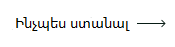

<!-- 
 -->

## Լեզու

&nbsp;&nbsp;&nbsp;&nbsp;&nbsp;&nbsp;&nbsp;&nbsp;&nbsp;&nbsp;&nbsp;&nbsp;&nbsp;&nbsp;&nbsp;&nbsp;&nbsp;&nbsp;&nbsp;&nbsp;&nbsp;&nbsp;&nbsp;&nbsp;&nbsp;

&nbsp;&nbsp;&nbsp;&nbsp;&nbsp;&nbsp;&nbsp;&nbsp;&nbsp;&nbsp;&nbsp;&nbsp;&nbsp;&nbsp;&nbsp;&nbsp;&nbsp;&nbsp;&nbsp;&nbsp;&nbsp;&nbsp;&nbsp;&nbsp;&nbsp;

&nbsp;&nbsp;&nbsp;&nbsp;&nbsp;&nbsp;&nbsp;&nbsp;&nbsp;&nbsp;&nbsp;&nbsp;&nbsp;&nbsp;&nbsp;&nbsp;&nbsp;&nbsp;&nbsp;&nbsp;&nbsp;&nbsp;&nbsp;&nbsp;&nbsp;

&nbsp;&nbsp;&nbsp;&nbsp;&nbsp;&nbsp;&nbsp;&nbsp;&nbsp;&nbsp;&nbsp;&nbsp;&nbsp;&nbsp;&nbsp;&nbsp;&nbsp;&nbsp;&nbsp;&nbsp;&nbsp;&nbsp;&nbsp;&nbsp;&nbsp;

&nbsp;&nbsp;&nbsp;&nbsp;&nbsp;&nbsp;&nbsp;&nbsp;&nbsp;&nbsp;&nbsp;&nbsp;&nbsp;&nbsp;&nbsp;&nbsp;&nbsp;&nbsp;&nbsp;&nbsp;&nbsp;&nbsp;&nbsp;&nbsp;&nbsp;

&nbsp;&nbsp;&nbsp;&nbsp;&nbsp;&nbsp;&nbsp;&nbsp;&nbsp;&nbsp;&nbsp;&nbsp;&nbsp;&nbsp;&nbsp;&nbsp;&nbsp;&nbsp;&nbsp;&nbsp;&nbsp;&nbsp;&nbsp;&nbsp;&nbsp;

&nbsp;&nbsp;&nbsp;&nbsp;&nbsp;&nbsp;&nbsp;&nbsp;&nbsp;&nbsp;&nbsp;&nbsp;&nbsp;&nbsp;&nbsp;&nbsp;&nbsp;&nbsp;&nbsp;&nbsp;&nbsp;&nbsp;&nbsp;&nbsp;&nbsp;

&nbsp;&nbsp;&nbsp;&nbsp;&nbsp;&nbsp;&nbsp;&nbsp;&nbsp;&nbsp;&nbsp;&nbsp;&nbsp;&nbsp;&nbsp;&nbsp;&nbsp;&nbsp;&nbsp;&nbsp;&nbsp;&nbsp;&nbsp;&nbsp;&nbsp;

&nbsp;&nbsp;&nbsp;&nbsp;&nbsp;&nbsp;&nbsp;&nbsp;&nbsp;&nbsp;&nbsp;&nbsp;&nbsp;&nbsp;&nbsp;&nbsp;&nbsp;&nbsp;&nbsp;&nbsp;&nbsp;&nbsp;&nbsp;&nbsp;&nbsp;

&nbsp;&nbsp;&nbsp;&nbsp;&nbsp;&nbsp;&nbsp;&nbsp;&nbsp;&nbsp;&nbsp;&nbsp;&nbsp;&nbsp;&nbsp;&nbsp;&nbsp;&nbsp;&nbsp;&nbsp;&nbsp;&nbsp;&nbsp;&nbsp;&nbsp;

&nbsp;&nbsp;&nbsp;&nbsp;&nbsp;&nbsp;&nbsp;&nbsp;&nbsp;&nbsp;&nbsp;&nbsp;&nbsp;&nbsp;&nbsp;&nbsp;&nbsp;&nbsp;&nbsp;&nbsp;&nbsp;&nbsp;&nbsp;&nbsp;&nbsp;

&nbsp;&nbsp;&nbsp;&nbsp;&nbsp;&nbsp;&nbsp;&nbsp;&nbsp;&nbsp;&nbsp;&nbsp;&nbsp;&nbsp;&nbsp;&nbsp;&nbsp;&nbsp;&nbsp;&nbsp;&nbsp;&nbsp;&nbsp;&nbsp;&nbsp;

&nbsp;&nbsp;&nbsp;&nbsp;&nbsp;&nbsp;&nbsp;&nbsp;&nbsp;&nbsp;&nbsp;&nbsp;&nbsp;&nbsp;&nbsp;&nbsp;&nbsp;&nbsp;&nbsp;&nbsp;&nbsp;&nbsp;&nbsp;&nbsp;&nbsp;

&nbsp;&nbsp;&nbsp;&nbsp;&nbsp;&nbsp;&nbsp;&nbsp;&nbsp;&nbsp;&nbsp;&nbsp;&nbsp;&nbsp;&nbsp;&nbsp;&nbsp;&nbsp;&nbsp;&nbsp;&nbsp;&nbsp;&nbsp;&nbsp;&nbsp;

&nbsp;&nbsp;&nbsp;&nbsp;&nbsp;&nbsp;&nbsp;&nbsp;&nbsp;&nbsp;&nbsp;&nbsp;&nbsp;&nbsp;&nbsp;&nbsp;&nbsp;&nbsp;&nbsp;&nbsp;&nbsp;&nbsp;&nbsp;&nbsp;&nbsp;

&nbsp;&nbsp;&nbsp;&nbsp;&nbsp;&nbsp;&nbsp;&nbsp;&nbsp;&nbsp;&nbsp;&nbsp;&nbsp;&nbsp;&nbsp;&nbsp;&nbsp;&nbsp;&nbsp;&nbsp;&nbsp;&nbsp;&nbsp;&nbsp;&nbsp;

&nbsp;&nbsp;&nbsp;&nbsp;&nbsp;&nbsp;&nbsp;&nbsp;&nbsp;&nbsp;&nbsp;&nbsp;&nbsp;&nbsp;&nbsp;&nbsp;&nbsp;&nbsp;&nbsp;&nbsp;&nbsp;&nbsp;&nbsp;&nbsp;&nbsp;

# Ձեռքբերումները GitHub-ում 🏆

 

  <picture>
    <source media="(prefers-color-scheme: light)" srcset="https://user-images.githubusercontent.com/65187002/172940015-d9d072e7-c47d-4ddd-83f6-8e7717a721b8.png">
    
  </picture> 
  <picture>
    <source media="(prefers-color-scheme: light)" srcset="https://user-images.githubusercontent.com/65187002/172941127-4061fac1-736b-4c24-b7ea-c210b3578cc5.png">
    
  </picture>

 

# Ինչպես ստանալ GitHub-ի ձեռքբերումները

## Այս դասընթացը ձեզ քայլ առ քայլ կսովորեցնի, թե ինչպես վաստակել GitHub-ի ձեռքբերումները:

### Նշումներ:

#### Նշում 1. Եթե ձեռքբերումներ ստանալու հետ կապված խնդիրներ ունեք, կարող եք օգտագործել քայլ առ քայլ ձեռնարկը բաժնում, թե ինչպես ստանալ դրանք:

#### Նշում 2. Բոլոր հրահանգները կցվում են լուսանկարներով, և յուրաքանչյուր քայլ մանրամասն բացատրվում է:

#### Նշում 3. Եթե որևէ խնդիր կամ վրիպակ եք գտնում, խնդրում ենք [հայտնել](https://github.com/4xmen/Get-Github-Achievements/issues/new) մեզ. Այդ ամենով դուք օգնում եք մեզ բարելավել դասընթացը։

 

# Ձեռքբերումները և նրանց ցուցադրումը 🏅

#### Ձեռքբերումները նշաններ են, որոնք GitHub-ը տալիս է ձեր GitHub հաշվին որպես պարգև որոշակի գործողությունների համար և կարող են դիտվել ձեր պրոֆիլում: Այս ձեռքբերումները լավ խթան են տալիս ձեր GitHub հաշվին և կարող են ցույց տալ, թե որքան ակտիվության մակարդակը և որքան ակտիվ եք դուք:

#### Դուք կարող եք չցուցադրել ձեռքբերումները ձեր պրոֆիլում, անցնելով [պրոֆիլի կարգավորումներ](https://github.com/settings).

#### Այստեղ մենք ձեզ ցույց կտանք, թե ինչպես կարելի է քայլ առ քայլ ստանալ GitHub-ի ձեռքբերումների նշան :)

 

# Նշանների ցանկ 📃

 

## Ինչպես ստանալ Quickdraw ձեռքբերումը

### Quickdraw-ն ունի ստանալու ամենահեշտ ձևերից մեկը: Եվ դուք կարող եք ստանալ այն ընդամենը մի քանի քայլով: Այս ձեռքբերումը ստանալու համար դուք պետք է (փակեք թողարկումը/փուլ-ռեքուեսթը բացելուց հետո 5 րոպեի ընթացքում)

#### - Եթե ​​ավելի շատ օգնության կարիք ունեք, սեղմեք «Ինչպես ստանալ» կոճակը՝ այս ձեռքբերումը ստանալու քայլ առ քայլ ուղեցույց ստանալու համար:

 

## Ինչպես ստանալ Yolo ձեռքբերումը

### Yolo-ն Github-ի ամենագեղեցիկ ձեռքբերումներից է և կարող է շատ գեղեցիկ էֆեկտ հաղորդել ձեր Github պրոֆիլին։ Այս ձեռքբերումը ստանալու համար դուք պետք է մերջ արեք փուլ-ռեքուեսթը առանց վերանայման:

#### - Եթե ​​ավելի շատ օգնության կարիք ունեք, սեղմեք «Ինչպես ստանալ» կոճակը՝ այս ձեռքբերումը ստանալու քայլ առ քայլ ուղեցույց ստանալու համար:

 

## Ինչպես ստանալ Galaxy Brain ձեռքբերումը

### Galaxy Brain ստանալն ավելի դժվար է, քան նախորդ երկու ձեռքբերումները: Իսկ այն ստանալու համար ձեզ պետք կգան GitHub-ի այլ օգտատերեր: Ձեզ անհրաժեշտ է. Պատասխանել քննարկմանը (երկու անգամ ստանալ ընդունված պատասխան)

#### - Եթե ​​ավելի շատ օգնության կարիք ունեք, սեղմեք «Ինչպես ստանալ» կոճակը՝ այս ձեռքբերումը ստանալու քայլ առ քայլ ուղեցույց ստանալու համար:

 

## Ինչպես ստանալ Pull Shark ձեռքբերումը

### Pull Shark ստանալու համար անհրաժեշտ է կատարել 2 միավորված փուլլ ռեքուեսթ, դուք կստանաք մեկ ձգվող շնաձկան նշան:

#### - Եթե ​​ավելի շատ օգնության կարիք ունեք, սեղմեք «Ինչպես ստանալ» կոճակը՝ այս ձեռքբերումը ստանալու քայլ առ քայլ ուղեցույց ստանալու համար:

 

## Ինչպես ստանալ Starstruck ձեռքբերումը

### Starstruck ձեռքբերումը ստանալը շատ պարզ է, և ձեզ ընդամենը մի քանի քայլ է անհրաժեշտ Starstruck-ին հասնելու համար: Դուք կարող եք ստանալ այս ձեռքբերումը, երբ ձեր հաշվի պահոցը հավաքի 16 աստղ, նույնիսկ եթե այն տեղափոխվել է, դուք կստանաք նշանը:

#### - Եթե ​​ավելի շատ օգնության կարիք ունեք, սեղմեք «Ինչպես ստանալ» կոճակը՝ այս ձեռքբերումը ստանալու քայլ առ քայլ ուղեցույց ստանալու համար:

 

## Ինչպես ստանալ Pair Extraordinaire ձեռքբերումը

### Դուք կարող եք վաստակել Pair Extraordinaire նշանը՝ ստեղծելով փուլլ ռեքուեսթ, որն այնուհետև կմիավորվի:

#### - Եթե ​​ավելի շատ օգնության կարիք ունեք, սեղմեք «Ինչպես ստանալ» կոճակը՝ այս ձեռքբերումը ստանալու քայլ առ քայլ ուղեցույց ստանալու համար:

 

## Ինչպես ստանալ Public Sponsor Achievement ձեռքբերումը

### Դուք պարզապես պետք է նվիրատվություն կատարեք բաց կոդով ներդրողներից մեկին:

#### - Եթե ​​ավելի շատ օգնության կարիք ունեք, սեղմեք «Ինչպես ստանալ» կոճակը՝ այս ձեռքբերումը ստանալու քայլ առ քայլ ուղեցույց ստանալու համար:

 

# Չհրապարակված ձեռքբերումներ ⏳

 

## Heart On Your Sleeve

### Այս պահին «Heart On Your Sleeve» ձեռքբերումը դեռ չի հրապարակվել GitHub-ի օգտատերերի համար:

 

## Open Sourcerer

### Այս պահին «Open Sourcerer» ձեռքբերումը դեռ չի հրապարակվել GitHub-ի օգտատերերի համար.

 

# Նշաններ, որոնք այլևս հնարավոր չէ ձեռք բերել ❌

 

## Mars 2020 Contributor

### «Մարս 2020» ուղղաթիռի առաքելության մեջ օգտագործվող պահոցում ներդնող կոդը.

## Arctic Code Vault Contributor

### Կոդի ներդրում GitHub Archive Program 2020 պահոցում.

 

# Ձեռքբերումների գույները 👋

 

#### Որոշ ձեռքբերումների տեսքը կախված է ձեր էմոջի մաշկի գույնի նախապատվությունից.

#### Դուք կարող եք փոխել ձեր նախընտրած մաշկի երանգը գնալով [Արտաքին տեսքի կարգավորումներ](https://github.com/settings/appearance).

<h4>Մաշկի երանգների տարբերակներ Starstuck-ի համար</h4>

<h4>Մաշկի երանգների տարբերակներ Quickdraw-ի համար</h4>

 

# Լրացուցիչ տեղեկություններ ℹ

 

#### GitHub նշանների մասին լրացուցիչ տեղեկություններ կարելի է գտնել այս [բաժնում](https://docs.github.com/en/account-and-profile/setting-up-and-managing-your-github-profile/customizing-your-profile/personalizing-your-profile#displaying-badges-on-your-profile).

<!-- 
 -->
 

####
