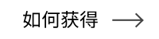

<!-- 
 -->

## 语言

&nbsp;&nbsp;&nbsp;&nbsp;&nbsp;&nbsp;&nbsp;&nbsp;&nbsp;&nbsp;&nbsp;&nbsp;&nbsp;&nbsp;&nbsp;&nbsp;&nbsp;&nbsp;&nbsp;&nbsp;&nbsp;&nbsp;&nbsp;&nbsp;&nbsp;

&nbsp;&nbsp;&nbsp;&nbsp;&nbsp;&nbsp;&nbsp;&nbsp;&nbsp;&nbsp;&nbsp;&nbsp;&nbsp;&nbsp;&nbsp;&nbsp;&nbsp;&nbsp;&nbsp;&nbsp;&nbsp;&nbsp;&nbsp;&nbsp;&nbsp;

&nbsp;&nbsp;&nbsp;&nbsp;&nbsp;&nbsp;&nbsp;&nbsp;&nbsp;&nbsp;&nbsp;&nbsp;&nbsp;&nbsp;&nbsp;&nbsp;&nbsp;&nbsp;&nbsp;&nbsp;&nbsp;&nbsp;&nbsp;&nbsp;&nbsp;

&nbsp;&nbsp;&nbsp;&nbsp;&nbsp;&nbsp;&nbsp;&nbsp;&nbsp;&nbsp;&nbsp;&nbsp;&nbsp;&nbsp;&nbsp;&nbsp;&nbsp;&nbsp;&nbsp;&nbsp;&nbsp;&nbsp;&nbsp;&nbsp;&nbsp;

&nbsp;&nbsp;&nbsp;&nbsp;&nbsp;&nbsp;&nbsp;&nbsp;&nbsp;&nbsp;&nbsp;&nbsp;&nbsp;&nbsp;&nbsp;&nbsp;&nbsp;&nbsp;&nbsp;&nbsp;&nbsp;&nbsp;&nbsp;&nbsp;&nbsp;

&nbsp;&nbsp;&nbsp;&nbsp;&nbsp;&nbsp;&nbsp;&nbsp;&nbsp;&nbsp;&nbsp;&nbsp;&nbsp;&nbsp;&nbsp;&nbsp;&nbsp;&nbsp;&nbsp;&nbsp;&nbsp;&nbsp;&nbsp;&nbsp;&nbsp;

&nbsp;&nbsp;&nbsp;&nbsp;&nbsp;&nbsp;&nbsp;&nbsp;&nbsp;&nbsp;&nbsp;&nbsp;&nbsp;&nbsp;&nbsp;&nbsp;&nbsp;&nbsp;&nbsp;&nbsp;&nbsp;&nbsp;&nbsp;&nbsp;&nbsp;

&nbsp;&nbsp;&nbsp;&nbsp;&nbsp;&nbsp;&nbsp;&nbsp;&nbsp;&nbsp;&nbsp;&nbsp;&nbsp;&nbsp;&nbsp;&nbsp;&nbsp;&nbsp;&nbsp;&nbsp;&nbsp;&nbsp;&nbsp;&nbsp;&nbsp;

# GitHub成就 🏆

 

  <picture>
    <source media="(prefers-color-scheme: light)" srcset="https://user-images.githubusercontent.com/65187002/172940015-d9d072e7-c47d-4ddd-83f6-8e7717a721b8.png">
    
  </picture> 
  <picture>
    <source media="(prefers-color-scheme: light)" srcset="https://user-images.githubusercontent.com/65187002/172941127-4061fac1-736b-4c24-b7ea-c210b3578cc5.png">
    
  </picture>

 

# 如何获得GitHub成就

## 您将在本教程中一步一步学习如何获取Github成就

### 请注意：

#### Tips 1：如果您在获取成就时遇到问题，可以在获得成就的教程中分步骤学习。

#### Tips 2：所有教程都有图片，每一步都有完整的解释和过程。

#### Tips 3：如果您发现任何问题或错误，请 [报告](https://github.com/4xmen/Get-Github-Achievements/issues/new) 给我们，帮助我们完善和改进教程。

 

# 成就 & 展示 🏅

#### 成就是GitHub为特定活动奖励您的GitHub账户的徽章，可以在您的个人资料中看到。这些成就对您的GitHub账户有良好的影响，并可以展示您的活动量和活跃程度。

#### 您可以通过进入您的个人资料设置来选择不在个人资料中显示成就。以下是具体步骤： [个人资料设置](https://github.com/settings)

#### 这里我们向您展示如何一步步获得GitHub成就徽章 :)

 

# 成就列表 📃

 

## 如何获得 Quickdraw 成就

### Quickdraw 是最容易获得的成就之一。只需要完成以下几个步骤即可获得该成就：
#### 1. 在打开后 5 分钟内关闭问题/拉取请求

#### - 如果您需要更多帮助，可以点击"如何获得"按钮，获取有关如何获得该成就的逐步教程。请注意，这些信息是根据搜索结果提供的，并可能随时间变化而有所不同。建议在GitHub官方文档或相关社区中查找最新的信息和指南。

 

## 如何获得 Yolo 成就

### Yolo是GitHub上最漂亮的成就之一，可以为您的GitHub个人资料带来非常漂亮的效果。要获得此成就：
#### 1. 您需要在没有审核的情况下合并一个拉取请求

#### - 如果您需要更多帮助，可以点击"如何获得"按钮，获取有关如何获得该成就的逐步教程。请注意，这些信息是根据搜索结果提供的，并可能随时间变化而有所不同。建议在GitHub官方文档或相关社区中查找最新的信息和指南。

 

## 如何获得 Galaxy Brain 成就

### 获得Galaxy Brain成就比前两个成就更困难。要获得该成就，您需要按照以下步骤与其他GitHub用户进行互动：
#### 1. 回答至少两个讨论问题
#### 2. 请注意，您不能将自己的答案标记为自己的问题的答案，必须由其他用户标记
#### 3. 这些讨论应该在公开仓库中进行

#### - 如果您需要更多帮助，可以点击"如何获得"按钮，获取有关如何获得该成就的逐步教程。请注意，这些信息是根据搜索结果提供的，并可能随时间变化而有所不同。建议在GitHub官方文档或相关社区中查找最新的信息和指南。

 

## 如何获得 Pull Shark 成就

### 要获得Pull Shark成就，您需要完成以下步骤：
#### 1. 创建并提交两个拉取请求
#### 2. 确保这两个拉取请求被成功合并

#### - 如果您需要更多帮助，可以点击"如何获得"按钮，获取有关如何获得该成就的逐步教程。请注意，这些信息是根据搜索结果提供的，并可能随时间变化而有所不同。建议在GitHub官方文档或相关社区中查找最新的信息和指南。

 

## 如何获得 Starstruck 成就

### 要获得Starstruck成就，您只需要完成以下几个步骤：
#### 1. 创建一个仓库
#### 2. 确保该仓库获得了16个星标(收藏)
#### 3. 即使该仓库被转移，只要它在您的帐户上获得了16个星标(收藏)，您也将获得该成就

#### - 如果您需要更多帮助，可以点击"如何获得"按钮，获取有关如何获得该成就的逐步教程。请注意，这些信息是根据搜索结果提供的，并可能随时间变化而有所不同。建议在GitHub官方文档或相关社区中查找最新的信息和指南。

 

## 如何获得 Pair Extraordinaire 成就

### 要获得Pair Extraordinaire成就，您需要完成以下步骤：
#### 1. 与另一个GitHub用户共同创作一个拉取请求
#### 2. 确保该拉取请求被成功合并

#### - 如果您需要更多帮助，可以点击"如何获得"按钮，获取有关如何获得该成就的逐步教程。请注意，这些信息是根据搜索结果提供的，并可能随时间变化而有所不同。建议在GitHub官方文档或相关社区中查找最新的信息和指南。

 

## 如何获得 Public Sponsor 成就

### 您只需要向一些开源贡献者捐款即可。

#### - 如果您需要更多帮助，可以点击"如何获得"按钮，获取有关如何获得该成就的逐步教程。请注意，这些信息是根据搜索结果提供的，并可能随时间变化而有所不同。建议在GitHub官方文档或相关社区中查找最新的信息和指南。

 

# 未发布的GitHub成就 ⏳

 

## 真情流露(袖子上的心) - Heart On Your Sleeve

### "Heart On Your Sleeve" 成就徽章目前尚未向公共 GitHub 用户发布。

 

## 开源者 - Open Sourcerer

### "Open Sourcerer" 成就徽章目前尚未向GitHub的公共用户发布。

 

# 徽章不再可以获得 ❌

 

## 火星2020贡献者 - Mars 2020 Contributor

### 为火星 2020 （Mars 2020 Contributor）直升机任务中贡献仓库代码

## 北极代码库贡献者 - Arctic Code Vault Contributor

### 为2020 GitHub（Arctic Code Vault Contributor）存档计划中的仓库贡献代码

 

# 成就肤色 👋

 

#### 某些成就的外观取决于您的表情符号肤色偏好。

#### 您可以通过以下方式更改您喜欢的肤色： [外观设置](https://github.com/settings/appearance)

<h4>"收藏之星" 肤色版本</h4>

<h4>"Quickdraw" 肤色版本</h4>

 

# 更多信息 ℹ

 

#### 您可以在下面找到有关 GitHub 徽章的更多信息 [link](https://docs.github.com/en/account-and-profile/setting-up-and-managing-your-github-profile/customizing-your-profile/personalizing-your-profile#displaying-badges-on-your-profile)

<!-- 
 -->
 

####          

