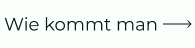

<!-- 
 -->

## Sprache

  

&nbsp;&nbsp;&nbsp;&nbsp;&nbsp;&nbsp;&nbsp;&nbsp;&nbsp;&nbsp;&nbsp;&nbsp;&nbsp;&nbsp;&nbsp;&nbsp;&nbsp;&nbsp;&nbsp;&nbsp;&nbsp;&nbsp;&nbsp;&nbsp;&nbsp;

&nbsp;&nbsp;&nbsp;&nbsp;&nbsp;&nbsp;&nbsp;&nbsp;&nbsp;&nbsp;&nbsp;&nbsp;&nbsp;&nbsp;&nbsp;&nbsp;&nbsp;&nbsp;&nbsp;&nbsp;&nbsp;&nbsp;&nbsp;&nbsp;&nbsp;

&nbsp;&nbsp;&nbsp;&nbsp;&nbsp;&nbsp;&nbsp;&nbsp;&nbsp;&nbsp;&nbsp;&nbsp;&nbsp;&nbsp;&nbsp;&nbsp;&nbsp;&nbsp;&nbsp;&nbsp;&nbsp;&nbsp;&nbsp;&nbsp;&nbsp;

&nbsp;&nbsp;&nbsp;&nbsp;&nbsp;&nbsp;&nbsp;&nbsp;&nbsp;&nbsp;&nbsp;&nbsp;&nbsp;&nbsp;&nbsp;&nbsp;&nbsp;&nbsp;&nbsp;&nbsp;&nbsp;&nbsp;&nbsp;&nbsp;&nbsp;

&nbsp;&nbsp;&nbsp;&nbsp;&nbsp;&nbsp;&nbsp;&nbsp;&nbsp;&nbsp;&nbsp;&nbsp;&nbsp;&nbsp;&nbsp;&nbsp;&nbsp;&nbsp;&nbsp;&nbsp;&nbsp;&nbsp;&nbsp;&nbsp;&nbsp;

&nbsp;&nbsp;&nbsp;&nbsp;&nbsp;&nbsp;&nbsp;&nbsp;&nbsp;&nbsp;&nbsp;&nbsp;&nbsp;&nbsp;&nbsp;&nbsp;&nbsp;&nbsp;&nbsp;&nbsp;&nbsp;&nbsp;&nbsp;&nbsp;&nbsp;

&nbsp;&nbsp;&nbsp;&nbsp;&nbsp;&nbsp;&nbsp;&nbsp;&nbsp;&nbsp;&nbsp;&nbsp;&nbsp;&nbsp;&nbsp;&nbsp;&nbsp;&nbsp;&nbsp;&nbsp;&nbsp;&nbsp;&nbsp;&nbsp;&nbsp;

&nbsp;&nbsp;&nbsp;&nbsp;&nbsp;&nbsp;&nbsp;&nbsp;&nbsp;&nbsp;&nbsp;&nbsp;&nbsp;&nbsp;&nbsp;&nbsp;&nbsp;&nbsp;&nbsp;&nbsp;&nbsp;&nbsp;&nbsp;&nbsp;&nbsp;

&nbsp;&nbsp;&nbsp;&nbsp;&nbsp;&nbsp;&nbsp;&nbsp;&nbsp;&nbsp;&nbsp;&nbsp;&nbsp;&nbsp;&nbsp;&nbsp;&nbsp;&nbsp;&nbsp;&nbsp;&nbsp;&nbsp;&nbsp;&nbsp;&nbsp;

# GitHub Erfolge 🏆

 

  <picture>
    <source media="(prefers-color-scheme: light)" srcset="https://user-images.githubusercontent.com/65187002/172940015-d9d072e7-c47d-4ddd-83f6-8e7717a721b8.png">
    
  </picture> 
  <picture>
    <source media="(prefers-color-scheme: light)" srcset="https://user-images.githubusercontent.com/65187002/172941127-4061fac1-736b-4c24-b7ea-c210b3578cc5.png">
    
  </picture>

 

# Erfolge & Anzeige 🏅

#### Achievements sind Pins, die GitHub als Belohnung für bestimmte Aktivitäten an Ihren GitHub-Account vergibt und die in Ihrem Profil zu sehen sind. Diese Errungenschaften verleihen Ihrem GitHub-Konto einen guten Effekt und können den Umfang Ihrer Aktivität und Ihre Aktivität anzeigen.

#### Sie können die Anzeige von Erfolgen in Ihrem Profil deaktivieren, indem Sie zu Ihrem gehen, [Profileinstellungen](https://github.com/settings).

#### Hier zeigen wir Ihnen Schritt für Schritt, wie Sie GitHub Achievement Pins erhalten :)

 

# So erhalten Sie GitHub-Erfolge

## In diesem Kurs erfahren Sie Schritt für Schritt, wie Sie GitHub-Erfolge erzielen.

### Hinweis:

#### Hinweis 1: Wenn Sie Probleme beim Erhalt von Erfolgen haben, können Sie die Schritt-für-Schritt-Schulung im Abschnitt zum Erhalt dieser Erfolge nutzen.

#### Hinweis 2: Alle Tutorials sind mit Fotos versehen und jeder Schritt wird ausführlich erklärt.

#### Hinweis 3: Wenn Sie Probleme oder Fehler finden, wenden Sie sich bitte an uns [Bericht](https://github.com/4xmen/Get-Github-Achievements/issues/new) es uns. Und helfen Sie uns, den Kurs zu verbessern.

 

# Erfolgsliste 📃

 

## So erhalten Sie den Quickdraw-Erfolg

### Quickdraw hat eine der einfachsten Möglichkeiten, und Sie können es erhalten, indem Sie nur ein paar Schritte unternehmen. Um diesen Erfolg zu erhalten, müssen Sie . (Issue/Pull-Request innerhalb von 5 Minuten nach Eröffnung geschlossen)

#### - Wenn Sie weitere Hilfe benötigen, klicken Sie auf die Schaltfläche So erhalten Sie eine Schritt-für-Schritt-Anleitung, wie Sie diesen Erfolg erhalten.

 

## So erhalten Sie den Yolo-Erfolg

### Yolo ist eine der schönsten Errungenschaften von Github, die Ihrem Github-Profil einen sehr schönen Effekt verleihen kann. Um diesen Erfolg zu erhalten, müssen Sie eine Pull-Anforderung ohne Überprüfung zusammenführen.

#### - Wenn Sie weitere Hilfe benötigen, klicken Sie auf die Schaltfläche So erhalten Sie eine Schritt-für-Schritt-Anleitung, wie Sie diesen Erfolg erhalten.

 

## So erhalten Sie den Galaxy Brain Erfolg

### Galaxy Brain zu bekommen ist schwieriger als die beiden vorherigen Erfolge. Und um es zu erhalten, müssen Sie die Schritte durchlaufen, die Sie für andere GitHub-Benutzer benötigen. Sie müssen: eine Diskussion beantwortet haben (eine akzeptierte Antwort erhalten haben)

#### - Wenn Sie weitere Hilfe benötigen, klicken Sie auf die Schaltfläche So erhalten Sie eine Schritt-für-Schritt-Anleitung, wie Sie diesen Erfolg erhalten.

 

## So erhalten Sie den Pull Shark Erfolg

### Um Pull Shark zu erhalten, müssen Sie 2 zusammengeführte Pull-Anforderungen stellen, Sie erhalten das One Pull Shark-Abzeichen.

#### - Wenn Sie weitere Hilfe benötigen, klicken Sie auf die Schaltfläche So erhalten Sie eine Schritt-für-Schritt-Anleitung, wie Sie diesen Erfolg erhalten.

 

## So erhalten Sie den Starstruck-Erfolg

### Es ist zu einfach, Starstruck Achievement zu erhalten, und Sie haben nur wenige Schritte, um Starstruck zu erhalten. Sie können diese Errungenschaft erhalten, wenn ein Repository auf Ihrem Konto 16 Sterne erreicht, selbst wenn es übertragen wurde, erhalten Sie das Abzeichen.

#### - Wenn Sie weitere Hilfe benötigen, klicken Sie auf die Schaltfläche So erhalten Sie eine Schritt-für-Schritt-Anleitung, wie Sie diesen Erfolg erhalten.

 

## So erhalten Sie den Pair Extraordinaire Erfolg

### Sie können das Pair Extraordinaire-Abzeichen verdienen, indem Sie eine Pull-Anfrage mitverfassen, die dann zusammengeführt wird.

#### - Wenn Sie weitere Hilfe benötigen, klicken Sie auf die Schaltfläche So erhalten Sie eine Schritt-für-Schritt-Anleitung, wie Sie diesen Erfolg erhalten.

 

## So erhalten Sie den Public Sponsor Erfolg

### Sie müssen nur eine Spende an einen Open-Source-Mitwirkenden leisten.

#### - Wenn Sie weitere Hilfe benötigen, klicken Sie auf die Schaltfläche So erhalten Sie eine Schritt-für-Schritt-Anleitung, wie Sie diesen Erfolg erhalten.

 

# Unveröffentlichte Erfolge ⏳

 

## Heart On Your Sleeve

### Die Heart On Your Sleeve-Erfolgsabzeichen werden derzeit noch nicht für öffentliche GitHub-Benutzer freigegeben.

 

## Open Sourcerer

### Die Open Sourcerer-Erfolgsabzeichen sind derzeit noch nicht für öffentliche GitHub-Benutzer freigegeben.

 

# Abzeichen können nicht mehr verdient werden ❌

 

## Mars 2020 Contributor

### Beigesteuerter Code für ein Repository, das in der Hubschraubermission Mars 2020 verwendet wird

## Arctic Code Vault Contributor

### Beigesteuerter Code zu einem Repository im GitHub Archive Program 2020

 

# Leistung Hautton 👋

 

#### Das Aussehen einiger Erfolge hängt von Ihrer Emoji-Hauttonpräferenz ab.

#### Sie können Ihren bevorzugten Hautton ändern, indem Sie auf gehen [Darstellungseinstellungen](https://github.com/settings/appearance).

<h4>Starstuck Skin Tone Versions</h4>

<h4>Quikdraw Skin Tone Versions</h4>

 

# Mehr Informationen ℹ

 

#### Weitere Informationen zu GitHub-Badges finden Sie darunter [Verknüpfung](https://docs.github.com/en/account-and-profile/setting-up-and-managing-your-github-profile/customizing-your-profile/personalizing-your-profile#displaying-badges-on-your-profile).

<!-- 
 -->
 

####         
