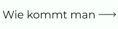

<!-- 
 -->

## Sprache

|                                                                                                                                        |                                                                                                                                         |                                                                                                                                                   |                                                                                                                                           |                                                                                                                                           |                                                                                                                                          |
|:--------------------------------------------------------------------------------------------------------------------------------------:|:---------------------------------------------------------------------------------------------------------------------------------------:|:-------------------------------------------------------------------------------------------------------------------------------------------------:|:-----------------------------------------------------------------------------------------------------------------------------------------:|:-----------------------------------------------------------------------------------------------------------------------------------------:|:----------------------------------------------------------------------------------------------------------------------------------------:|
|     |  |             |   |    |  |
|     |      |  |      |  |    |
|  |  |          |  |    |  |

# GitHub Erfolge 🏆

 

  <picture>
    <source media="(prefers-color-scheme: light)" srcset="https://user-images.githubusercontent.com/65187002/172940015-d9d072e7-c47d-4ddd-83f6-8e7717a721b8.png">
    
  </picture> 
  <picture>
    <source media="(prefers-color-scheme: light)" srcset="https://user-images.githubusercontent.com/65187002/172941127-4061fac1-736b-4c24-b7ea-c210b3578cc5.png">
    
  </picture>

 

# Erfolge & Anzeige 🏅

#### GitHub Achievements sind Auszeichnungen (Badges), die GitHub für bestimmte Aktivitäten vergibt. Sie werden auf deinem GitHub-Profil angezeigt und machen sichtbar, wie aktiv du auf GitHub bist.

#### Wenn du deine Achievements nicht in deinem Profil anzeigen möchtest, kannst du sie jederzeit in deinen [Profileinstellungen](https://github.com/settings) ausblenden.

#### Im Folgenden zeigen wir dir Schritt für Schritt, wie du jedes GitHub Achievement erhalten kannst.

 

# So erhalten Sie GitHub-Erfolge

## In dieser Anleitung zeigen wir dir Schritt für Schritt, wie du GitHub Achievements erhältst.

### Hinweise

#### Hinweis 1: Falls du Probleme beim Erhalten eines Achievements hast, findest du zu jedem Achievement eine ausführliche Schritt-für-Schritt-Anleitung.

#### Hinweis 2: Alle Tutorials enthalten Bilder und erklären jeden Schritt detailliert.

#### Hinweis 3: Falls dir ein Fehler oder Problem auffällt, kannst du ihn gerne [hier melden](https://github.com/4xmen/Get-Github-Achievements/issues/new). So hilfst du uns dabei, diese Anleitung weiter zu verbessern.

 

# Erfolgsliste 📃

 

## So erhältst du das Quickdraw Achievement

### Quickdraw gehört zu den einfachsten Achievements. Du erhältst es, indem du ein Issue oder einen Pull Request innerhalb von fünf Minuten nach dem Erstellen wieder schließt.

#### - Wenn du weitere Hilfe benötigst, klicke auf **„So erhältst du es“**, um zur ausführlichen Schritt-für-Schritt-Anleitung zu gelangen.

 

## So erhältst du das Yolo Achievement

### Das Yolo Achievement gehört zu den auffälligsten GitHub Achievements und verleiht deinem Profil einen besonderen Look. Du erhältst es, indem du einen Pull Request ohne vorheriges Review mergst.

#### - Wenn du weitere Hilfe benötigst, klicke auf **„So erhältst du es“**, um zur ausführlichen Schritt-für-Schritt-Anleitung zu gelangen.

 

## So erhältst du das Pull Shark Achievement

### Für das Pull Shark Achievement musst du zwei Pull Requests erstellen, die erfolgreich gemergt werden. Anschließend erhältst du das Pull Shark Badge.

#### - Wenn du weitere Hilfe benötigst, klicke auf **„So erhältst du es“**, um zur ausführlichen Schritt-für-Schritt-Anleitung zu gelangen.

 

## Galaxy Brain (2022)

### Dieses Achievement erhältst du, wenn zwei deiner Antworten in GitHub Discussions als **akzeptierte Antwort** markiert wurden. Es war von 2020 bis 2024 verfügbar.

#### - Wenn du weitere Hilfe benötigst, klicke auf **„So erhältst du es“**, um zur ausführlichen Schritt-für-Schritt-Anleitung zu gelangen.

 

## So erhältst du das Starstruck Achievement

### Das Starstruck Achievement erhältst du, sobald eines deiner Repositories mindestens **16 Sterne** erreicht. Dabei spielt es keine Rolle, ob das Repository später übertragen wurde – das Badge bleibt dir erhalten.

#### - Wenn du weitere Hilfe benötigst, klicke auf **„So erhältst du es“**, um zur ausführlichen Schritt-für-Schritt-Anleitung zu gelangen.

 

## So erhältst du das Pair Extraordinaire Achievement

### Dieses Badge erhältst du, indem du als Co-Autor an einem Pull Request mitwirkst, der anschließend gemergt wird.

#### - Wenn du weitere Hilfe benötigst, klicke auf **„So erhältst du es“**, um zur ausführlichen Schritt-für-Schritt-Anleitung zu gelangen.

 

## So erhältst du das Public Sponsor Achievement

### Unterstütze einen Open-Source-Mitwirkenden mit einer Spende, um dieses Achievement zu erhalten.

#### - Wenn du weitere Hilfe benötigst, klicke auf **„So erhältst du es“**, um zur ausführlichen Schritt-für-Schritt-Anleitung zu gelangen.

 

# Noch nicht veröffentlichte Achievements ⏳

 

## Heart On Your Sleeve

### Dieses Achievement befindet sich derzeit noch in der Testphase. Nach der offiziellen Veröffentlichung wird eine Schritt-für-Schritt-Anleitung ergänzt.

 

## Open Sourcerer

### Auch dieses Achievement befindet sich derzeit noch in der Testphase. Nach der offiziellen Veröffentlichung wird eine ausführliche Anleitung ergänzt.

 

# Nicht mehr erhältliche Badges ❌

 

## Mars 2020 Contributor

### Dieses Badge wurde an Personen vergeben, die Code zu einem Repository beigetragen haben, das im Rahmen der Mars-2020-Helikoptermission verwendet wurde.

## Arctic Code Vault Contributor

### Dieses Badge wurde an Mitwirkende vergeben, deren Code in einem Repository des GitHub Archive Program 2020 enthalten war.

 

# Emoji-Hautton für Achievements 👋

 

#### Das Erscheinungsbild einiger Achievements richtet sich nach deiner ausgewählten Emoji-Hautton-Einstellung.

#### Deinen bevorzugten Emoji-Hautton kannst du jederzeit in den [Darstellungseinstellungen](https://github.com/settings/appearance) ändern.

<h4>Starstuck Skin Tone Versions</h4>

<h4>Quikdraw Skin Tone Versions</h4>

 

# Profil-Badges ✨

 

|                                                                                                                                                          Badge                                                                                                                                                           |            Name            |                                                         So erhältst du es                                                         |
|:------------------------------------------------------------------------------------------------------------------------------------------------------------------------------------------------------------------------------------------------------------------------------------------------------------------------:|:--------------------------:|:----------------------------------------------------------------------------------------------------------------------------------:|
|                                               |            Pro             |          Nutze [GitHub Pro](https://docs.github.com/en/get-started/learning-about-github/githubs-products#github-pro)           |
|      |  Developer Program Member  |  Werde Mitglied des [GitHub Developer Program](https://docs.github.com/en/developers/overview/github-developer-program) |
|  | Security Bug Bounty Hunter |                     Melde Sicherheitslücken über das [GitHub Security](https://bounty.github.com/)                     |
|              |    GitHub Campus Expert    |                             Nimm am [GitHub Campus Program](https://education.github.com/experts) teil                             |
|      |  Security advisory credit  |            Reiche eine Sicherheitsmeldung ein, die in die [GitHub Advisory Database](https://github.com/advisories) aufgenommen wird             |

# Fair bleiben und die GitHub-Regeln respektieren 🏁

 

#### Dieses Repository soll dir zeigen, wie GitHub Achievements funktionieren und wie du sie erhalten kannst. Bitte halte dich dabei an die Community-Richtlinien und Nutzungsbedingungen von GitHub.

#### Beteilige dich aktiv an Open-Source-Projekten und versuche nicht, ausschließlich für Achievements an diesem Repository mitzuwirken. Das entspricht weder dem Sinn dieses Projekts noch den Richtlinien von GitHub.

#### Nutze diese Anleitung als Lernhilfe und verdiene deine Achievements auf faire Weise. So trägst du zu einer offenen, gesunden und nachhaltigen Open-Source-Community auf GitHub bei.

# Weitere Informationen ℹ

 

#### Weitere Informationen zu GitHub Badges und Achievements findest du in der offiziellen GitHub-Dokumentation: [Verknüpfungen](https://docs.github.com/en/account-and-profile/setting-up-and-managing-your-github-profile/customizing-your-profile/personalizing-your-profile#displaying-badges-on-your-profile).

<!-- 
 -->
 

####
