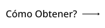

<!-- 
 -->

## Idioma

&nbsp;&nbsp;&nbsp;&nbsp;&nbsp;&nbsp;&nbsp;&nbsp;&nbsp;&nbsp;&nbsp;&nbsp;&nbsp;&nbsp;&nbsp;&nbsp;&nbsp;&nbsp;&nbsp;&nbsp;&nbsp;&nbsp;&nbsp;&nbsp;&nbsp;

&nbsp;&nbsp;&nbsp;&nbsp;&nbsp;&nbsp;&nbsp;&nbsp;&nbsp;&nbsp;&nbsp;&nbsp;&nbsp;&nbsp;&nbsp;&nbsp;&nbsp;&nbsp;&nbsp;&nbsp;&nbsp;&nbsp;&nbsp;&nbsp;&nbsp;

&nbsp;&nbsp;&nbsp;&nbsp;&nbsp;&nbsp;&nbsp;&nbsp;&nbsp;&nbsp;&nbsp;&nbsp;&nbsp;&nbsp;&nbsp;&nbsp;&nbsp;&nbsp;&nbsp;&nbsp;&nbsp;&nbsp;&nbsp;&nbsp;&nbsp;

&nbsp;&nbsp;&nbsp;&nbsp;&nbsp;&nbsp;&nbsp;&nbsp;&nbsp;&nbsp;&nbsp;&nbsp;&nbsp;&nbsp;&nbsp;&nbsp;&nbsp;&nbsp;&nbsp;&nbsp;&nbsp;&nbsp;&nbsp;&nbsp;&nbsp;

&nbsp;&nbsp;&nbsp;&nbsp;&nbsp;&nbsp;&nbsp;&nbsp;&nbsp;&nbsp;&nbsp;&nbsp;&nbsp;&nbsp;&nbsp;&nbsp;&nbsp;&nbsp;&nbsp;&nbsp;&nbsp;&nbsp;&nbsp;&nbsp;&nbsp;

&nbsp;&nbsp;&nbsp;&nbsp;&nbsp;&nbsp;&nbsp;&nbsp;&nbsp;&nbsp;&nbsp;&nbsp;&nbsp;&nbsp;&nbsp;&nbsp;&nbsp;&nbsp;&nbsp;&nbsp;&nbsp;&nbsp;&nbsp;&nbsp;&nbsp;

&nbsp;&nbsp;&nbsp;&nbsp;&nbsp;&nbsp;&nbsp;&nbsp;&nbsp;&nbsp;&nbsp;&nbsp;&nbsp;&nbsp;&nbsp;&nbsp;&nbsp;&nbsp;&nbsp;&nbsp;&nbsp;&nbsp;&nbsp;&nbsp;&nbsp;

&nbsp;&nbsp;&nbsp;&nbsp;&nbsp;&nbsp;&nbsp;&nbsp;&nbsp;&nbsp;&nbsp;&nbsp;&nbsp;&nbsp;&nbsp;&nbsp;&nbsp;&nbsp;&nbsp;&nbsp;&nbsp;&nbsp;&nbsp;&nbsp;&nbsp;

&nbsp;&nbsp;&nbsp;&nbsp;&nbsp;&nbsp;&nbsp;&nbsp;&nbsp;&nbsp;&nbsp;&nbsp;&nbsp;&nbsp;&nbsp;&nbsp;&nbsp;&nbsp;&nbsp;&nbsp;&nbsp;&nbsp;&nbsp;&nbsp;&nbsp;

&nbsp;&nbsp;&nbsp;&nbsp;&nbsp;&nbsp;&nbsp;&nbsp;&nbsp;&nbsp;&nbsp;&nbsp;&nbsp;&nbsp;&nbsp;&nbsp;&nbsp;&nbsp;&nbsp;&nbsp;&nbsp;&nbsp;&nbsp;&nbsp;&nbsp;

&nbsp;&nbsp;&nbsp;&nbsp;&nbsp;&nbsp;&nbsp;&nbsp;&nbsp;&nbsp;&nbsp;&nbsp;&nbsp;&nbsp;&nbsp;&nbsp;&nbsp;&nbsp;&nbsp;&nbsp;&nbsp;&nbsp;&nbsp;&nbsp;&nbsp;

&nbsp;&nbsp;&nbsp;&nbsp;&nbsp;&nbsp;&nbsp;&nbsp;&nbsp;&nbsp;&nbsp;&nbsp;&nbsp;&nbsp;&nbsp;&nbsp;&nbsp;&nbsp;&nbsp;&nbsp;&nbsp;&nbsp;&nbsp;&nbsp;&nbsp;

&nbsp;&nbsp;&nbsp;&nbsp;&nbsp;&nbsp;&nbsp;&nbsp;&nbsp;&nbsp;&nbsp;&nbsp;&nbsp;&nbsp;&nbsp;&nbsp;&nbsp;&nbsp;&nbsp;&nbsp;&nbsp;&nbsp;&nbsp;&nbsp;&nbsp;

&nbsp;&nbsp;&nbsp;&nbsp;&nbsp;&nbsp;&nbsp;&nbsp;&nbsp;&nbsp;&nbsp;&nbsp;&nbsp;&nbsp;&nbsp;&nbsp;&nbsp;&nbsp;&nbsp;&nbsp;&nbsp;&nbsp;&nbsp;&nbsp;&nbsp;

&nbsp;&nbsp;&nbsp;&nbsp;&nbsp;&nbsp;&nbsp;&nbsp;&nbsp;&nbsp;&nbsp;&nbsp;&nbsp;&nbsp;&nbsp;&nbsp;&nbsp;&nbsp;&nbsp;&nbsp;&nbsp;&nbsp;&nbsp;&nbsp;&nbsp;

&nbsp;&nbsp;&nbsp;&nbsp;&nbsp;&nbsp;&nbsp;&nbsp;&nbsp;&nbsp;&nbsp;&nbsp;&nbsp;&nbsp;&nbsp;&nbsp;&nbsp;&nbsp;&nbsp;&nbsp;&nbsp;&nbsp;&nbsp;&nbsp;&nbsp;

&nbsp;&nbsp;&nbsp;&nbsp;&nbsp;&nbsp;&nbsp;&nbsp;&nbsp;&nbsp;&nbsp;&nbsp;&nbsp;&nbsp;&nbsp;&nbsp;&nbsp;&nbsp;&nbsp;&nbsp;&nbsp;&nbsp;&nbsp;&nbsp;&nbsp;

# Logros de GitHub 🏆

 

  <picture>
    <source media="(prefers-color-scheme: light)" srcset="https://user-images.githubusercontent.com/65187002/172940015-d9d072e7-c47d-4ddd-83f6-8e7717a721b8.png">
    
  </picture> 
  <picture>
    <source media="(prefers-color-scheme: light)" srcset="https://user-images.githubusercontent.com/65187002/172941127-4061fac1-736b-4c24-b7ea-c210b3578cc5.png">
    
  </picture>

 

# Cómo obtener logros de GitHub

## En este curso se le enseñará paso a paso cómo obtener logros de GitHub.

### Notas:

#### Nota 1: Si tienes algún problema para recibir logros, puedes utilizar las instrucciones paso a paso en la sección de cómo obtenerlos.

#### Nota 2: Todos los tutoriales tienen fotos y cada paso está completamente explicado.

#### Nota 3: Si encuentra algún problema o error, [infórmenos](https://github.com/4xmen/Get-Github-Achievements/issues/new). Y ayúdanos a mejorar el curso.

 

# Logros y exhibición 🏅

#### Los logros son pines que GitHub otorga a tu cuenta de GitHub como recompensa por ciertas actividades y se pueden ver en tu perfil. Estos logros le dan un buen efecto a su cuenta de GitHub y pueden indicar la cantidad de su actividad y cómo está activo.

#### Puede optar por no mostrar logros en su perfil yendo a su [configuración de perfil](https://github.com/settings).

#### Aquí te mostramos cómo obtener los logros de GitHub paso a paso :)

 

# Lista de logros 📃

 

## Cómo conseguir el logro Quickdraw

### Quickdraw es uno de los logros más fáciles de conseguir. Sólo requiere unos pocos pasos. Para obtener este logro debes (cerrar un issue o Pull Request dentro de los 5 minutos posteriores a su apertura).

#### - Si necesitas más ayuda, haz clic en el botón `Cómo Obtener?` para obtener un tutorial paso a paso sobre cómo conseguir este logro.

 

## Cómo conseguir el logro Yolo

### Yolo es uno de los logros más bellos de Github, que puede darle un efecto muy hermoso a tu perfil de Github. Para obtener este logro, debes fusionar una solicitud de extracción sin revisión.

#### - Si necesitas más ayuda, haz clic en el botón `Cómo Obtener?` para obtener un tutorial paso a paso sobre cómo conseguir este logro.

 

## Cómo conseguir el logro Galaxy Brain

### Obtener Galaxy Brain es más difícil que los dos logros anteriores. Y para recibirlo, debe seguir los pasos que necesitan otros usuarios de GitHub. Necesitas: Responder una discusión (obtener una respuesta aceptada dos veces)

#### - Si necesitas más ayuda, haz clic en el botón `Cómo Obtener?` para obtener un tutorial paso a paso sobre cómo conseguir este logro.

 

## Cómo conseguir el logro Pull Shark

### Para obtener Pull Shark, debes realizar 2 solicitudes de extracción fusionadas y obtendrás la insignia de un Pull Shark.

#### - Si necesitas más ayuda, haz clic en el botón `Cómo Obtener?` para obtener un tutorial paso a paso sobre cómo conseguir este logro.

 

## Cómo conseguir el logro Starstruck

### Es demasiado simple obtener el logro Starstruck y tienes unos pocos pasos para obtener Starstruck. Puede obtener este logro cuando un repositorio en su cuenta alcance las 16 estrellas, incluso si fue transferido, recibirá la insignia.

#### - Si necesitas más ayuda, haz clic en el botón `Cómo Obtener?` para obtener un tutorial paso a paso sobre cómo conseguir este logro.

 

## Cómo conseguir el logro Pair Extraordinaire

### Puedes obtener el logro Pair Extraordinaire si eres co-autor de una solicitud de extracción que luego se fusiona.

#### - Si necesitas más ayuda, haz clic en el botón `Cómo Obtener?` para obtener un tutorial paso a paso sobre cómo conseguir este logro.

 

## Cómo conseguir logros de Public Sponsor 

### Solo necesitas hacer una donación a algún colaborador de código abierto.

#### - Si necesitas más ayuda, haz clic en el botón `Cómo Obtener?` para obtener un tutorial paso a paso sobre cómo conseguir este logro.

 

# Logros inéditos ⏳

 

## Heart On Your Sleeve

### El logro 'Heart On Your Sleeve' aún no está disponibles para los usuarios públicos de GitHub en este momento.

 

## Open Sourcerer

### EL logro 'Open Sourcerer' aún no está disponibles para los usuarios públicos de GitHub en este momento.

 

# Logros que ya no se pueden obtener ❌

 

## Mars 2020 Contributor

### Código contribuido a un repositorio utilizado en la misión de helicóptero Mars 2020

## Arctic Code Vault Contributor

### Código contribuido a un repositorio en el Programa de Archivo GitHub 2020

 

# Logros con tonos de piel 👋

 

#### La apariencia de algunos logros depende de tu preferencia de tono de piel de Emoji.

#### Puedes cambiar tu tono de piel preferido yendo a [configuración de apariencia](https://github.com/settings/appearance).

<h4>Versiones de tono de piel de Starstuck</h4>

<h4>Versiones de tono de piel de Quikdraw</h4>

 

# Insignias Destacadas ✨

 

|                                                                                                                                                          Insignia                                                                                                                                                           |            Nombre            |                                                            Cómo obtenerlo                                                             |
| :----------------------------------------------------------------------------------------------------------------------------------------------------------------------------------------------------------------------------------------------------------------------------------------------------------------------: | :------------------------: | :-------------------------------------------------------------------------------------------------------------------------------: |
|                                               |            Pro             |            Usa [GitHub Pro](https://docs.github.com/en/get-started/learning-about-github/githubs-products#github-pro)             |
|      |  Developer Program Member  | Sé miembro registrado del [GitHub Developer Program](https://docs.github.com/en/developers/overview/github-developer-program) |
|  | Security Bug Bounty Hunter |                 Ayuda a cazar vulnerabilidades de seguridad en [GitHub Security](https://bounty.github.com/)                 |
|              |    GitHub Campus Expert    |                         Participa en el [GitHub Campus Program](https://education.github.com/experts)                          |
|      |  Security advisory credit  |          Haz que tu asesoría de seguridad sea aceptada en la [GitHub Advisory Database](https://github.com/advisories)          |

# Mantener la equidad y adherirse a las reglas es esencial 🏁

 

#### Este repositorio solo pretende enseñarte cómo obtener logros de GitHub. Por favor respeta las reglas de GitHub y las pautas de la comunidad. Trata de ser activo en la comunidad de GitHub y evita participar en nuestro proyecto únicamente para obtener logros de GitHub. Esto va en contra de nuestros deseos y las reglas de GitHub. Por favor sigue estas reglas y esfuérzate por contribuir de manera justa a GitHub y a los proyectos para construir juntos una mejor comunidad en GitHub.

#### Por favor usa esta guía para aprender cómo obtener logros y respeta nuestros términos después de aprender cómo obtener logros de GitHub. Trata de participar en proyectos y esfuérzate por ganar estos logros de manera justa para construir una comunidad más saludable y equitativa en <a href="https://docs.github.com/en/site-policy/github-terms/github-terms-of-service">GitHub</a>.

# Más información ℹ

 

#### Puede encontrar más información sobre las insignias de GitHub en este [enlace](https://docs.github.com/en/account-and-profile/setting-up-and-managing-your-github-profile/customizing-your-profile/personalizing-your-profile#displaying-badges-on-your-profile).

<!-- 
 -->
 

####          

