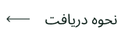

<!-- 
 -->

## زبان

&nbsp;&nbsp;&nbsp;&nbsp;&nbsp;&nbsp;&nbsp;&nbsp;&nbsp;&nbsp;&nbsp;&nbsp;&nbsp;&nbsp;&nbsp;&nbsp;&nbsp;&nbsp;&nbsp;&nbsp;&nbsp;&nbsp;&nbsp;&nbsp;&nbsp;&nbsp;&nbsp;&nbsp;&nbsp;&nbsp;&nbsp;&nbsp;&nbsp;&nbsp;&nbsp;&nbsp;&nbsp;&nbsp;&nbsp;&nbsp;&nbsp;&nbsp;&nbsp;&nbsp;&nbsp;&nbsp;

&nbsp;&nbsp;&nbsp;&nbsp;&nbsp;&nbsp;&nbsp;&nbsp;&nbsp;&nbsp;&nbsp;&nbsp;&nbsp;&nbsp;&nbsp;&nbsp;&nbsp;&nbsp;&nbsp;&nbsp;&nbsp;&nbsp;&nbsp;&nbsp;&nbsp;&nbsp;&nbsp;&nbsp;&nbsp;&nbsp;&nbsp;&nbsp;&nbsp;&nbsp;&nbsp;&nbsp;&nbsp;&nbsp;&nbsp;&nbsp;&nbsp;&nbsp;&nbsp;&nbsp;&nbsp;&nbsp;

# پین های گیت هاب 🏆

 

  <picture>
    <source media="(prefers-color-scheme: light)" srcset="https://user-images.githubusercontent.com/65187002/172940015-d9d072e7-c47d-4ddd-83f6-8e7717a721b8.png">
    
  </picture> 
  <picture>
    <source media="(prefers-color-scheme: light)" srcset="https://user-images.githubusercontent.com/65187002/172941127-4061fac1-736b-4c24-b7ea-c210b3578cc5.png">
    
  </picture>

 

# پین ها و تنظیمات نمایش آن 🏅

#### دستاورد ها پین هایی هستند که گیت هاب به نسبت فعالیت هایی خاص به عنوان جایزه به اکانت گیت هاب شما اهدا میکند و در پروفایلتان قابل رویت است این دستاورد ها جلوه مناسبی به اکانت گیت هاب شما میدهد و میتواند نشانگر میزان فعالیت شما و چگونگی فعالیت شما باشد .

#### می‌توانید با رفتن به [تنظیمات نمایه](https://github.com/settings) خود از نمایش دستاوردها در نمایه خود انصراف دهید.

#### در اینجا ما به شما نشان می دهیم که چگونه پین ​​دستاورد GitHub را گام به گام دریافت کنید :)

 

# لیست پین ها 📃

 

## پین Quickdraw

### این پین یکی از ساده ترین راه ها را برای دریافت دارد. و فقط با چند قدم می توانید آن را دریافت کنید. برای به دست آوردن این دستاورد باید . (بستن یک issue یا pull request را ظرف 5 دقیقه پس از باز کردن بست)

#### - اگر نیازمند کمک بیشتری هستید میتوانید بر روی دکمه نحوه دریافت کلیک کرده , و از آموزش قدم به قدم نحوه دریافت این پین استفاده کنید

 

## پین Yolo

### این پین یکی از زیباترین پین های Github است که می تواند جلوه بسیار زیبایی به پروفایل Github شما بدهد. برای دریافت این پین، باید یک Pull Request را بدون بازبینی(ًReview) ادغام کنید.

#### - اگر نیازمند کمک بیشتری هستید میتوانید بر روی دکمه نحوه دریافت کلیک کرده , و از آموزش قدم به قدم نحوه دریافت این پین استفاده کنید

 

## پین Galaxy Brain

### دریافت Galaxy Brain نسبت به دو دستاورد قبلی دشوارتر است. و برای دریافت آن باید مراحلی را طی کنید که به سایر کاربران گیت هاب نیاز دارید. شما باید: به یک بحث پاسخ دهید (باید پاسخ شما به عنوان پاسخ به سوال توسط پرسشگر سوال دو مرتبه انتخاب شود.)

#### - اگر نیازمند کمک بیشتری هستید میتوانید بر روی دکمه نحوه دریافت کلیک کرده , و از آموزش قدم به قدم نحوه دریافت این پین استفاده کنید

 

## پین Pull Shark

### برای گرفتن  پین pull shark باید 2 درخواست کشش ( Pull Request ) ادغام شده داشته باشید. 

#### - اگر نیازمند کمک بیشتری هستید میتوانید بر روی دکمه نحوه دریافت کلیک کرده , و از آموزش قدم به قدم نحوه دریافت این پین استفاده کنید

 

## پین Starstruck

### دریافت Starstruck بسیار ساده است و مراحل کمی برای دریافت Starstruck دارید. شما می توانید این دستاورد را زمانی دریافت کنید که یک مخزن در حساب شما به 16 ستاره برسد.

#### - اگر نیازمند کمک بیشتری هستید میتوانید بر روی دکمه نحوه دریافت کلیک کرده , و از آموزش قدم به قدم نحوه دریافت این پین استفاده کنید

 

## پین Pair Extraordinaire

### با ایجاد یک branch جدید میبایست یک pull request به همراه یک هم تیم (co-author) یک commit مشترک بزنید و آنرا به ریپازیتوری خود merge کنید 

#### - اگر نیازمند کمک بیشتری هستید میتوانید بر روی دکمه نحوه دریافت کلیک کرده , و از آموزش قدم به قدم نحوه دریافت این پین استفاده کنید

 

## پین Public Sponsor

### شما فقط باید به برخی از مشارکت کنندگان open course کمک مالی کنید.

#### - اگر نیازمند کمک بیشتری هستید میتوانید بر روی دکمه نحوه دریافت کلیک کرده , و از آموزش قدم به قدم نحوه دریافت این پین استفاده کنید

 

# پین های منتشر نشده⏳ 

 

## پین Heart On Your Sleeve  

### پین های دستاورد «Heart On Your Sleeve» در حال حاضر برای کاربران عمومی GitHub منتشر نشده است. 

 

##  پین Open Sourcerer

### پین های دستاورد Open Sourcerer در حال حاضر برای کاربران عمومی GitHub منتشر نشده است.

 

# پین هایی که دیگر قابل کسب نیستند ❌ 

 

## پین Mars 2020 Contributor 

### این پین تنها به افرادی که در سال 2020 در یک سری پروژه های منتخب (لینوکس-بوت استرپ-آپاچی و...) مشارکت داشته اند داده شده بود 

## پین Arctic Code Vault Contributor

### این پین به اشخاصی که در سال 2021 به طور همزمان بر روی پنج پروژه در یک روز کار کرده اند و بر روی همه این پنج پروژه در یک روز کامیت خورده باشن . داده شده بود 

 

# رنگ پوست پین ها 👋

 

#### ظاهر برخی از دستاوردها به ترجیح رنگ پوست Emoji شما بستگی دارد.

#### با رفتن به به این بخش میتوانید رتگ پوست دلخواه خود را تغییر دهید . [appearance settings](https://github.com/settings/appearance).

<h4>Starstuck Skin Tone Versions</h4>

<h4>Quikdraw Skin Tone Versions</h4>

 

# اطلاعات بیشتر ℹ

 

#### میتوانید اطلاعات بیشتری راجع به پیت های GitHub در این آدرس پیدا کنید [اطلاعات بیشتر](https://docs.github.com/en/account-and-profile/setting-up-and-managing-your-github-profile/customizing-your-profile/personalizing-your-profile#displaying-badges-on-your-profile).

<!-- 
 -->
 

####                 

