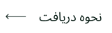

<!-- 
 -->

## زبان

|                                                                                                                                        |                                                                                                                                         |                                                                                                                                                   |                                                                                                                                           |                                                                                                                                           |                                                                                                                                          |
|:--------------------------------------------------------------------------------------------------------------------------------------:|:---------------------------------------------------------------------------------------------------------------------------------------:|:-------------------------------------------------------------------------------------------------------------------------------------------------:|:-----------------------------------------------------------------------------------------------------------------------------------------:|:-----------------------------------------------------------------------------------------------------------------------------------------:|:----------------------------------------------------------------------------------------------------------------------------------------:|
|     |  |             |   |    |  |
|     |      |  |      |  |    |
|  |  |          |  |    |  |

# پین‌های گیت‌هاب 🏆

 

  <picture>
    <source media="(prefers-color-scheme: light)" srcset="https://user-images.githubusercontent.com/65187002/172940015-d9d072e7-c47d-4ddd-83f6-8e7717a721b8.png">
    
  </picture> 
  <picture>
    <source media="(prefers-color-scheme: light)" srcset="https://user-images.githubusercontent.com/65187002/172941127-4061fac1-736b-4c24-b7ea-c210b3578cc5.png">
    
  </picture>

 

# چگونه پین‌های گیت‌هاب را دریافت کنیم

## در این آموزش به شما مرحله‌به‌مرحله, آموزش گرفتن پین‌های گیت‌هاب آموزش داده می‌شود

### نکته‌ها:

#### نکته 1: آموزش‌ها در صفحه فعلی به صورت کلیات به شما داده می‌شود, در صورتی که آموزش بیشتر و تصویری نیاز بود. حتما بر روی دکمه نحوه دریافت در انتهای هر بخش کلیک کرده به صفحه آموزش قدم‌به‌قدم بروید.

#### نکته 2: آموزش دریافت پین‌های گیت‌هاب, به صورت تصویری و قدم‌به‌قدم می‌باشد.

#### نکته 3: در صورتی که در قسمت مشکل و ایرادی پیدا کردید و نیاز به تغییر در هر بخشی شاهد بودید لطفا آن را به ما [گزارش](https://github.com/4xmen/Get-Github-Achievements/issues/new) کنید و ما را در بهبود هر چه بیشتر این کورس یاری کنید.

 

# پین‌ها و تنظیمات نمایش آن 🏅

#### دستاوردها پین‌هایی هستند که گیت‌هاب به نسبت فعالیت‌هایی خاص به عنوان جایزه به اکانت گیت‌هاب شما اهدا می‌کند و در پروفایل‌تان قابل رویت است این دستاوردها جلوه مناسبی به اکانت گیت‌هاب شما می‌دهد و می‌تواند نشانگر میزان فعالیت شما و چگونگی فعالیت شما باشد .

#### می‌توانید با رفتن به [تنظیمات نمایه](https://github.com/settings) خود از نمایش دستاوردها در نمایه خود انصراف دهید.

#### در اینجا ما به شما نشان می‌دهیم که چگونه پین ​​دستاورد GitHub را گام‌به‌گام دریافت کنید :)

 

# لیست پین‌ها 📃

 

## چگونه پین Quickdraw را دریافت کنیم

### این پین یکی از ساده‌ترین راه‌ها را برای دریافت دارد. و فقط با چند قدم می‌توانید آن را دریافت کنید. برای به دست آوردن این دستاورد باید . (بستن یک issue یا pull request را ظرف 5 دقیقه پس از باز کردن بست)

#### - اگر نیازمند کمک بیشتری هستید می‌توانید بر روی دکمه نحوه دریافت کلیک کرده , و از آموزش قدم‌به‌قدم نحوه دریافت این پین استفاده کنید

 

## چگونه پین Yolo را دریافت کنیم

### این پین یکی از زیباترین پین‌های Github است که می‌تواند جلوه بسیار زیبایی به پروفایل Github شما بدهد. برای دریافت این پین، باید یک Pull Request را بدون بازبینی(ًReview) ادغام کنید.

#### - اگر نیازمند کمک بیشتری هستید می‌توانید بر روی دکمه نحوه دریافت کلیک کرده , و از آموزش قدم‌به‌قدم نحوه دریافت این پین استفاده کنید

 

## چگونه پین Galaxy Brain را دریافت کنیم

### دریافت Galaxy Brain نسبت به دو دستاورد قبلی دشوارتر است. و برای دریافت آن باید مراحلی را طی کنید که به سایر کاربران گیت‌هاب نیاز دارید. شما باید: به یک بحث پاسخ دهید (باید پاسخ شما به عنوان پاسخ به سوال توسط پرسشگر سوال دو مرتبه انتخاب شود.)

#### - اگر نیازمند کمک بیشتری هستید می‌توانید بر روی دکمه نحوه دریافت کلیک کرده , و از آموزش قدم‌به‌قدم نحوه دریافت این پین استفاده کنید

 

## چگونه پین Pull Shark را دریافت کنیم

### برای گرفتن پین pull shark باید 2 درخواست کشش ( Pull Request ) ادغام شده داشته باشید.

#### - اگر نیازمند کمک بیشتری هستید می‌توانید بر روی دکمه نحوه دریافت کلیک کرده , و از آموزش قدم‌به‌قدم نحوه دریافت این پین استفاده کنید

 

## چگونه پین Starstruck را دریافت کنیم

### دریافت Starstruck بسیار ساده است و مراحل کمی برای دریافت Starstruck دارید. شما می‌توانید این دستاورد را زمانی دریافت کنید که یک مخزن در حساب شما به 16 ستاره برسد.

#### - اگر نیازمند کمک بیشتری هستید می‌توانید بر روی دکمه نحوه دریافت کلیک کرده , و از آموزش قدم‌به‌قدم نحوه دریافت این پین استفاده کنید

 

## چگونه پین Pair Extraordinaire را دریافت کنیم

### با ایجاد یک branch جدید می‌بایست یک pull request به همراه یک هم‌تیم (co-author) یک commit مشترک بزنید و آن را به ریپازیتوری خود merge کنید

#### - اگر نیازمند کمک بیشتری هستید می‌توانید بر روی دکمه نحوه دریافت کلیک کرده , و از آموزش قدم‌به‌قدم نحوه دریافت این پین استفاده کنید

 

## چگونه پین Public Sponsor را دریافت کنیم

### شما فقط باید به برخی از مشارکت‌کنندگان open course کمک مالی کنید.

#### - اگر نیازمند کمک بیشتری هستید می‌توانید بر روی دکمه نحوه دریافت کلیک کرده , و از آموزش قدم‌به‌قدم نحوه دریافت این پین استفاده کنید

 

# پین‌های منتشر نشده⏳

 

## پین Heart On Your Sleeve

### پین‌های دستاورد «Heart On Your Sleeve» در حال حاضر برای کاربران عمومی GitHub منتشر نشده است.

 

## پین Open Sourcerer

### پین‌های دستاورد Open Sourcerer در حال حاضر برای کاربران عمومی GitHub منتشر نشده است.

 

# پین‌هایی که دیگر قابل کسب نیستند ❌

 

## پین Mars 2020 Contributor

### این پین تنها به افرادی که در سال 2020 در یک سری پروژه‌های منتخب (لینوکس-بوت‌استرپ-آپاچی و...) مشارکت داشته‌اند داده شده بود

## پین Arctic Code Vault Contributor

### این پین به اشخاصی که در سال 2021 به طور همزمان بر روی پنج پروژه در یک روز کار کرده‌اند و بر روی همه این پنج پروژه در یک روز کامیت خورده باشن . داده شده بود

 

# رنگ پوست پین‌ها 👋

 

#### ظاهر برخی از دستاوردها به ترجیح رنگ پوست Emoji شما بستگی دارد.

#### با رفتن به به این بخش می‌توانید رنگ پوست دلخواه خود را تغییر دهید . [appearance settings](https://github.com/settings/appearance).

<h4>Starstuck Skin Tone Versions</h4>

<h4>Quikdraw Skin Tone Versions</h4>

 

# اطلاعات بیشتر ℹ

 

#### می‌توانید اطلاعات بیشتری راجع به پین‌های GitHub در این آدرس پیدا کنید [اطلاعات بیشتر](https://docs.github.com/en/account-and-profile/setting-up-and-managing-your-github-profile/customizing-your-profile/personalizing-your-profile#displaying-badges-on-your-profile).

<!-- 
 -->
 

####                   

