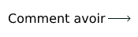

<!-- 
 -->

## Langue

  

&nbsp;&nbsp;&nbsp;&nbsp;&nbsp;&nbsp;&nbsp;&nbsp;&nbsp;&nbsp;&nbsp;&nbsp;&nbsp;&nbsp;&nbsp;&nbsp;&nbsp;&nbsp;&nbsp;&nbsp;&nbsp;&nbsp;&nbsp;&nbsp;&nbsp;

&nbsp;&nbsp;&nbsp;&nbsp;&nbsp;&nbsp;&nbsp;&nbsp;&nbsp;&nbsp;&nbsp;&nbsp;&nbsp;&nbsp;&nbsp;&nbsp;&nbsp;&nbsp;&nbsp;&nbsp;&nbsp;&nbsp;&nbsp;&nbsp;&nbsp;

&nbsp;&nbsp;&nbsp;&nbsp;&nbsp;&nbsp;&nbsp;&nbsp;&nbsp;&nbsp;&nbsp;&nbsp;&nbsp;&nbsp;&nbsp;&nbsp;&nbsp;&nbsp;&nbsp;&nbsp;&nbsp;&nbsp;&nbsp;&nbsp;&nbsp;

&nbsp;&nbsp;&nbsp;&nbsp;&nbsp;&nbsp;&nbsp;&nbsp;&nbsp;&nbsp;&nbsp;&nbsp;&nbsp;&nbsp;&nbsp;&nbsp;&nbsp;&nbsp;&nbsp;&nbsp;&nbsp;&nbsp;&nbsp;&nbsp;&nbsp;

&nbsp;&nbsp;&nbsp;&nbsp;&nbsp;&nbsp;&nbsp;&nbsp;&nbsp;&nbsp;&nbsp;&nbsp;&nbsp;&nbsp;&nbsp;&nbsp;&nbsp;&nbsp;&nbsp;&nbsp;&nbsp;&nbsp;&nbsp;&nbsp;&nbsp;

&nbsp;&nbsp;&nbsp;&nbsp;&nbsp;&nbsp;&nbsp;&nbsp;&nbsp;&nbsp;&nbsp;&nbsp;&nbsp;&nbsp;&nbsp;&nbsp;&nbsp;&nbsp;&nbsp;&nbsp;&nbsp;&nbsp;&nbsp;&nbsp;&nbsp;

&nbsp;&nbsp;&nbsp;&nbsp;&nbsp;&nbsp;&nbsp;&nbsp;&nbsp;&nbsp;&nbsp;&nbsp;&nbsp;&nbsp;&nbsp;&nbsp;&nbsp;&nbsp;&nbsp;&nbsp;&nbsp;&nbsp;&nbsp;&nbsp;&nbsp;

&nbsp;&nbsp;&nbsp;&nbsp;&nbsp;&nbsp;&nbsp;&nbsp;&nbsp;&nbsp;&nbsp;&nbsp;&nbsp;&nbsp;&nbsp;&nbsp;&nbsp;&nbsp;&nbsp;&nbsp;&nbsp;&nbsp;&nbsp;&nbsp;&nbsp;

&nbsp;&nbsp;&nbsp;&nbsp;&nbsp;&nbsp;&nbsp;&nbsp;&nbsp;&nbsp;&nbsp;&nbsp;&nbsp;&nbsp;&nbsp;&nbsp;&nbsp;&nbsp;&nbsp;&nbsp;&nbsp;&nbsp;&nbsp;&nbsp;&nbsp;

# Réalisations GitHub 🏆

 

  <picture>
    <source media="(prefers-color-scheme: light)" srcset="https://user-images.githubusercontent.com/65187002/172940015-d9d072e7-c47d-4ddd-83f6-8e7717a721b8.png">
    
  </picture> 
  <picture>
    <source media="(prefers-color-scheme: light)" srcset="https://user-images.githubusercontent.com/65187002/172941127-4061fac1-736b-4c24-b7ea-c210b3578cc5.png">
    
  </picture>

 

# Comment obtenir les réalisations GitHub

## Dans ce cours, vous apprendrez étape par étape comment obtenir des réalisations GitHub.

### Remarques :

#### Remarque 1 : Si vous rencontrez des problèmes pour recevoir des réalisations, vous pouvez utiliser la formation étape par étape dans la section sur la façon de les recevoir.

#### Remarque 2 : Tous les tutoriels sont accompagnés de photos et chaque étape est entièrement expliquée.

#### Remarque 3 : Si vous trouvez un problème ou un bug, veuillez nous le [signaler](https://github.com/4xmen/Get-Github-Achievements/issues/new) .Et aidez-nous à améliorer le cours.

 

# Réalisations et affichage 🏅

#### Les réalisations sont des épinglettes que GitHub donne à votre compte GitHub en récompense de certaines activités et peuvent être consultées dans votre profil. Ces réalisations donnent un bon effet à votre compte GitHub et peuvent indiquer le niveau de votre activité et votre niveau d'engagement.

#### Vous pouvez choisir de ne pas afficher les réalisations sur votre profil en accédant aux paramètres de votre [profil](https://github.com/settings).

#### Nous vous montrons ici comment obtenir l'épingle de réalisation GitHub étape par étape :)

 

# Liste des réalisations 📃

 

## Comment obtenir la réalisation QuickDraw

### QuickDraw est l'une des réalisations les plus faciles à obtenir. Vous pouvez la recevoir en ne faisant que quelques étapes. Pour obtenir cette réalisation, vous devez (fermer une issue/ une demande de fusion dans les 5 minutes suivant l'ouverture)

#### - Si vous avez besoin de plus d'aide, cliquez sur le bouton Comment obtenir pour obtenir un tutoriel étape par étape sur la façon d'obtenir cette réalisation.

 

## Comment obtenir la réalisation Yolo

### Yolo est l'une des réalisations les plus belles de Github, qui peut donner un effet très beau à votre profil Github. Pour obtenir cette réalisation, vous devez fusionner une demande de fusion sans examen préalable.

#### - Si vous avez besoin de plus d'aide, cliquez sur le bouton Comment obtenir pour obtenir un tutoriel étape par étape sur la façon d'obtenir cette réalisation.

 

## Comment obtenir la réalisation Cerveau galactique

### Obtenir la réalisation Cerveau galactique est plus difficile que les deux réalisations précédentes. Et pour la recevoir, vous devez passer par les étapes que vous avez besoin d'autres utilisateurs GitHub. Vous devez : répondre à une discussion (obtenir une réponse acceptée deux fois).

#### - Si vous avez besoin de plus d'aide, cliquez sur le bouton Comment obtenir pour obtenir un tutoriel étape par étape sur la façon d'obtenir cette réalisation.

 

## Comment obtenir la réalisation Pull Shark

### Pour obtenir Pull Shark, vous devez effectuer 2 demandes de fusion fusionnées, vous obtiendrez un badge Pull Shark.

#### - Si vous avez besoin de plus d'aide, cliquez sur le bouton Comment obtenir pour obtenir un tutoriel étape par étape sur la façon d'obtenir cette réalisation.

 

## Comment obtenir la réalisation Starstruck

### C'est trop simple pour obtenir la réalisation Starstruck et vous avez quelques étapes à suivre pour l'obtenir. Vous pouvez obtenir cette réalisation lorsqu'un référentiel de votre compte atteint 16 étoiles, même s'il a été transféré, vous recevrez le badge.

#### - Si vous avez besoin de plus d'aide, cliquez sur le bouton Comment obtenir pour obtenir un tutoriel étape par étape sur la façon d'obtenir cette réalisation.

 

## Comment obtenir la réalisation Pair Extraordinaire

### Vous pouvez gagner le badge de la paire extraordinaire en co-écrivant une demande de fusion qui est ensuite fusionnée.

#### - Si vous avez besoin de plus d'aide, cliquez sur le bouton Comment obtenir pour obtenir un tutoriel étape par étape sur la façon d'obtenir cette réalisation.

 

## Comment obtenir la réalisation Public Sponsor

### Vous devez simplement faire un don à un contributeur open source.

#### - Si vous avez besoin de plus d'aide, cliquez sur le bouton Comment obtenir pour obtenir un tutoriel étape par étape sur la façon d'obtenir cette réalisation.

 

# Réalisations non publiées ⏳

 

## Heart On Your Sleeve

### Le badge de réalisation "Heart On Your Sleeve" n'est pas encore publié pour les utilisateurs de GitHub publics pour le moment.

 

## Open Sourcerer

### Le badge de réalisation "Open Sourcerer" n'est pas encore publié pour les utilisateurs de GitHub publics pour le moment.

 

# Badges non gagnables ❌

 

## Contributeur Mars 2020

### A contribué du code à un référentiel utilisé dans la mission de l'hélicoptère Mars 2020.

## Contributeur de l'Arctic Code Vault

### A contribué du code à un référentiel dans le cadre du programme d'archivage de GitHub en 2020.

 

# Couleur de peau de réalisation 👋

 

#### L'apparence de certaines réalisations dépend de votre préférence de couleur de peau Emoji.

#### Vous pouvez modifier votre couleur de peau préférée en accédant aux [paramètres d'apparence](https://github.com/settings/appearance).

<h4>Versions de tons de peau Starstuck</h4>

<h4>Versions Quikdraw Skin Tone</h4>

 

# Plus d'informations ℹ

 

#### Vous pouvez trouver plus d'informations sur les badges GitHub sous ce [lien](https://docs.github.com/en/account-and-profile/setting-up-and-managing-your-github-profile/customizing-your-profile/personalizing-your-profile#displaying-badges-on-your-profile).

<!-- 
 -->
 

####          

