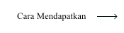

<!-- 
 -->

## Bahasa

  

&nbsp;&nbsp;&nbsp;&nbsp;&nbsp;&nbsp;&nbsp;&nbsp;&nbsp;&nbsp;&nbsp;&nbsp;&nbsp;&nbsp;&nbsp;&nbsp;&nbsp;&nbsp;&nbsp;&nbsp;&nbsp;&nbsp;&nbsp;&nbsp;&nbsp;

&nbsp;&nbsp;&nbsp;&nbsp;&nbsp;&nbsp;&nbsp;&nbsp;&nbsp;&nbsp;&nbsp;&nbsp;&nbsp;&nbsp;&nbsp;&nbsp;&nbsp;&nbsp;&nbsp;&nbsp;&nbsp;&nbsp;&nbsp;&nbsp;&nbsp;

&nbsp;&nbsp;&nbsp;&nbsp;&nbsp;&nbsp;&nbsp;&nbsp;&nbsp;&nbsp;&nbsp;&nbsp;&nbsp;&nbsp;&nbsp;&nbsp;&nbsp;&nbsp;&nbsp;&nbsp;&nbsp;&nbsp;&nbsp;&nbsp;&nbsp;

&nbsp;&nbsp;&nbsp;&nbsp;&nbsp;&nbsp;&nbsp;&nbsp;&nbsp;&nbsp;&nbsp;&nbsp;&nbsp;&nbsp;&nbsp;&nbsp;&nbsp;&nbsp;&nbsp;&nbsp;&nbsp;&nbsp;&nbsp;&nbsp;&nbsp;

&nbsp;&nbsp;&nbsp;&nbsp;&nbsp;&nbsp;&nbsp;&nbsp;&nbsp;&nbsp;&nbsp;&nbsp;&nbsp;&nbsp;&nbsp;&nbsp;&nbsp;&nbsp;&nbsp;&nbsp;&nbsp;&nbsp;&nbsp;&nbsp;&nbsp;

&nbsp;&nbsp;&nbsp;&nbsp;&nbsp;&nbsp;&nbsp;&nbsp;&nbsp;&nbsp;&nbsp;&nbsp;&nbsp;&nbsp;&nbsp;&nbsp;&nbsp;&nbsp;&nbsp;&nbsp;&nbsp;&nbsp;&nbsp;&nbsp;&nbsp;

&nbsp;&nbsp;&nbsp;&nbsp;&nbsp;&nbsp;&nbsp;&nbsp;&nbsp;&nbsp;&nbsp;&nbsp;&nbsp;&nbsp;&nbsp;&nbsp;&nbsp;&nbsp;&nbsp;&nbsp;&nbsp;&nbsp;&nbsp;&nbsp;&nbsp;

&nbsp;&nbsp;&nbsp;&nbsp;&nbsp;&nbsp;&nbsp;&nbsp;&nbsp;&nbsp;&nbsp;&nbsp;&nbsp;&nbsp;&nbsp;&nbsp;&nbsp;&nbsp;&nbsp;&nbsp;&nbsp;&nbsp;&nbsp;&nbsp;&nbsp;

&nbsp;&nbsp;&nbsp;&nbsp;&nbsp;&nbsp;&nbsp;&nbsp;&nbsp;&nbsp;&nbsp;&nbsp;&nbsp;&nbsp;&nbsp;&nbsp;&nbsp;&nbsp;&nbsp;&nbsp;&nbsp;&nbsp;&nbsp;&nbsp;&nbsp;

&nbsp;&nbsp;&nbsp;&nbsp;&nbsp;&nbsp;&nbsp;&nbsp;&nbsp;&nbsp;&nbsp;&nbsp;&nbsp;&nbsp;&nbsp;&nbsp;&nbsp;&nbsp;&nbsp;&nbsp;&nbsp;&nbsp;&nbsp;&nbsp;&nbsp;

# Prestasi GitHub 🏆

 

  <picture>
    <source media="(prefers-color-scheme: light)" srcset="https://user-images.githubusercontent.com/65187002/172940015-d9d072e7-c47d-4ddd-83f6-8e7717a721b8.png">
    
  </picture> 
  <picture>
    <source media="(prefers-color-scheme: light)" srcset="https://user-images.githubusercontent.com/65187002/172941127-4061fac1-736b-4c24-b7ea-c210b3578cc5.png">
    
  </picture>

 

# Cara Mendapatkan Prestasi GitHub

## Anda akan diajarkan langkah demi langkah cara mendapatkan prestasi GitHub dalam kursus ini.

### Catatan:

#### Catatan 1: Jika Anda mengalami masalah dalam menerima prestasi, Anda dapat menggunakan pelatihan langkah demi langkah di bagian cara menerimanya.

#### Catatan 2: Semua tutorial dilengkapi dengan foto, dan setiap langkah dijelaskan sepenuhnya.

#### Catatan 3: Jika Anda menemui masalah atau bug, harap [laporkan](https://github.com/4xmen/Get-Github-Achievements/issues/new) kepada kami. Dan bantu kami untuk meningkatkan kursus ini.

 

# Prestasi & Tampilan 🏅

#### Prestasi adalah pin yang diberikan GitHub ke akun GitHub Anda sebagai penghargaan untuk aktivitas tertentu dan dapat dilihat di profil Anda. Prestasi ini memberikan efek positif pada akun GitHub Anda dan dapat menunjukkan seberapa aktifnya Anda.

#### Anda dapat memilih untuk tidak menampilkan prestasi di profil Anda dengan pergi ke [pengaturan profil](https://github.com/settings).

#### Di sini kami menunjukkan cara mendapatkan pin Prestasi GitHub langkah demi langkah :)

 

# Daftar Prestasi 📃

 

## Cara Mendapatkan Prestasi Quickdraw

### Quickdraw adalah salah satu prestasi tercepat untuk diterima. Ini hanya memerlukan beberapa langkah. Untuk mendapatkan prestasi ini, Anda harus (menutup issue / pull request dalam waktu 5 menit setelah dibuka)

#### - Jika Anda memerlukan bantuan lebih lanjut, klik pada tombol Cara Mendapatkan untuk mendapatkan tutorial langkah demi langkah tentang cara mendapatkan prestasi ini.

 

## Cara Mendapatkan Prestasi Yolo

### Yolo adalah salah satu prestasi terindah di GitHub, yang dapat memberikan efek sangat bagus pada profil GitHub Anda. Untuk mendapatkan prestasi ini, Anda perlu melakukan Merge pull request tanpa tinjauan.

#### - Jika Anda memerlukan bantuan lebih lanjut, klik pada tombol Cara Mendapatkan untuk mendapatkan tutorial langkah demi langkah tentang cara mendapatkan prestasi ini.

 

## Cara Mendapatkan Prestasi Galaxy Brain

### Mendapatkan Galaxy Brain lebih sulit daripada dua prestasi sebelumnya. Dan untuk menerimanya, Anda perlu menjalani langkah-langkah yang membutuhkan pengguna GitHub lain. Anda perlu: Menjawab diskusi (mendapatkan jawaban diterima dua kali)

#### - Jika Anda memerlukan bantuan lebih lanjut, klik pada tombol Cara Mendapatkan untuk mendapatkan tutorial langkah demi langkah tentang cara mendapatkan prestasi ini.

 

## Cara Mendapatkan Prestasi Pull Shark

### Untuk mendapatkan pull shark, Anda perlu membuat 2 pull request yang di-merge, Anda akan mendapatkan satu pin pull shark.

#### - Jika Anda memerlukan bantuan lebih lanjut, klik pada tombol Cara Mendapatkan untuk mendapatkan tutorial langkah demi langkah tentang cara mendapatkan prestasi ini.

 

## Cara Mendapatkan Prestasi Starstruck

### Sangat mudah untuk mendapatkan Prestasi Starstruck dan Anda hanya perlu beberapa langkah untuk mendapatkannya. Anda bisa mendapatkan Prestasi ini ketika sebuah Repositori di akun Anda mencapai 16 bintang, bahkan jika itu dipindahkan, Anda akan menerima badge.

#### - Jika Anda membutuhkan bantuan lebih lanjut, klik tombol Cara Mendapatkan untuk mendapatkan tutorial langkah demi langkah tentang cara mendapatkan prestasi ini.

 

## Cara Mendapatkan Prestasi Pair Extraordinaire

### Anda dapat mendapatkan lencana pair extraordinaire dengan menjadi co-author pada pull request yang kemudian di-merge.

#### - Jika Anda membutuhkan bantuan lebih lanjut, klik tombol Cara Mendapatkan untuk mendapatkan tutorial langkah demi langkah tentang cara mendapatkan prestasi ini.

 

## Cara Mendapatkan Prestasi Public Sponsor

### Anda hanya perlu melakukan sumbangan kepada beberapa kontributor sumber terbuka.

#### - Jika Anda membutuhkan bantuan lebih lanjut, klik tombol Cara Mendapatkan untuk mendapatkan tutorial langkah demi langkah tentang cara mendapatkan prestasi ini.

 

# Prestasi Sedang Diuji ⏳

 

## Heart On Your Sleeve

### Lencana prestasi 'Heart On Your Sleeve' sedang diuji, setelah rilis resmi. Tutorial langkah demi langkah akan disediakan untuk menerimanya.

 

## Open Sourcerer

### Lencana prestasi 'Open Sourcerer' sedang diuji, setelah rilis resmi. Tutorial langkah demi langkah akan disediakan untuk menerimanya.

 

# Badge yang Tidak Dapat Diperoleh Lagi ❌

 

## Kontributor Mars 2020

### Berkontribusi pada kode repositori yang digunakan dalam Misi Helikopter Mars 2020

## Kontributor Vault Kode Arktik

### Berkontribusi pada kode repositori dalam Program Arsip GitHub 2020

 

# Warna Kulit Prestasi 👋

 

#### Tampilan beberapa prestasi bergantung pada Preferensi Warna Kulit Emoji Anda.

#### Anda dapat mengubah Preferensi Warna Kulit Anda dengan pergi ke [pengaturan penampilan](https://github.com/settings/appearance).

<h4>Versi Warna Kulit Starstuck</h4>

<h4>Versi Warna Kulit Quickdraw</h4>

 

# Sorotan Lencana ✨
 

| Lencana | Nama | Cara Mendapatkan |
| :-: | :-: | :-: |
|   | Pro | Use [GitHub Pro](https://docs.github.com/en/get-started/learning-about-github/githubs-products#github-pro) |
|  | Developer Program Member | Be a registered member of the [GitHub Developer Program](https://docs.github.com/en/developers/overview/github-developer-program) |
|  | Security Bug Bounty Hunter | Helped out hunting down security vulnerabilities at [GitHub Security](https://bounty.github.com/) |
|  | GitHub Campus Expert | Participate in the [GitHub Campus Program](https://education.github.com/experts) |
|  | Security advisory credit | Have your security advisory submitted to the [GitHub Advisory Database](https://github.com/advisories) accepted |

# Informasi selengkapnya ℹ

 

#### Kamu bisa menemukan informasi selengkapnya tentang lencana github disini [ link](https://docs.github.com/en/account-and-profile/setting-up-and-managing-your-github-profile/customizing-your-profile/personalizing-your-profile#displaying-badges-on-your-profile).

<!-- 
 -->
 

####          

