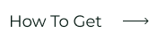
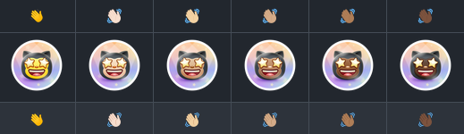

<!-- 
 -->

## Language

&nbsp;&nbsp;&nbsp;&nbsp;&nbsp;&nbsp;&nbsp;&nbsp;&nbsp;&nbsp;&nbsp;&nbsp;&nbsp;&nbsp;&nbsp;&nbsp;&nbsp;&nbsp;&nbsp;&nbsp;&nbsp;&nbsp;&nbsp;&nbsp;&nbsp;

&nbsp;&nbsp;&nbsp;&nbsp;&nbsp;&nbsp;&nbsp;&nbsp;&nbsp;&nbsp;&nbsp;&nbsp;&nbsp;&nbsp;&nbsp;&nbsp;&nbsp;&nbsp;&nbsp;&nbsp;&nbsp;&nbsp;&nbsp;&nbsp;&nbsp;

&nbsp;&nbsp;&nbsp;&nbsp;&nbsp;&nbsp;&nbsp;&nbsp;&nbsp;&nbsp;&nbsp;&nbsp;&nbsp;&nbsp;&nbsp;&nbsp;&nbsp;&nbsp;&nbsp;&nbsp;&nbsp;&nbsp;&nbsp;&nbsp;&nbsp;

&nbsp;&nbsp;&nbsp;&nbsp;&nbsp;&nbsp;&nbsp;&nbsp;&nbsp;&nbsp;&nbsp;&nbsp;&nbsp;&nbsp;&nbsp;&nbsp;&nbsp;&nbsp;&nbsp;&nbsp;&nbsp;&nbsp;&nbsp;&nbsp;&nbsp;

&nbsp;&nbsp;&nbsp;&nbsp;&nbsp;&nbsp;&nbsp;&nbsp;&nbsp;&nbsp;&nbsp;&nbsp;&nbsp;&nbsp;&nbsp;&nbsp;&nbsp;&nbsp;&nbsp;&nbsp;&nbsp;&nbsp;&nbsp;&nbsp;&nbsp;

&nbsp;&nbsp;&nbsp;&nbsp;&nbsp;&nbsp;&nbsp;&nbsp;&nbsp;&nbsp;&nbsp;&nbsp;&nbsp;&nbsp;&nbsp;&nbsp;&nbsp;&nbsp;&nbsp;&nbsp;&nbsp;&nbsp;&nbsp;&nbsp;&nbsp;

&nbsp;&nbsp;&nbsp;&nbsp;&nbsp;&nbsp;&nbsp;&nbsp;&nbsp;&nbsp;&nbsp;&nbsp;&nbsp;&nbsp;&nbsp;&nbsp;&nbsp;&nbsp;&nbsp;&nbsp;&nbsp;&nbsp;&nbsp;&nbsp;&nbsp;

&nbsp;&nbsp;&nbsp;&nbsp;&nbsp;&nbsp;&nbsp;&nbsp;&nbsp;&nbsp;&nbsp;&nbsp;&nbsp;&nbsp;&nbsp;&nbsp;&nbsp;&nbsp;&nbsp;&nbsp;&nbsp;&nbsp;&nbsp;&nbsp;&nbsp;

&nbsp;&nbsp;&nbsp;&nbsp;&nbsp;&nbsp;&nbsp;&nbsp;&nbsp;&nbsp;&nbsp;&nbsp;&nbsp;&nbsp;&nbsp;&nbsp;&nbsp;&nbsp;&nbsp;&nbsp;&nbsp;&nbsp;&nbsp;&nbsp;&nbsp;

&nbsp;&nbsp;&nbsp;&nbsp;&nbsp;&nbsp;&nbsp;&nbsp;&nbsp;&nbsp;&nbsp;&nbsp;&nbsp;&nbsp;&nbsp;&nbsp;&nbsp;&nbsp;&nbsp;&nbsp;&nbsp;&nbsp;&nbsp;&nbsp;&nbsp;

&nbsp;&nbsp;&nbsp;&nbsp;&nbsp;&nbsp;&nbsp;&nbsp;&nbsp;&nbsp;&nbsp;&nbsp;&nbsp;&nbsp;&nbsp;&nbsp;&nbsp;&nbsp;&nbsp;&nbsp;&nbsp;&nbsp;&nbsp;&nbsp;&nbsp;

&nbsp;&nbsp;&nbsp;&nbsp;&nbsp;&nbsp;&nbsp;&nbsp;&nbsp;&nbsp;&nbsp;&nbsp;&nbsp;&nbsp;&nbsp;&nbsp;&nbsp;&nbsp;&nbsp;&nbsp;&nbsp;&nbsp;&nbsp;&nbsp;&nbsp;

&nbsp;&nbsp;&nbsp;&nbsp;&nbsp;&nbsp;&nbsp;&nbsp;&nbsp;&nbsp;&nbsp;&nbsp;&nbsp;&nbsp;&nbsp;&nbsp;&nbsp;&nbsp;&nbsp;&nbsp;&nbsp;&nbsp;&nbsp;&nbsp;&nbsp;

&nbsp;&nbsp;&nbsp;&nbsp;&nbsp;&nbsp;&nbsp;&nbsp;&nbsp;&nbsp;&nbsp;&nbsp;&nbsp;&nbsp;&nbsp;&nbsp;&nbsp;&nbsp;&nbsp;&nbsp;&nbsp;&nbsp;&nbsp;&nbsp;&nbsp;

&nbsp;&nbsp;&nbsp;&nbsp;&nbsp;&nbsp;&nbsp;&nbsp;&nbsp;&nbsp;&nbsp;&nbsp;&nbsp;&nbsp;&nbsp;&nbsp;&nbsp;&nbsp;&nbsp;&nbsp;&nbsp;&nbsp;&nbsp;&nbsp;&nbsp;

&nbsp;&nbsp;&nbsp;&nbsp;&nbsp;&nbsp;&nbsp;&nbsp;&nbsp;&nbsp;&nbsp;&nbsp;&nbsp;&nbsp;&nbsp;&nbsp;&nbsp;&nbsp;&nbsp;&nbsp;&nbsp;&nbsp;&nbsp;&nbsp;&nbsp;

&nbsp;&nbsp;&nbsp;&nbsp;&nbsp;&nbsp;&nbsp;&nbsp;&nbsp;&nbsp;&nbsp;&nbsp;&nbsp;&nbsp;&nbsp;&nbsp;&nbsp;&nbsp;&nbsp;&nbsp;&nbsp;&nbsp;&nbsp;&nbsp;&nbsp;

# GitHub Achievements 🏆

 

  <picture>
    <source media="(prefers-color-scheme: light)" srcset="https://user-images.githubusercontent.com/65187002/172940015-d9d072e7-c47d-4ddd-83f6-8e7717a721b8.png">
    
  </picture> 
  <picture>
    <source media="(prefers-color-scheme: light)" srcset="https://user-images.githubusercontent.com/65187002/172941127-4061fac1-736b-4c24-b7ea-c210b3578cc5.png">
    
  </picture>

 

# How to Get GitHub Achievements

## You will be taught step by step how to get GitHub achievements in this course.

### Notes:

#### Note 1: If you have a problem receiving achievements, you can use the step-by-step training in the section on how to receive them.

#### Note 2: All tutorials are with photos and each step is fully explained.

#### Note 3: If you find a problem or bug, please [report](https://github.com/4xmen/Get-Github-Achievements/issues/new) it to us. And help us to improve the course.

 

# Achievements & Display 🏅

#### Achievements are pins that GitHub gives to your GitHub account as a reward for certain activities. They can be seen on your profile. These achievements give a good effect to your GitHub account and can indicate the amount of your activity and how active you are.

#### You can opt out from having achievements displayed on your profile by going to your [profile settings](https://github.com/settings).

#### Here we show you how to get GitHub Achievement pins step by step :)

 

# Achievement List 📃

 

## How to Get Quickdraw Achievement

### Quickdraw is one of the easiest achievements to receive. It only requires a few steps. To get this achievement you must close an issue / pull request within 5 minutes of opening.

#### - If you need more help, click on the How to Get button to get a step-by-step tutorial on how to get this achievement.

 

## How to Get Yolo Achievement

### Yolo is one of the most beautiful achievements of Github, and can give a very nice effect to your Github profile. To get this achievement, you need to merge a pull request without a review.

#### - If you need more help, click on the How to Get button to get a step-by-step tutorial on how to get this achievement.

 

## How to Get Pull Shark Achievement

### To get Pull Shark you need to make 2 merged pull requests. You will then get the one pull shark badge.

#### - If you need more help, click on the How to Get button to get a step-by-step tutorial on how to get this achievement.

 

## How to Get Starstruck Achievement

### It's simple to get Starstruck Achievement & you have few steps to get Starstruck. You can get this achievement when a repository on your account hits 16 stars. Even if it was transferred you will still receive the badge.

#### - If you need more help, click on the How to Get button to get a step-by-step tutorial on how to get this achievement.

 

## How to Get Pair Extraordinaire Achievement

### You can earn the pair extraordinaire badge by co-authoring a pull request that then gets merged.

#### - If you need more help, click on the How to Get button to get a step-by-step tutorial on how to get this achievement.

 

## How to Get Public Sponsor Achievement

### You just need to make a donation to an open-source contributor.

#### - If you need more help, click on the How to Get button to get a step-by-step tutorial on how to get this achievement.

 

# On Test Achievements ⏳

 

## Heart On Your Sleeve

### The lHeart On Your Sleeve" achievement badge is being tested. After the official release a step-by-step tutorial will be provided on how to receive it.

 

## Open Sourcerer

### The "Open Sourcerer" achievement badge is on test. After the official release a step-by-step tutorial will be provided on how to receive it.

 

# Badges no longer earnable ❌

 

## Mars 2020 Contributor

### Contributed code to a repository used in the Mars 2020 Helicopter Mission.

## Arctic Code Vault Contributor

### Contributed code to a repository in the 2020 GitHub Archive Program.

 

## Galaxy Brain 2022

### Answered a discussion (got an accepted answer two times), From 2020 to 2024.

# Achievement Skin Tone 👋

 

#### Some achievements' appearance depend on your Emoji Skin Tone Preference.

#### You can change your preferred Skin Tone by going to [appearance settings](https://github.com/settings/appearance).

<h4>Starstuck Skin Tone Versions</h4>

<h4>Quikdraw Skin Tone Versions</h4>

 

# Highlights Badges ✨

 

|                                                                                                                                                          Badge                                                                                                                                                           |            Name            |                                                            How to get                                                             |
| :----------------------------------------------------------------------------------------------------------------------------------------------------------------------------------------------------------------------------------------------------------------------------------------------------------------------: | :------------------------: | :-------------------------------------------------------------------------------------------------------------------------------: |
|                                               |            Pro             |            Use [GitHub Pro](https://docs.github.com/en/get-started/learning-about-github/githubs-products#github-pro)             |
|      |  Developer Program Member  | Be a registered member of the [GitHub Developer Program](https://docs.github.com/en/developers/overview/github-developer-program) |
|  | Security Bug Bounty Hunter |                 Helped out hunting down security vulnerabilities at [GitHub Security](https://bounty.github.com/)                 |
|              |    GitHub Campus Expert    |                         Participate in the [GitHub Campus Program](https://education.github.com/experts)                          |
|      |  Security advisory credit  |          Have your security advisory submitted to the [GitHub Advisory Database](https://github.com/advisories) accepted          |

# Maintaining fairness and adhering to rules is essential 🏁

<be>

#### This repository only intended to teach you how to get GitHub achievements. Please respect GitHub's rules and community guidelines. Try to be active in the GitHub community and refrain from participating in our project solely to obtain GitHub achievements. This goes against our wishes and GitHub's rules. Please follow these rules and strive to contribute fairly to GitHub and projects to build a better community on GitHub together.

#### Please use this guide to learn how to get achievements and respect Our terms after learning how to get GitHub achievements, Try to participate in projects and strive to earn these achievements fairly to build a healthier and more equitable community on <a href="https://docs.github.com/en/site-policy/github-terms/github-terms-of-service">GitHub</a>.

# More information ℹ

 

#### You can find more information about GitHub Badges under this [link](https://docs.github.com/en/account-and-profile/setting-up-and-managing-your-github-profile/customizing-your-profile/personalizing-your-profile#displaying-badges-on-your-profile).

<!-- 
 -->
 

####
