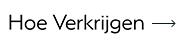
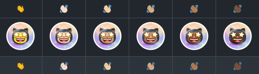
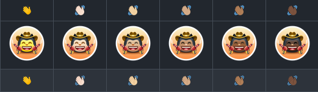

<!-- 
 -->

## Taal

|                                                                                                                                        |                                                                                                                                         |                                                                                                                                                   |                                                                                                                                           |                                                                                                                                           |                                                                                                                                          |
|:--------------------------------------------------------------------------------------------------------------------------------------:|:---------------------------------------------------------------------------------------------------------------------------------------:|:-------------------------------------------------------------------------------------------------------------------------------------------------:|:-----------------------------------------------------------------------------------------------------------------------------------------:|:-----------------------------------------------------------------------------------------------------------------------------------------:|:----------------------------------------------------------------------------------------------------------------------------------------:|
|     |  |             |   |    |  |
|     |      |  |      |  |    |
|  |  |          |  |    |  |

# GitHub Prestaties 🏆

 

  <picture>
    <source media="(prefers-color-scheme: light)" srcset="https://user-images.githubusercontent.com/65187002/172940015-d9d072e7-c47d-4ddd-83f6-8e7717a721b8.png">
    
  </picture> 
  <picture>
    <source media="(prefers-color-scheme: light)" srcset="https://user-images.githubusercontent.com/65187002/172941127-4061fac1-736b-4c24-b7ea-c210b3578cc5.png">
    
  </picture>

 

# GitHub Prestaties behalen

## In deze handleiding leer je stap voor stap hoe je GitHub Achievements kunt verdienen.

### Opmerkingen

#### Opmerking 1: Lukt het niet om een Achievement te krijgen? Raadpleeg dan de stapsgewijze handleiding bij het betreffende Achievement.

#### Opmerking 2: Alle handleidingen bevatten afbeeldingen en leggen iedere stap uitgebreid uit.

#### Opmerking 3: Vind je een fout of bug? Meld deze dan via onze [issue tracker](https://github.com/4xmen/Get-Github-Achievements/issues/new) en help ons deze handleiding te verbeteren.

 

# Prestaties & weergave 🏅

#### GitHub Achievements zijn badges die GitHub toekent als beloning voor bepaalde activiteiten. Ze worden weergegeven op je GitHub-profiel en laten zien hoe actief je bent op GitHub.

#### Wil je je Achievements niet op je profiel tonen? Dan kun je dit uitschakelen via je [profielinstellingen](https://github.com/settings).

#### Hieronder laten we stap voor stap zien hoe je ieder GitHub Achievement kunt verdienen.

 

# Prestatielijst 📃

 

## Quickdraw Achievement behalen

### Quickdraw is een van de eenvoudigste Achievements. Je verdient dit Achievement door een Issue of Pull Request binnen vijf minuten na het aanmaken weer te sluiten.

#### - Heb je extra hulp nodig? Klik dan op de knop **'Hoe krijg je dit Achievement?'** voor een uitgebreide stap-voor-stap handleiding.

 

## Yolo Achievement behalen

### Yolo is een van de meest opvallende GitHub Achievements en geeft je GitHub-profiel een unieke uitstraling. Je verdient dit Achievement door een Pull Request zonder review te mergen.

#### - Heb je extra hulp nodig? Klik dan op de knop **'Hoe krijg je dit Achievement?'** voor een uitgebreide stap-voor-stap handleiding.

 

## Galaxy Brain Achievement behalen

### Je verdient het Galaxy Brain Achievement wanneer twee van je antwoorden in GitHub Discussions als **geaccepteerd antwoord** zijn gemarkeerd.

#### - Heb je extra hulp nodig? Klik dan op de knop **'Hoe krijg je dit Achievement?'** voor een uitgebreide stap-voor-stap handleiding.

 

## Pull Shark Achievement behalen

### Om het Pull Shark Achievement te verdienen, moeten twee van je Pull Requests succesvol worden gemergd. Daarna ontvang je de Pull Shark Badge.

#### - Heb je extra hulp nodig? Klik dan op de knop **'Hoe krijg je dit Achievement?'** voor een uitgebreide stap-voor-stap handleiding.

 

## Starstruck Achievement behalen

### Je verdient het Starstruck Achievement zodra een repository op jouw account minimaal **16 sterren** heeft ontvangen. Ook als de repository later wordt overgedragen, behoud je de badge.

#### - Heb je extra hulp nodig? Klik dan op de knop **'Hoe krijg je dit Achievement?'** voor een uitgebreide stap-voor-stap handleiding.

 

## Pair Extraordinaire Achievement behalen

### Je verdient de Pair Extraordinaire Badge door als co-auteur bij te dragen aan een Pull Request die vervolgens wordt gemergd.

#### - Heb je extra hulp nodig? Klik dan op de knop **'Hoe krijg je dit Achievement?'** voor een uitgebreide stap-voor-stap handleiding.

 

## Public Sponsor Achievement behalen

### Je hoeft alleen een donatie te doen aan een open-sourcebijdrager om dit Achievement te verdienen.

#### - Heb je extra hulp nodig? Klik dan op de knop **'Hoe krijg je dit Achievement?'** voor een uitgebreide stap-voor-stap handleiding.

 

# Nog niet uitgebrachte Prestaties ⏳

 

## Heart On Your Sleeve

### Het **Heart On Your Sleeve** Achievement is momenteel nog niet beschikbaar voor publieke GitHub-gebruikers.

 

## Open Sourcerer

### Ook het **Open Sourcerer** Achievement is momenteel nog niet beschikbaar voor publieke GitHub-gebruikers.

 

# Badges die niet langer beschikbaar zijn ❌

 

## Mars 2020 Contributor

### Toegekend aan ontwikkelaars die code hebben bijgedragen aan een repository dat werd gebruikt voor de Mars 2020 Helicopter Mission

## Arctic Code Vault Contributor

### Toegekend aan ontwikkelaars die hebben bijgedragen aan een repository dat onderdeel was van het GitHub Archive Program 2020

 

# Emoji-huidskleur voor Achievements 👋

 

#### Het uiterlijk van sommige Achievements is afhankelijk van de huidskleur die je voor emoji's hebt ingesteld.

#### Je kunt je voorkeurs-huidskleur wijzigen via de [weergave-instellingen](https://github.com/settings/appearance)

<h4>Starstuck huidtoon versies</h4>

<h4>Quikdraw huidtoon versies</h4>

 

# Meer informatie

 

#### Meer informatie over GitHub Badges en Achievements vind je in de officiële GitHub-documentatie: [link](https://docs.github.com/en/account-and-profile/setting-up-and-managing-your-github-profile/customizing-your-profile/personalizing-your-profile#displaying-badges-on-your-profile).

<!-- 
 -->
 

####     

