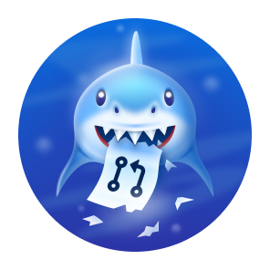

<!-- 
 -->

## Taal

&nbsp;&nbsp;&nbsp;&nbsp;&nbsp;&nbsp;&nbsp;&nbsp;&nbsp;&nbsp;&nbsp;&nbsp;&nbsp;&nbsp;&nbsp;&nbsp;&nbsp;&nbsp;&nbsp;&nbsp;&nbsp;&nbsp;&nbsp;&nbsp;&nbsp;

&nbsp;&nbsp;&nbsp;&nbsp;&nbsp;&nbsp;&nbsp;&nbsp;&nbsp;&nbsp;&nbsp;&nbsp;&nbsp;&nbsp;&nbsp;&nbsp;&nbsp;&nbsp;&nbsp;&nbsp;&nbsp;&nbsp;&nbsp;&nbsp;&nbsp;

&nbsp;&nbsp;&nbsp;&nbsp;&nbsp;&nbsp;&nbsp;&nbsp;&nbsp;&nbsp;&nbsp;&nbsp;&nbsp;&nbsp;&nbsp;&nbsp;&nbsp;&nbsp;&nbsp;&nbsp;&nbsp;&nbsp;&nbsp;&nbsp;&nbsp;

&nbsp;&nbsp;&nbsp;&nbsp;&nbsp;&nbsp;&nbsp;&nbsp;&nbsp;&nbsp;&nbsp;&nbsp;&nbsp;&nbsp;&nbsp;&nbsp;&nbsp;&nbsp;&nbsp;&nbsp;&nbsp;&nbsp;&nbsp;&nbsp;&nbsp;

&nbsp;&nbsp;&nbsp;&nbsp;&nbsp;&nbsp;&nbsp;&nbsp;&nbsp;&nbsp;&nbsp;&nbsp;&nbsp;&nbsp;&nbsp;&nbsp;&nbsp;&nbsp;&nbsp;&nbsp;&nbsp;&nbsp;&nbsp;&nbsp;&nbsp;

&nbsp;&nbsp;&nbsp;&nbsp;&nbsp;&nbsp;&nbsp;&nbsp;&nbsp;&nbsp;&nbsp;&nbsp;&nbsp;&nbsp;&nbsp;&nbsp;&nbsp;&nbsp;&nbsp;&nbsp;&nbsp;&nbsp;&nbsp;&nbsp;&nbsp;

# GitHub Prestaties 🏆

 

  <picture>
    <source media="(prefers-color-scheme: light)" srcset="https://user-images.githubusercontent.com/65187002/172940015-d9d072e7-c47d-4ddd-83f6-8e7717a721b8.png">
    
  </picture> 
  <picture>
    <source media="(prefers-color-scheme: light)" srcset="https://user-images.githubusercontent.com/65187002/172941127-4061fac1-736b-4c24-b7ea-c210b3578cc5.png">
    
  </picture>

 

# Hoe GitHub Prestaties Krijgen

## Je zult stap voor stap leren hoe je GitHub prestaties kunt krijgen in deze cursus.

### Opmerkingen:

#### Opmerking 1: Als je problemen hebt met het ontvangen van prestaties, kan je de stapsgewijze training gebruiken in het gedeelte over het ontvangen van prestaties.

#### Opmerking 2: Alle tutorials zijn met foto's en elke stap wordt volledig uitgelegd.

#### Opmerking 3: Als je een probleem of bug vindt, [rapporteer](https://github.com/4xmen/Get-Github-Achievements/issues/new) dit dan alsjeblieft aan ons om zo de cursus te verbeteren.

 

# Prestaties & Weergave 🏅

#### Prestaties zijn pins die GitHub aan je GitHub account geeft als beloning voor bepaalde activiteiten en kunnen in je profiel gezien worden. Deze prestaties geven een goed effect aan je GitHub account en kunnen aangeven hoeveel activiteit je hebt en hoe actief je bent.

#### Je kunt de weergave van prestaties op je profiel uitschakelen door naar je [profielinstellingen](https://github.com/settings) te gaan.

#### Hier laten we je stap voor stap zien hoe je GitHub Prestatie pins krijgt :)

 

# Prestatielijst 📃

 

## Hoe krijg ik Quickdraw?

### Quickdraw is een van de makkelijkste prestaties om te behalen. Je kunt het ontvangen in slechts een paar stappen. Om deze prestatie te krijgen moet je (een issue / pull request binnen 5 minuten na het openen sluiten)

#### - Als je meer hulp nodig hebt, klik dan op de ‘Hoe Verkrijgen’-knop voor een stap-voor-stap uitleg over hoe je deze prestatie kunt behalen.

 

## Hoe Yolo Prestatie Behalen

### Yolo is een van de mooiste prestaties van GitHub, die een heel mooi effect kan geven aan je GitHub-profiel. Om deze prestatie te krijgen, moet je een pull request zonder review mergen.

#### - Als je meer hulp nodig hebt, klik dan op de ‘Hoe Verkrijgen’-knop voor een stap-voor-stap uitleg over hoe je deze prestatie kunt behalen.

 

## Hoe Galaxy Brain Prestatie Behalen

### Het verkrijgen van Galaxy Brain is moeilijker dan de vorige twee prestaties. En om het te krijgen, moet je de stappen doorlopen die andere GitHub gebruikers nodig hebben. Je moet : Een discussie beantwoord (twee keer een geaccepteerd antwoord gekregen)

#### - Als je meer hulp nodig hebt, klik dan op de ‘Hoe Verkrijgen’-knop voor een stap-voor-stap uitleg over hoe je deze prestatie kunt behalen.

 

## Hoe Pull Haai Prestatie Behalen

### Om een pull shark te krijgen moet je 2 samengevoegde pull requests maken, dan krijg je een pull shark badge.

#### - Als je meer hulp nodig hebt, klik dan op de ‘Hoe Verkrijgen’-knop voor een stap-voor-stap uitleg over hoe je deze prestatie kunt behalen.

 

## Hoe Starstruck Prestatie Behalen

### Het is te eenvoudig om het Starstruck-prestatie te behalen & je hoeft maar een paar stappen te doorlopen om Starstruck te behalen. Je kunt deze prestatie behalen als een repository op je account 16 sterren heeft, zelfs als het is overgezet, ontvang je de badge.

#### - Als je meer hulp nodig hebt, klik dan op de ‘Hoe Verkrijgen’-knop voor een stap-voor-stap uitleg over hoe je deze prestatie kunt behalen.

 

## Hoe Pair Extraordinaire Prestatie Behalen

### Je kunt de badge 'pair extraordinaire' verdienen door co-auteur te zijn van een pull request dat vervolgens wordt samengevoegd.

#### - Als je meer hulp nodig hebt, klik dan op de ‘Hoe Verkrijgen’-knop voor een stap-voor-stap uitleg over hoe je deze prestatie kunt behalen.

 

## Hoe Publieke Sponsor Prestatie Behalen

### U hoeft alleen maar een donatie te doen aan een open source-medewerker.

#### - Als je meer hulp nodig hebt, klik dan op de ‘Hoe Verkrijgen’-knop voor een stap-voor-stap uitleg over hoe je deze prestatie kunt behalen.

 

# Onuitgebrachte prestaties ⏳

 

## Hart op je mouw

### De 'Hart op je mouw' prestatie badges zijn op dit moment nog niet vrijgegeven voor publieke GitHub gebruikers.

 

## Open Source

### De 'Open Sourcerer' prestatie badges zijn op dit moment nog niet vrijgegeven voor publieke GitHub gebruikers.

 

# Badges niet langer verdienbaar ❌

 

## Mars 2020 Bijdrager

### Code bijgedragen aan een archief dat wordt gebruikt in de Mars 2020 Helikoptermissie

## Arctic Code Vault Bijdrager

### Code bijgedragen aan een repository in het 2020 GitHub Archiefprogramma

 

# Huidskleur verbeteren 👋

 

#### Het uiterlijk van sommige prestaties hangt af van je voorkeur voor de huidskleur van de Emoji.

#### U kunt de huidskleur van uw voorkeur wijzigen door naar [uiterlijk instellingen] (https://github.com/settings/appearance) te gaan.

<h4>Starstuck huidtoon versies</h4>

<h4>Quikdraw huidtoon versies</h4>

 

# Meer informatie

 

#### Je kunt meer informatie over GitHub Badges vinden onder deze [link](https://docs.github.com/en/account-and-profile/setting-up-and-managing-your-github-profile/customizing-your-profile/personalizing-your-profile#displaying-badges-on-your-profile).

<!-- 
 -->
 

####    

