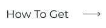
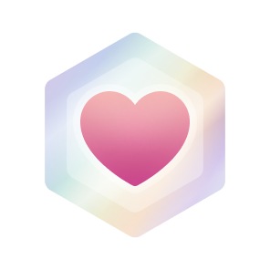
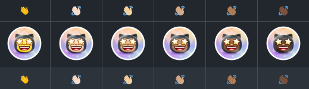
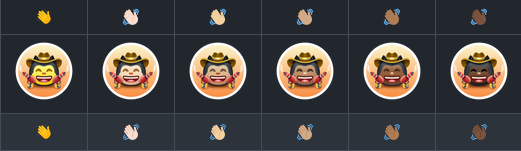

<!-- 
 -->

## Wersje językowe

|                                                                                                                                        |                                                                                                                                         |                                                                                                                                                   |                                                                                                                                           |                                                                                                                                           |                                                                                                                                          |
| :------------------------------------------------------------------------------------------------------------------------------------: | :-------------------------------------------------------------------------------------------------------------------------------------: | :-----------------------------------------------------------------------------------------------------------------------------------------------: | :---------------------------------------------------------------------------------------------------------------------------------------: | :---------------------------------------------------------------------------------------------------------------------------------------: | :--------------------------------------------------------------------------------------------------------------------------------------: |
|     |  |             |   |    |  |
|     |      |  |      |  |    |
|  |  |          |  |    |    |
|      |                                                                                                                                         |                                                                                                                                                   |                                                                                                                                           |                                                                                                                                           |                                                                                                                                          |

# Osiągnięcia GitHub 🏆

 

  <picture>
    <source media="(prefers-color-scheme: light)" srcset="https://user-images.githubusercontent.com/65187002/172940015-d9d072e7-c47d-4ddd-83f6-8e7717a721b8.png">
    
  </picture> 
  <picture>
    <source media="(prefers-color-scheme: light)" srcset="https://user-images.githubusercontent.com/65187002/172941127-4061fac1-736b-4c24-b7ea-c210b3578cc5.png">
    
  </picture>

 

# Jak zdobyć osiągnięcia GitHub

## W tym poradniku krok po kroku dowiesz się, jak zdobywać osiągnięcia GitHub.

### Uwagi:

#### Uwaga 1: Jeśli masz problem ze zdobyciem osiągnięcia, skorzystaj z instrukcji krok po kroku w odpowiedniej sekcji.

#### Uwaga 2: Każda instrukcja zawiera zdjęcia, a kolejne kroki są szczegółowo opisane.

#### Uwaga 3: Jeśli zauważysz problem lub błąd, [zgłoś go](https://github.com/4xmen/Get-Github-Achievements/issues/new). Pomożesz nam ulepszyć poradnik.

 

# Osiągnięcia i ich wyświetlanie 🏅

#### Osiągnięcia to odznaki, które GitHub przyznaje za określone działania. Są widoczne na profilu i mogą pokazywać, jak aktywnie korzystasz z serwisu.

#### Możesz wyłączyć wyświetlanie osiągnięć na swoim profilu w [ustawieniach profilu](https://github.com/settings).

#### Poniżej pokazujemy krok po kroku, jak zdobyć odznaki GitHub :)

 

# Lista osiągnięć 📃

 

## Jak zdobyć osiągnięcie Quickdraw

### Quickdraw to jedno z najłatwiejszych osiągnięć. Aby je zdobyć, zamknij zgłoszenie (issue) lub pull request w ciągu 5 minut od jego utworzenia.

#### - Jeśli potrzebujesz więcej wskazówek, kliknij przycisk „Jak zdobyć”, aby przejść do instrukcji krok po kroku.

 

## Jak zdobyć osiągnięcie YOLO

### YOLO to jedna z efektowniejszych odznak GitHub. Aby ją zdobyć, scal pull request bez recenzji.

#### - Jeśli potrzebujesz więcej wskazówek, kliknij przycisk „Jak zdobyć”, aby przejść do instrukcji krok po kroku.

 

## Jak zdobyć osiągnięcie Pull Shark

### Aby zdobyć Pull Shark, musisz mieć scalone dwa pull requesty. Otrzymasz wtedy pierwszą odznakę Pull Shark.

#### - Jeśli potrzebujesz więcej wskazówek, kliknij przycisk „Jak zdobyć”, aby przejść do instrukcji krok po kroku.

 

## Jak zdobyć osiągnięcie Starstruck

### Zdobycie Starstruck jest proste. Osiągnięcie otrzymasz, gdy repozytorium na Twoim koncie zdobędzie 16 gwiazdek. Odznaka nadal będzie przyznana, nawet jeśli repozytorium zostanie przeniesione.

#### - Jeśli potrzebujesz więcej wskazówek, kliknij przycisk „Jak zdobyć”, aby przejść do instrukcji krok po kroku.

 

## Jak zdobyć osiągnięcie Pair Extraordinaire

### Odznakę Pair Extraordinaire otrzymasz za współtworzenie pull requesta, który następnie zostanie scalony.

#### - Jeśli potrzebujesz więcej wskazówek, kliknij przycisk „Jak zdobyć”, aby przejść do instrukcji krok po kroku.

 

## Jak zdobyć osiągnięcie Public Sponsor

### Wystarczy wesprzeć finansowo osobę tworzącą oprogramowanie open source.

#### - Jeśli potrzebujesz więcej wskazówek, kliknij przycisk „Jak zdobyć”, aby przejść do instrukcji krok po kroku.

 

# Osiągnięcia w fazie testów ⏳

 

## Heart On Your Sleeve

### Odznaka „Heart On Your Sleeve” jest w fazie testów. Po jej oficjalnym udostępnieniu dodamy instrukcję krok po kroku.

 

## Open Sourcerer

### Odznaka „Open Sourcerer” jest w fazie testów. Po jej oficjalnym udostępnieniu dodamy instrukcję krok po kroku.

 

# Odznaki, których nie można już zdobyć ❌

 

## Mars 2020 Contributor

### Wniesienie wkładu w kod repozytorium wykorzystanego w misji helikoptera Mars 2020.

## Arctic Code Vault Contributor

### Wniesienie wkładu w repozytorium objęte programem GitHub Archive z 2020 roku.

 

## Galaxy Brain 2022

### Udzielenie odpowiedzi w dyskusji, która dwukrotnie została zaakceptowana jako najlepsza odpowiedź. Osiągnięcie dotyczy lat 2020–2024.

# Odcień skóry odznak 👋

 

#### Wygląd niektórych osiągnięć zależy od wybranego odcienia skóry emoji.

#### Preferowany odcień skóry możesz zmienić w [ustawieniach wyglądu](https://github.com/settings/appearance).

<h4>Warianty odznaki Starstruck dla różnych odcieni skóry</h4>

<h4>Warianty odznaki Quickdraw dla różnych odcieni skóry</h4>

 

# Odznaki wyróżnienia ✨

 

|                                                                                                                                                         Odznaka                                                                                                                                                          |           Nazwa            |                                                              Jak ją zdobyć                                                               |
| :----------------------------------------------------------------------------------------------------------------------------------------------------------------------------------------------------------------------------------------------------------------------------------------------------------------------: | :------------------------: | :--------------------------------------------------------------------------------------------------------------------------------------: |
|                                               |            Pro             |            Korzystaj z [GitHub Pro](https://docs.github.com/en/get-started/learning-about-github/githubs-products#github-pro)            |
|      |  Developer Program Member  |              Dołącz do [GitHub Developer Program](https://docs.github.com/en/developers/overview/github-developer-program)               |
|  | Security Bug Bounty Hunter |                    Pomagaj wyszukiwać luki w zabezpieczeniach w ramach [GitHub Security](https://bounty.github.com/)                     |
|              |    GitHub Campus Expert    |                                Weź udział w [GitHub Campus Program](https://education.github.com/experts)                                |
|      |  Security advisory credit  | Zgłoszona przez Ciebie informacja o luce musi zostać zaakceptowana i dodana do [GitHub Advisory Database](https://github.com/advisories) |

# Uczciwa rywalizacja i przestrzeganie zasad 🏁

<be>

#### To repozytorium ma uczyć, jak zdobywać osiągnięcia GitHub. Przestrzegaj zasad i wytycznych społeczności GitHub. Bierz aktywny udział w życiu społeczności i nie angażuj się w ten projekt wyłącznie po to, by zdobyć osiągnięcia. Takie działanie jest sprzeczne z naszymi intencjami i zasadami GitHub. Wspieraj projekty w uczciwy sposób, aby wspólnie budować lepszą społeczność.

#### Korzystaj z tego poradnika, aby dowiedzieć się, jak zdobywa się osiągnięcia, a potem stosuj się do tych zasad. Udzielaj się w projektach i zdobywaj odznaki uczciwie, przyczyniając się do budowania zdrowszej i bardziej sprawiedliwej społeczności na <a href="https://docs.github.com/en/site-policy/github-terms/github-terms-of-service">GitHub</a>.

# Więcej informacji ℹ

 

#### Więcej informacji o odznakach GitHub znajdziesz [tutaj](https://docs.github.com/en/account-and-profile/setting-up-and-managing-your-github-profile/customizing-your-profile/personalizing-your-profile#displaying-badges-on-your-profile).

<!-- 
 -->
 

####
