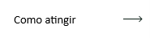

<!-- 
 -->

## Idioma

  

&nbsp;&nbsp;&nbsp;&nbsp;&nbsp;&nbsp;&nbsp;&nbsp;&nbsp;&nbsp;&nbsp;&nbsp;&nbsp;&nbsp;&nbsp;&nbsp;&nbsp;&nbsp;&nbsp;&nbsp;&nbsp;&nbsp;&nbsp;&nbsp;&nbsp;

&nbsp;&nbsp;&nbsp;&nbsp;&nbsp;&nbsp;&nbsp;&nbsp;&nbsp;&nbsp;&nbsp;&nbsp;&nbsp;&nbsp;&nbsp;&nbsp;&nbsp;&nbsp;&nbsp;&nbsp;&nbsp;&nbsp;&nbsp;&nbsp;&nbsp;

&nbsp;&nbsp;&nbsp;&nbsp;&nbsp;&nbsp;&nbsp;&nbsp;&nbsp;&nbsp;&nbsp;&nbsp;&nbsp;&nbsp;&nbsp;&nbsp;&nbsp;&nbsp;&nbsp;&nbsp;&nbsp;&nbsp;&nbsp;&nbsp;&nbsp;

&nbsp;&nbsp;&nbsp;&nbsp;&nbsp;&nbsp;&nbsp;&nbsp;&nbsp;&nbsp;&nbsp;&nbsp;&nbsp;&nbsp;&nbsp;&nbsp;&nbsp;&nbsp;&nbsp;&nbsp;&nbsp;&nbsp;&nbsp;&nbsp;&nbsp;

&nbsp;&nbsp;&nbsp;&nbsp;&nbsp;&nbsp;&nbsp;&nbsp;&nbsp;&nbsp;&nbsp;&nbsp;&nbsp;&nbsp;&nbsp;&nbsp;&nbsp;&nbsp;&nbsp;&nbsp;&nbsp;&nbsp;&nbsp;&nbsp;&nbsp;

&nbsp;&nbsp;&nbsp;&nbsp;&nbsp;&nbsp;&nbsp;&nbsp;&nbsp;&nbsp;&nbsp;&nbsp;&nbsp;&nbsp;&nbsp;&nbsp;&nbsp;&nbsp;&nbsp;&nbsp;&nbsp;&nbsp;&nbsp;&nbsp;&nbsp;

&nbsp;&nbsp;&nbsp;&nbsp;&nbsp;&nbsp;&nbsp;&nbsp;&nbsp;&nbsp;&nbsp;&nbsp;&nbsp;&nbsp;&nbsp;&nbsp;&nbsp;&nbsp;&nbsp;&nbsp;&nbsp;&nbsp;&nbsp;&nbsp;&nbsp;

&nbsp;&nbsp;&nbsp;&nbsp;&nbsp;&nbsp;&nbsp;&nbsp;&nbsp;&nbsp;&nbsp;&nbsp;&nbsp;&nbsp;&nbsp;&nbsp;&nbsp;&nbsp;&nbsp;&nbsp;&nbsp;&nbsp;&nbsp;&nbsp;&nbsp;

&nbsp;&nbsp;&nbsp;&nbsp;&nbsp;&nbsp;&nbsp;&nbsp;&nbsp;&nbsp;&nbsp;&nbsp;&nbsp;&nbsp;&nbsp;&nbsp;&nbsp;&nbsp;&nbsp;&nbsp;&nbsp;&nbsp;&nbsp;&nbsp;&nbsp;

&nbsp;&nbsp;&nbsp;&nbsp;&nbsp;&nbsp;&nbsp;&nbsp;&nbsp;&nbsp;&nbsp;&nbsp;&nbsp;&nbsp;&nbsp;&nbsp;&nbsp;&nbsp;&nbsp;&nbsp;&nbsp;&nbsp;&nbsp;&nbsp;&nbsp;

&nbsp;&nbsp;&nbsp;&nbsp;&nbsp;&nbsp;&nbsp;&nbsp;&nbsp;&nbsp;&nbsp;&nbsp;&nbsp;&nbsp;&nbsp;&nbsp;&nbsp;&nbsp;&nbsp;&nbsp;&nbsp;&nbsp;&nbsp;&nbsp;&nbsp;

  &nbsp;&nbsp;&nbsp;&nbsp;&nbsp;&nbsp;&nbsp;&nbsp;&nbsp;&nbsp;&nbsp;&nbsp;&nbsp;&nbsp;&nbsp;&nbsp;&nbsp;&nbsp;&nbsp;&nbsp;&nbsp;&nbsp;&nbsp;&nbsp;&nbsp;

&nbsp;&nbsp;&nbsp;&nbsp;&nbsp;&nbsp;&nbsp;&nbsp;&nbsp;&nbsp;&nbsp;&nbsp;&nbsp;&nbsp;&nbsp;&nbsp;&nbsp;&nbsp;&nbsp;&nbsp;&nbsp;&nbsp;&nbsp;&nbsp;&nbsp;

&nbsp;&nbsp;&nbsp;&nbsp;&nbsp;&nbsp;&nbsp;&nbsp;&nbsp;&nbsp;&nbsp;&nbsp;&nbsp;&nbsp;&nbsp;&nbsp;&nbsp;&nbsp;&nbsp;&nbsp;&nbsp;&nbsp;&nbsp;&nbsp;&nbsp;

# Conquistas do GitHub 🏆

 

  <picture>
    <source media="(prefers-color-scheme: light)" srcset="https://user-images.githubusercontent.com/65187002/172940015-d9d072e7-c47d-4ddd-83f6-8e7717a721b8.png">
    
  </picture> 
  <picture>
    <source media="(prefers-color-scheme: light)" srcset="https://user-images.githubusercontent.com/65187002/172941127-4061fac1-736b-4c24-b7ea-c210b3578cc5.png">
    
  </picture>

 

# Como conseguir as conquistas do Github

## Neste curso você aprenderá passo-a-passo de como conseguuir as conquistas do Github.

### Notas:

#### Nota 1: Se você tem algum problema para conseguir conquistas, pode usar as instruções passo-a-passo na seção de como obter cada uma.

#### Nota 2: Todos os tutoriais têm fotos e cada passo está completamente explicado.

#### Nota 3: Se você encontrar algum problema ou erro, por favor [informe](https://github.com/4xmen/Get-Github-Achievements/issues/new) para nós. E nos ajude a melhorar o curso.

 

# Conquistas e Exibição🏅

#### Conquistas são pins que o GitHub dá à sua conta GitHub como recompensa por determinadas atividades e podem ser vistos em seu perfil. Essas conquistas dão um bom efeito à sua conta GitHub e podem indicar a quantidade de sua atividade e como você está ativo..

#### Você pode cancelar a exibição de conquistas em seu perfil acessando as [Configurações de perfil](https://github.com/settings).

#### Aqui mostramos como obter os pins de conquista do GitHub passo a passo :)

 

# Lista de conquistas 📃

 

## Como conseguir a conquista Quickdraw

### Quickdraw é uma das conquistas mais fáceis de receber. Requer apenas algumas etapas. Para obter essa conquista você deve (fechar um issue/pull request dentro de 5 minutos após a abertura)

#### - Se precisar de mais ajuda, clique no botão 'Como obter' para ver um tutorial passo a passo sobre como conseguir essa conquista.

 

## Como conseguir a conquista Yolo

### Yolo é uma das conquistas mais bonitas do Github, que pode dar um efeito muito bonito ao seu perfil do Github. Para obter essa conquista, você precisa mesclar um pull request sem revisa-lo.

#### - Se precisar de mais ajuda, clique no botão 'Como obter' para ver um tutorial passo a passo sobre como conseguir essa conquista.

 

## Como conseguir a conquista Galaxy Brain

### Conseguir a Galaxy Brain é mais difícil do que os dois logros anteriores. E para recebê-lo, você deve seguir os passos necessários para outros usuários do GitHub. Você vai precisar: Responder a uma discussão (obter uma resposta aceita duas vezes)

#### - Se precisar de mais ajuda, clique no botão 'Como obter' para ver um tutorial passo a passo sobre como conseguir essa conquista.

## Como conseguir a conquista Pull Shark

### Para obter o pull Shark, você precisa fazer 2 merged pull request, fazendo isso você receberá o emblema de um pull Shark.

#### - Se precisar de mais ajuda, clique no botão 'Como obter' para ver um tutorial passo a passo sobre como conseguir essa conquista.

 

## Como conseguir a conquista Starstruck

### É muito simples obter a conquista Starstruck. Você pode obter esta conquista quando um repositório em sua conta atingir 16 estrelas, mesmo que tenha sido transferido, você receberá o emblema.

#### - Se precisar de mais ajuda, clique no botão 'Como obter' para ver um tutorial passo a passo sobre como conseguir essa conquista.

 

## Como conseguir a conquista Pair Extraordinaire

### Você pode ganhar a conquista Pair Extraordinaire sendo co-autor de um pull request que é mesclada.

#### - Se precisar de mais ajuda, clique no botão 'Como obter' para ver um tutorial passo a passo sobre como conseguir essa conquista.

 

## Como conseguir a conquista Public Sponsor

### Você só precisa fazer uma doação para algum contribuidor de código aberto.

#### - Se precisar de mais ajuda, clique no botão 'Como obter' para ver um tutorial passo a passo sobre como conseguir essa conquista.

 

# Conquistas em fase de teste ⏳

 

## Heart On Your Sleeve

### Os emblemas da conquista ‘Heart On Your Sleeve’ estão em teste, após o lançamento oficial. Um tutorial passo a passo será fornecido para recebê-lo.

 

## Open Sourcerer

### os emblemas de conquista ‘Open Sourcerer’ estão em teste, após o lançamento oficial. Um tutorial passo a passo será fornecido para recebê-lo.

 

# Emblemas que não podem mais ser obtidos ❌

 

## Mars 2020 Contributor

### Ter contribuído com um código para um repositório usado na missão de helicóptero Mars 2020

## Arctic Code Vault Contributor

### Ter contribuído com um código para um repositório no GitHub Archive Program 2020

 

# Tom de pele das conquistas 👋

 

#### A aparência de algumas conquistas depende da sua preferência de tom de pele do Emoji.

#### Você pode alterar seu tom de pele preferido acessando [configurações de aparência](https://github.com/settings/appearance).

<h4>Versões de tons de pele Starstuck</h4>

<h4>Versões de tons de pele do Quikdraw</h4>

 

# Mais informações!

 

#### Você pode encontrar mais informações sobre as insígnias do GitHub neste [link](https://docs.github.com/en/account-and-profile/setting-up-and-managing-your-github-profile/customizing-your-profile/personalizing-your-profile#displaying-badges-on-your-profile).

 

####               

