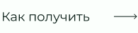
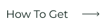

<!-- 
 -->

## Язык

&nbsp;&nbsp;&nbsp;&nbsp;&nbsp;&nbsp;&nbsp;&nbsp;&nbsp;&nbsp;&nbsp;&nbsp;&nbsp;&nbsp;&nbsp;&nbsp;&nbsp;&nbsp;&nbsp;&nbsp;&nbsp;&nbsp;&nbsp;&nbsp;&nbsp;

&nbsp;&nbsp;&nbsp;&nbsp;&nbsp;&nbsp;&nbsp;&nbsp;&nbsp;&nbsp;&nbsp;&nbsp;&nbsp;&nbsp;&nbsp;&nbsp;&nbsp;&nbsp;&nbsp;&nbsp;&nbsp;&nbsp;&nbsp;&nbsp;&nbsp;

&nbsp;&nbsp;&nbsp;&nbsp;&nbsp;&nbsp;&nbsp;&nbsp;&nbsp;&nbsp;&nbsp;&nbsp;&nbsp;&nbsp;&nbsp;&nbsp;&nbsp;&nbsp;&nbsp;&nbsp;&nbsp;&nbsp;&nbsp;&nbsp;&nbsp;

&nbsp;&nbsp;&nbsp;&nbsp;&nbsp;&nbsp;&nbsp;&nbsp;&nbsp;&nbsp;&nbsp;&nbsp;&nbsp;&nbsp;&nbsp;&nbsp;&nbsp;&nbsp;&nbsp;&nbsp;&nbsp;&nbsp;&nbsp;&nbsp;&nbsp;

&nbsp;&nbsp;&nbsp;&nbsp;&nbsp;&nbsp;&nbsp;&nbsp;&nbsp;&nbsp;&nbsp;&nbsp;&nbsp;&nbsp;&nbsp;&nbsp;&nbsp;&nbsp;&nbsp;&nbsp;&nbsp;&nbsp;&nbsp;&nbsp;&nbsp;

# Достижения на GitHub 🏆

 

  <picture>
    <source media="(prefers-color-scheme: light)" srcset="https://user-images.githubusercontent.com/65187002/172940015-d9d072e7-c47d-4ddd-83f6-8e7717a721b8.png">
    
  </picture> 
  <picture>
    <source media="(prefers-color-scheme: light)" srcset="https://user-images.githubusercontent.com/65187002/172941127-4061fac1-736b-4c24-b7ea-c210b3578cc5.png">
    
  </picture>

 

# Как получить достижения GitHub

## В этом курсе вас пошагово научат, как получать достижения GitHub.

### Примечания:

#### Примечание 1: Если у вас возникли проблемы с получением достижений, вы можете воспользоваться пошаговым обучением в разделе, как их получить.

#### Примечание 2: Все инструкции сопровождены фотографиями, и каждый шаг детально объяснен.

#### Примечание 3: Если вы обнаружите какие-либо проблемы или ошибки, пожалуйста, [сообщите](https://github.com/4xmen/Get-Github-Achievements/issues/new) это нам. Тем самым помогая нам улучшить курс.

 

# Достижения и отображение 🏅

#### Достижения — это значки, которые GitHub дает вашей учетной записи GitHub в качестве награды за определенные действия и которые можно увидеть в вашем профиле. Эти достижения дают хороший эффект для вашей учетной записи GitHub и могут указывать на количество вашей активности и то, насколько вы активны.

#### Вы можете отказаться от отображения достижений в своем профиле, перейдя в [настройки профиля](https://github.com/settings).

#### Здесь мы покажем вам, как пошагово получить значок достижения GitHub :)

 

# Список значков 📃

 

## Как получить достижение Quickdraw

### Quickdraw имеет один из самых простых способов получить. И вы можете получить его, всего лишь сделав несколько шагов. Чтобы получить это достижение, вы должны (закрыть проблему / пулл реквест в течение 5 минут после открытия)

#### - Если вам нужна дополнительная помощь, нажмите кнопку «Как получить», чтобы получить пошаговое руководство о том, как получить это достижение.

 

## Как получить достижение Yolo

### Yolo — одно из самых красивых достижений Github, которое может придать вашему профилю на Github очень красивый эффект. Чтобы получить это достижение, вам нужно объеденить пулл-реквест без проверки.

#### - Если вам нужна дополнительная помощь, нажмите кнопку «Как получить», чтобы получить пошаговое руководство о том, как получить это достижение.

 

## Как получить достижение Galaxy Brain

### Получить Galaxy Brain сложнее, чем два предыдущих достижения. А чтобы его получить, вам потребуются другие пользователи GitHub. Вам необходимо: Ответить на обсуждение (получить принятый ответ два раза)

#### - Если вам нужна дополнительная помощь, нажмите кнопку «Как получить», чтобы получить пошаговое руководство о том, как получить это достижение.

 

## Как получить достижение Pull Shark

### Чтобы получить Pull-Shark, вам нужно сделать 2 объединённых пулл-реквеста, вы получите значок одной пулл-акулы.

#### - Если вам нужна дополнительная помощь, нажмите кнопку «Как получить», чтобы получить пошаговое руководство о том, как получить это достижение.

 

## Как получить достижение Starstruck

### Получить достижение Starstruck очень просто, и вам надо всего пару шагов, чтобы получить Starstruck. Вы можете получить это достижение, когда репозиторий на вашей учетной записи наберет 16 звезд, даже если он был перенесен, вы получите значок.

#### - Если вам нужна дополнительная помощь, нажмите кнопку «Как получить», чтобы получить пошаговое руководство о том, как получить это достижение.

 

## Как получить достижение Pair Extraordinaire

### Вы можете заработать значок Pair Extraordinaire, создав совместно пулл реквест, который затем будет объединен.

#### - Если вам нужна дополнительная помощь, нажмите кнопку «Как получить», чтобы получить пошаговое руководство о том, как получить это достижение.

 

## Как получить Public Sponsor Achievement

### Вы просто должны сделать пожертвование одному из участников программ с открытым исходным кодом.

#### - Если вам нужна дополнительная помощь, нажмите кнопку «Как получить», чтобы получить пошаговое руководство о том, как получить это достижение.

 

# Невышедшие достижения ⏳

 

## Heart On Your Sleeve

### На данный момент достижение «Heart On Your Sleeve» еще не выпущен для пользователей GitHub.

 

## Open Sourcerer

### а данный момент достижение «Open Sourcerer» еще не выпущен для пользователей GitHub.

 

# Значки которые больше нельзя получить ❌

 

## Mars 2020 Contributor

### Внесение кода в репозиторий, используемый в вертолетной миссии Марс 2020.

## Arctic Code Vault Contributor

### Внесение кода в репозиторий GitHub Archive Program 2020.

 

# Тон кожи достижения 👋

 

#### Внешний вид некоторых достижений зависит от вашего предпочтения тона кожи эмодзи.

#### Вы можете сменить предпочитаемый тон кожи в [настройках внешнего вида](https://github.com/settings/appearance).

<h4>Версии тона кожи для Starstuck</h4>

<h4>Версии тона кожи для Quikdraw</h4>

 

# Больше информации ℹ

 

#### Дополнительную информацию о значках GitHub можно найти в этом [разделе](https://docs.github.com/en/account-and-profile/setting-up-and-managing-your-github-profile/customizing-your-profile/personalizing-your-profile#displaying-badges-on-your-profile).

<!-- 
 -->
 

####           

