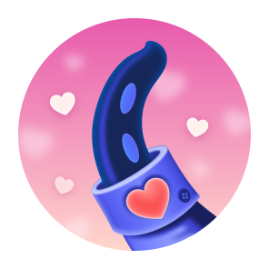

<!-- 
 -->

## Lugha

  

&nbsp;&nbsp;&nbsp;&nbsp;&nbsp;&nbsp;&nbsp;&nbsp;&nbsp;&nbsp;&nbsp;&nbsp;&nbsp;&nbsp;&nbsp;&nbsp;&nbsp;&nbsp;&nbsp;&nbsp;&nbsp;&nbsp;&nbsp;&nbsp;&nbsp;

&nbsp;&nbsp;&nbsp;&nbsp;&nbsp;&nbsp;&nbsp;&nbsp;&nbsp;&nbsp;&nbsp;&nbsp;&nbsp;&nbsp;&nbsp;&nbsp;&nbsp;&nbsp;&nbsp;&nbsp;&nbsp;&nbsp;&nbsp;&nbsp;&nbsp;

&nbsp;&nbsp;&nbsp;&nbsp;&nbsp;&nbsp;&nbsp;&nbsp;&nbsp;&nbsp;&nbsp;&nbsp;&nbsp;&nbsp;&nbsp;&nbsp;&nbsp;&nbsp;&nbsp;&nbsp;&nbsp;&nbsp;&nbsp;&nbsp;&nbsp;

&nbsp;&nbsp;&nbsp;&nbsp;&nbsp;&nbsp;&nbsp;&nbsp;&nbsp;&nbsp;&nbsp;&nbsp;&nbsp;&nbsp;&nbsp;&nbsp;&nbsp;&nbsp;&nbsp;&nbsp;&nbsp;&nbsp;&nbsp;&nbsp;&nbsp;

&nbsp;&nbsp;&nbsp;&nbsp;&nbsp;&nbsp;&nbsp;&nbsp;&nbsp;&nbsp;&nbsp;&nbsp;&nbsp;&nbsp;&nbsp;&nbsp;&nbsp;&nbsp;&nbsp;&nbsp;&nbsp;&nbsp;&nbsp;&nbsp;&nbsp;

&nbsp;&nbsp;&nbsp;&nbsp;&nbsp;&nbsp;&nbsp;&nbsp;&nbsp;&nbsp;&nbsp;&nbsp;&nbsp;&nbsp;&nbsp;&nbsp;&nbsp;&nbsp;&nbsp;&nbsp;&nbsp;&nbsp;&nbsp;&nbsp;&nbsp;

&nbsp;&nbsp;&nbsp;&nbsp;&nbsp;&nbsp;&nbsp;&nbsp;&nbsp;&nbsp;&nbsp;&nbsp;&nbsp;&nbsp;&nbsp;&nbsp;&nbsp;&nbsp;&nbsp;&nbsp;&nbsp;&nbsp;&nbsp;&nbsp;&nbsp;

&nbsp;&nbsp;&nbsp;&nbsp;&nbsp;&nbsp;&nbsp;&nbsp;&nbsp;&nbsp;&nbsp;&nbsp;&nbsp;&nbsp;&nbsp;&nbsp;&nbsp;&nbsp;&nbsp;&nbsp;&nbsp;&nbsp;&nbsp;&nbsp;&nbsp;

&nbsp;&nbsp;&nbsp;&nbsp;&nbsp;&nbsp;&nbsp;&nbsp;&nbsp;&nbsp;&nbsp;&nbsp;&nbsp;&nbsp;&nbsp;&nbsp;&nbsp;&nbsp;&nbsp;&nbsp;&nbsp;&nbsp;&nbsp;&nbsp;&nbsp;

&nbsp;&nbsp;&nbsp;&nbsp;&nbsp;&nbsp;&nbsp;&nbsp;&nbsp;&nbsp;&nbsp;&nbsp;&nbsp;&nbsp;&nbsp;&nbsp;&nbsp;&nbsp;&nbsp;&nbsp;&nbsp;&nbsp;&nbsp;&nbsp;&nbsp;

&nbsp;&nbsp;&nbsp;&nbsp;&nbsp;&nbsp;&nbsp;&nbsp;&nbsp;&nbsp;&nbsp;&nbsp;&nbsp;&nbsp;&nbsp;&nbsp;&nbsp;&nbsp;&nbsp;&nbsp;&nbsp;&nbsp;&nbsp;&nbsp;&nbsp;

  &nbsp;&nbsp;&nbsp;&nbsp;&nbsp;&nbsp;&nbsp;&nbsp;&nbsp;&nbsp;&nbsp;&nbsp;&nbsp;&nbsp;&nbsp;&nbsp;&nbsp;&nbsp;&nbsp;&nbsp;&nbsp;&nbsp;&nbsp;&nbsp;&nbsp;

  &nbsp;&nbsp;&nbsp;&nbsp;&nbsp;&nbsp;&nbsp;&nbsp;&nbsp;&nbsp;&nbsp;&nbsp;&nbsp;&nbsp;&nbsp;&nbsp;&nbsp;&nbsp;&nbsp;&nbsp;&nbsp;&nbsp;&nbsp;&nbsp;&nbsp;

# Mafanikio ya GitHub 🏆

 

  <picture>
    <source media="(prefers-color-scheme: light)" srcset="https://user-images.githubusercontent.com/65187002/172940015-d9d072e7-c47d-4ddd-83f6-8e7717a721b8.png">
    
  </picture> 
  <picture>
    <source media="(prefers-color-scheme: light)" srcset="https://user-images.githubusercontent.com/65187002/172941127-4061fac1-736b-4c24-b7ea-c210b3578cc5.png">
    
  </picture>

 

# Jinsi ya Kupata Mafanikio ya GitHub

## Utafunzwa moja kwa moja jinsi ya kupata mafanikio ya GitHub katika kozi hii.

### Vidokezo:

#### Taarifa ya 1: Ikiwa una tatizo la kupokea mafanikio, unaweza kutumia mafunzo ya hatua kwa hatua katika sehemu ya jinsi ya kuyapokea.

#### Taarifa ya 2: Mafunzo yote yana picha na kila hatua imeelezewa kikamilifu.

#### Taarifa ya 3: Ukipata tatizo lolote, tafadhali [ripoti](https://github.com/4xmen/Get-Github-Achievements/issues/new) kwetu. Na kutusaidia kuboresha kozi.

 

# Mafanikio na Onyesho 🏅

#### Mafanikio ni pini ambazo GitHub inatoa kwa akaunti yako ya GitHub kama zawadi kwa shughuli fulani na zinaweza kuonekana kwenye wasifu wako. Mafanikio haya yanatoa athari nzuri kwa akaunti yako ya GitHub na yanaweza kuonyesha kiasi cha shughuli yako na jinsi unavyofanya kazi.

#### Unaweza kuchagua kutolewa kwa mafanikio yako yanayo onyeshwa kwenye wasifu wako kwa kwenda kwenye [mipangilio ya wasifu](https://github.com/settings).

#### Hapa tunakuonyesha jinsi ya kupata pini ya Mafanikio ya GitHub hatua kwa hatua :)

 

# Orodha ya Mafanikio 📃

 

## Jinsi yakupata mafanikio ya Quickdraw

### Quickdraw ni mojawapo ya mafanikio rahisi kupokea. Inahitaji hatua chache tu. Ili kupata mafanikio haya lazima (ufunge suala / ombi la kuvuta ndani ya dakika 5 baada ya ufunguzi)
#### - Ikiwa unahitaji usaidizi zaidi, bofya kitufe cha `Jinsi ya Kupata` ili kupata mafunzo ya hatua kwa hatua kuhusu jinsi ya kupata mafanikio haya.

<a href="assets/steps-sw/README.quickdraw-sw.md"></a-->

 

## Jinsi yakupata mafanikio ya Yolo

### Yolo ni mojawapo ya mafanikio mazuri zaidi ya Github, ambayo yanaweza kutoa athari nzuri sana kwa wasifu wako wa Github. Ili kupata mafanikio haya, unahitaji Kuunganisha ombi la kuvuta bila ukaguzi.

#### - Ikiwa unahitaji usaidizi zaidi, bofya kitufe cha `Jinsi ya Kupata` ili kupata mafunzo ya hatua kwa hatua kuhusu jinsi ya kupata mafanikio haya.

 

## Jinsi yakupata mafanikio ya Pull Shark

### Kupata pull shark unahitaji kuwa na ombi 2 la kuvuta lililounganishwa, na utapata beji moja ya kuvuta papa.

#### - Ikiwa unahitaji usaidizi zaidi, bofya kitufe cha `Jinsi ya Kupata` ili kupata mafunzo ya hatua kwa hatua kuhusu jinsi ya kupata mafanikio haya.

 

## Jinsi yakupata mafanikio ya Starstruck

### Ni rahisi sana kupata mafanikio ya Starstruck, una hatua chache tu kupata Starstruck. Unaweza kupata Mafanikio haya wakati repo ya akaunti yako inapofikia nyota 16, hata kama ilihamishwa, utapokea beji.

#### - Ikiwa unahitaji usaidizi zaidi, bofya kitufe cha `Jinsi ya Kupata` ili kupata mafunzo ya hatua kwa hatua kuhusu jinsi ya kupata mafanikio haya.

 

## Jinsi yakupata mafanikio ya Pair Extraordinaire

### Unaweza kupata beji ya pair extraordinaire iwapo umekuwa co-authored kwenye ombi lakuvuta lililo unganishwa.

#### - Ikiwa unahitaji usaidizi zaidi, bofya kitufe cha `Jinsi ya Kupata` ili kupata mafunzo ya hatua kwa hatua kuhusu jinsi ya kupata mafanikio haya.

 

## Jinsi yakupata mafanikio ya Mdhamini wa Umma

### Unahitaji tu kutoa mchango kwa mchangiaji wa chanzo huria.

#### - Ikiwa unahitaji usaidizi zaidi, bofya kitufe cha `Jinsi ya Kupata` ili kupata mafunzo ya hatua kwa hatua kuhusu jinsi ya kupata mafanikio haya.

 

# Mafanikio kwenye Majaribio ⏳

 

## Heart On Your Sleeve

### Beji la 'Heart On Your Sleeve' bado iko kwenye majaribio, Baada ya kutolewa rasmi. Mafunzo ya hatua kwa hatua yatatolewa ili kuipokea.

 

## Open Sourcerer

### Beji la 'Open Sourcerer' bado iko kwenye majaribio, Baada ya kutolewa rasmi. Mafunzo ya hatua kwa hatua yatatolewa ili kuipokea.

 

# Beji ambazo havipatikani tena ❌

 

## Mars 2020 Contributor

### Changia kwenye code unao tumika kwenye repo ya Mars 2020 Helicopter Mission

## Arctic Code Vault Contributor

### CChangia kwenye code unao tumika kwenye repo ya 2020 GitHub Archive Program

 

## Galaxy Brain 2022

### Jubu mjadala(Iwapo una majibu mbili yalio kubaliwa), Kutoka 2020 mpaka 2024

# Rangi ya Ngozi kwa Mafanikio 👋

 

#### Mwonekano wa mafanikio mengine hutegemea mapendeleo yako ya rangi ya ngozi za emoji

#### Waweza kubadilisha rangi yako ya Ngozi unayopendelea kwa kwenda kwa: [Mipangilio ya Muonekano](https://github.com/settings/appearance).

<h4>Starstuck Skin Tone Versions</h4>

<h4>Quikdraw Skin Tone Versions</h4>

 

# Beji Zakuangazia ✨
 

| Beji | Jina | jinsi ya kuifikia |
| :-: | :-: | :-: |
|   | Pro | Tumia [GitHub Pro](https://docs.github.com/en/get-started/learning-about-github/githubs-products#github-pro) |
|  | Developer Program Member | Uwe umejisajilisha na [GitHub Developer Program](https://docs.github.com/en/developers/overview/github-developer-program) |
|  | Security Bug Bounty Hunter | Saidiana kuwinda kasoro za usalama kwenye [GitHub Security](https://bounty.github.com/) |
|  | GitHub Campus Expert | Iwapo umehusika kwenye [GitHub Campus Program](https://education.github.com/experts) |
|  | Security advisory credit | Wasilisha mawaidha yako ya usalama kwa [GitHub Advisory Database](https://github.com/advisories) nakukubaliwa |

# Kudumisha haki na kuzingatia sheria ni muhimu 🏁

<be>

#### Hifadhi hii ililenga kukufundisha jinsi ya kupata mafanikio ya GitHub. Tafadhali heshimu sheria za GitHub na miongozo ya jumuiya. Jaribu kuwa muungwana katika jumuiya ya GitHub na uepuke kushiriki katika mradi wetu ili tu kupata mafanikio ya GitHub.. Hii ni kinyume na matakwa yetu na sheria za GitHub. Tafadhali fuata sheria hizi na ujitahidi kuchangia kwa haki kwa GitHub na miradi ili kujenga jumuiya bora kwenye GitHub pamoja.

#### Tafadhali tumia mwongozo huu kujifunza jinsi ya kupata mafanikio na kuheshimu masharti yetu baada ya kujifunza jinsi ya kupata mafanikio ya GitHub, Jaribu kushiriki katika miradi na ujitahidi kupata mafanikio haya kwa haki ili kujenga jamii yenye afya na usawa zaidi kwenye <a href="https://docs.github.com/en/site-policy/github-terms/github-terms-of-service">GitHub</a>.

# Maelezo zaidi

 

#### Unaweza kupata habari zaidi kuhusu Beji za GitHub chini ya hii [link](https://docs.github.com/en/account-and-profile/setting-up-and-managing-your-github-profile/customizing-your-profile/personalizing-your-profile#displaying-badges-on-your-profile).

<!-- 
 -->
 

####          

