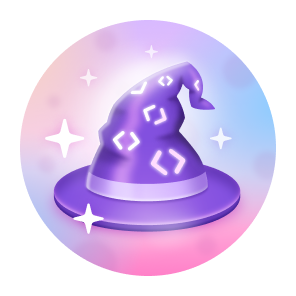

<!-- 
 -->

## Language

  

&nbsp;&nbsp;&nbsp;&nbsp;&nbsp;&nbsp;&nbsp;&nbsp;&nbsp;&nbsp;&nbsp;&nbsp;&nbsp;&nbsp;&nbsp;&nbsp;&nbsp;&nbsp;&nbsp;&nbsp;&nbsp;&nbsp;&nbsp;&nbsp;&nbsp;

&nbsp;&nbsp;&nbsp;&nbsp;&nbsp;&nbsp;&nbsp;&nbsp;&nbsp;&nbsp;&nbsp;&nbsp;&nbsp;&nbsp;&nbsp;&nbsp;&nbsp;&nbsp;&nbsp;&nbsp;&nbsp;&nbsp;&nbsp;&nbsp;&nbsp;

&nbsp;&nbsp;&nbsp;&nbsp;&nbsp;&nbsp;&nbsp;&nbsp;&nbsp;&nbsp;&nbsp;&nbsp;&nbsp;&nbsp;&nbsp;&nbsp;&nbsp;&nbsp;&nbsp;&nbsp;&nbsp;&nbsp;&nbsp;&nbsp;&nbsp;

&nbsp;&nbsp;&nbsp;&nbsp;&nbsp;&nbsp;&nbsp;&nbsp;&nbsp;&nbsp;&nbsp;&nbsp;&nbsp;&nbsp;&nbsp;&nbsp;&nbsp;&nbsp;&nbsp;&nbsp;&nbsp;&nbsp;&nbsp;&nbsp;&nbsp;

&nbsp;&nbsp;&nbsp;&nbsp;&nbsp;&nbsp;&nbsp;&nbsp;&nbsp;&nbsp;&nbsp;&nbsp;&nbsp;&nbsp;&nbsp;&nbsp;&nbsp;&nbsp;&nbsp;&nbsp;&nbsp;&nbsp;&nbsp;&nbsp;&nbsp;

&nbsp;&nbsp;&nbsp;&nbsp;&nbsp;&nbsp;&nbsp;&nbsp;&nbsp;&nbsp;&nbsp;&nbsp;&nbsp;&nbsp;&nbsp;&nbsp;&nbsp;&nbsp;&nbsp;&nbsp;&nbsp;&nbsp;&nbsp;&nbsp;&nbsp;

&nbsp;&nbsp;&nbsp;&nbsp;&nbsp;&nbsp;&nbsp;&nbsp;&nbsp;&nbsp;&nbsp;&nbsp;&nbsp;&nbsp;&nbsp;&nbsp;&nbsp;&nbsp;&nbsp;&nbsp;&nbsp;&nbsp;&nbsp;&nbsp;&nbsp;

&nbsp;&nbsp;&nbsp;&nbsp;&nbsp;&nbsp;&nbsp;&nbsp;&nbsp;&nbsp;&nbsp;&nbsp;&nbsp;&nbsp;&nbsp;&nbsp;&nbsp;&nbsp;&nbsp;&nbsp;&nbsp;&nbsp;&nbsp;&nbsp;&nbsp;

&nbsp;&nbsp;&nbsp;&nbsp;&nbsp;&nbsp;&nbsp;&nbsp;&nbsp;&nbsp;&nbsp;&nbsp;&nbsp;&nbsp;&nbsp;&nbsp;&nbsp;&nbsp;&nbsp;&nbsp;&nbsp;&nbsp;&nbsp;&nbsp;&nbsp;

# GitHub Başarıları 🏆

 

  <picture>
    <source media="(prefers-color-scheme: light)" srcset="https://user-images.githubusercontent.com/65187002/172940015-d9d072e7-c47d-4ddd-83f6-8e7717a721b8.png">
    
  </picture> 
  <picture>
    <source media="(prefers-color-scheme: light)" srcset="https://user-images.githubusercontent.com/65187002/172941127-4061fac1-736b-4c24-b7ea-c210b3578cc5.png">
    
  </picture>

 

# GitHub Başarıları Nasıl Kazanılır

## Bu eğitimde GitHub başarılarını nasıl elde edeceğiniz adım adım öğretilecektir.

### Notlar:

#### Not 1: Başarıları almakta sorun yaşıyorsanız, nasıl alacağınızla ilgili bölümdeki adım adım eğitimi kullanabilirsiniz.

#### Not 2: Tüm eğitimler fotoğraflıdır ve her adım tam olarak açıklanmıştır.

#### Not 3: Herhangi bir sorun veya hata bulursanız, lütfen bize [rapor edin] (https://github.com/4xmen/Get-Github-Achievements/issues/new). Ve kursu geliştirmemize yardımcı olun.

 

# Başarılar & Sergileme 🏅

#### Başarılar, GitHub'ın belirli etkinlikler için ödül olarak GitHub hesabınıza verdiği ve profilinizde görülebilen pinlerdir. Bu başarılar GitHub hesabınıza iyi bir etki verir ve etkinliğinizin miktarını ve ne kadar aktif olduğunuzu gösterebilir.

#### Profil ayarlarınıza] (https://github.com/settings) giderek profilinizde başarıların görüntülenmesini devre dışı bırakabilirsiniz.

#### Burada size GitHub Başarı pinlerini adım adım nasıl alacağınızı gösteriyoruz :)

 

# Başarı Listesi 📃

 

## Quickdraw Başarısı Nasıl Elde Edilir ?

### Quickdraw, elde etmenin en kolay yolu olan başarıma sahiptir ve sadece birkaç basit adımı izleyerek elde edebilirsiniz. Bu başarımı elde etmek için yapmanız gerekenler (bir issue/pull talebini açtıktan sonra 5 dakika içinde kapatmak)

#### - Daha fazla yardıma ihtiyacınız varsa, bu başarımı nasıl elde edeceğinizi adım adım öğrenmek için Nasıl Elde Edilir butonuna tıklayın.

 

## Yolo Başarısı Nasıl Alınır?

### Yolo, Github profilinize çok güzel bir etki verebilecek Github'ın en güzel başarılarından biridir. Bu başarımı elde etmek için, bir inceleme olmadan bir çekme isteğini birleştirmeniz gerekir.

#### - Daha fazla yardıma ihtiyacınız varsa, bu başarımı nasıl elde edeceğinizi adım adım öğrenmek için Nasıl Elde Edilir butonuna tıklayın.

 

## Galaxy Brain Başarısı Nasıl Elde Edilir

### Galaxy Brain'i elde etmek önceki iki başarıdan daha zordur. Ve onu almak için, diğer GitHub kullanıcılarının ihtiyaç duyduğu adımlardan geçmeniz gerekir. Yapmanız gerekenler Bir tartışmaya cevap vermek ve (iki kez kabul edilen bir cevap almak)

#### - Daha fazla yardıma ihtiyacınız varsa, bu başarımı nasıl elde edeceğinizi adım adım öğrenmek için Nasıl Elde Edilir butonuna tıklayın.

 

## Pull Shark Başarısı Nasıl Elde Edilir

### Pull shark almak için 2 birleştirilmiş pull request yapmanız gerekir, bir pull shark rozeti alırsınız.

#### - Daha fazla yardıma ihtiyacınız varsa, bu başarımı nasıl elde edeceğinizi adım adım öğrenmek için Nasıl Elde Edilir butonuna tıklayın.

 

## Starstruck Başarısı Nasıl Elde Edilir

### Starstruck başarımını elde etmek çok kolay & Starstruck'ı elde etmek için sadece birkaç adımı takip etmeniz gerekiyor. Hesabınızdaki bir depo 16 yıldıza ulaştığında bu başarımı elde edebilirsiniz, transfer edilmiş olsa bile rozeti alacaksınız.

#### - Daha fazla yardıma ihtiyacınız varsa, bu başarımı nasıl elde edeceğinizi adım adım öğrenmek için Nasıl Elde Edilir butonuna tıklayın.

 

## Pair Extraordinaire Başarısı Nasıl Elde Edilir

### Daha sonra birleştirilen bir çekme isteğine ortak yazarlık yaparak Pair Extraordinary rozetini kazanabilirsiniz.

#### - Daha fazla yardıma ihtiyacınız varsa, bu başarımı nasıl elde edeceğinizi adım adım öğrenmek için Nasıl Elde Edilir butonuna tıklayın.

 

## Public Sponsor Başarısı Nasıl Elde Edilir

### Tek yapmanız gereken açık kaynaklara katkıda bulunan birine bağış yapmak.

#### - Daha fazla yardıma ihtiyacınız varsa, bu başarımı nasıl elde edeceğinizi adım adım öğrenmek için Nasıl Elde Edilir butonuna tıklayın.

 

# Yayınlanmamış Başarımlar ⏳

 

## Heart On Your Sleeve

### 'Heart On Your Sleeve' başarı rozetleri henüz herkese açık GitHub kullanıcıları için yayınlanmadı.

 

## Open Sourcerer

### 'Open Sourcerer' başarı rozetleri henüz genel GitHub kullanıcıları için yayınlanmadı.

 

# Artık kazanılması mümkün olmayan rozetler ❌

 

## Mars 2020 Contributor

### Mars 2020 Helikopter Görevinde kullanılan bir depoya kod katkısında bulunmak

## Arctic Code Vault Contributor

### GitHub 2020 Arşiv Programındaki bir depoya kod katkısında bulunmak

 

# Başarılar için ten rengi tonları 👋

 

#### Bazı başarıların görünümü Emoji Cilt Tonu Tercihinize bağlıdır.

#### Tercih ettiğiniz Ten Tonunu [appearance settings] (görünüm ayarları) (https://github.com/settings/appearance) bölümüne giderek değiştirebilirsiniz.

<h4>Starstuck Cilt Tonu Versiyonları</h4>

<h4>Quikdraw Cilt Tonu Versiyonları</h4>

 

# Daha fazla bilgi için ℹ

 

#### GitHub Rozetleri hakkında daha fazla bilgiyi bu [link](https://docs.github.com/en/account-and-profile/setting-up-and-managing-your-github-profile/customizing-your-profile/personalizing-your-profile#displaying-badges-on-your-profile) altında bulabilirsiniz.

<!-- 
 -->
 

####          

