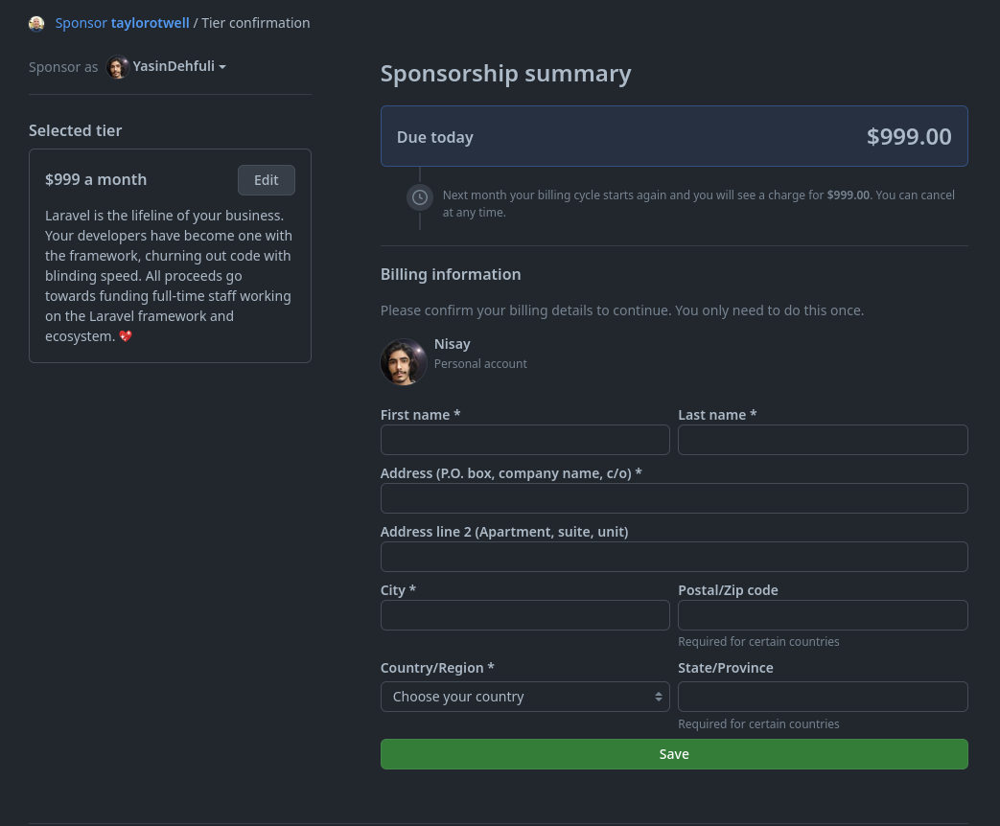

# Հանրության հովանավոր

## Ինչպես քայլ առ քայլ ստանալ достижение Public Sponsor-ը:

### 1. (Նախ դուք պետք է իմանաք, որ այս նշանը ստանալու համար ձեզ հարկավոր է կրեդիտ քարտ և որոշակի գումար նվիրաբերել): Այնուհետև նախ պետք է բացեք GitHub-ի աջակիցների էջը և սեղմեք «See Your Top Dependencies» կոճակը:

### 2. Դուք կարող եք տեսնել օգտատերերի ցանկը, որոնց կարող եք նվիրաբերել այստեղ: (Դուք կարող եք հովանավորվել GitHub-ի ցանկացած օգտատերերի կողմից, ովքեր ունեն հովանավորման կոճակ իրենց էջում):

### 3. Այն բանից հետո, երբ գտաք հովանավորվող անձին: դուք կտեսնեք մի էջ՝ ընտրելու համար, թե որքան եք ցանկանում նվիրաբերել ամսական:

### 4. Այստեղ վճարման դաշտեր կան։ Վճարման ավարտից հետո դուք կարող եք տեսնել ձեր նշանը ձեր պրոֆիլում (բետա տարբերակում 30 երկրներ առայժմ վճարման եղանակներ ունեն):

### 5. Պատրաստ է, այժմ դուք կարող եք տեսնել Public Sponsor ձեռքբերումը ձեր ձեռքբերումների ցանկում:

