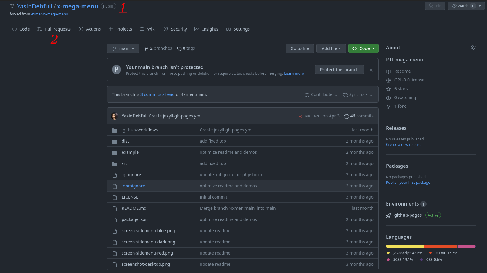

# тянуть акулу

## Ինչպես քայլ առ քայլ ստանալ достижение Pull Shark-ը:

### 1. Դուք պետք է ֆոռք ստանաք ռեպոյից (կարող եք ֆոռքել ցանկացած ռեպոյից, որը ցանկանում եք):

### 2. Երբ ձեր ֆոռք եղած ռեպոն ստեղծվի, դուք պետք է որոշ փոփոխություններ կատարեք ֆոռք եղած ռեպոյում (ցանկացած փոփոխություն, օրինակ՝ ավելացնել նոր ֆայլ կամ որոշ փոփոխություններ կատարել կոդերի վրա):

### 3. Կտտացրեք «Create a Pull Request» կոճակին։

### 4. Այժմ դուք կարող եք տեսնել, որ կարող եք «Merge» կանաչ տեքստը, ինչը նշանակում է, որ դուք կարող եք մերջ անել ձեր փուլլ ռեքուեսթը, այնպես որ սեղմեք «Create a Pull Request» կոճակը, որպեսզի ձեր փուլլ ռեքուեսթը հաջողությամբ ստեղծվի: Այնուհետև դուք պետք է սպասեք, որ ձեր հարցումը մերջ արվի ռեպոն ստեղծողի կողմից:
#### - Ձեզ անհրաժեշտ է 2 միավորված փուլլ ռեքուեսթ՝ Pull Shark ձեռքբերումը ստանալու համար

### 5. Պատրաստ է, այժմ դուք կարող եք տեսնել Pull Shark ձեռքբերումը ձեր ձեռքբերումների ցանկում:

