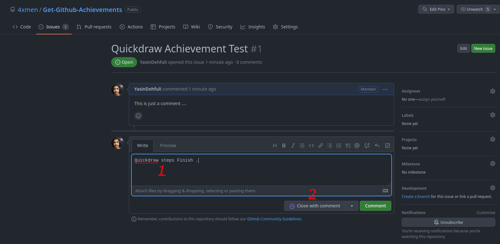

# Արագ խաղարկություն

## Ինչպես քայլ առ քայլ ստանալ Quickdraw-ը:

### 1. Դուք պետք է ստեղծեք նոր խնդիր կամ փուլլ ռեքուեսթ ցանկացած ռեպոյի վրա, որը ցանկանում եք:

### 2. Այժմ դուք պետք է գրեք վերնագիր և թողեք մեկնաբանություն (եթե ցանկանում եք) և հետո սեղմեք «Submit New Issue» կոճակը:

### 3. Գրեք ցանկացած մեկնաբանություն (կարող եք նաև փակել խնդիրը կամ ուղարկել հարցումը առանց մեկնաբանությունների): Այնուհետև սեղմեք Փակել խնդիրը/Փակել փուլլ ռեքուեսթը:

### 4. Պատրաստ է, այժմ դուք կարող եք տեսնել Quickdraw ձեռքբերումը ձեր ձեռքբերումների ցանկում:

