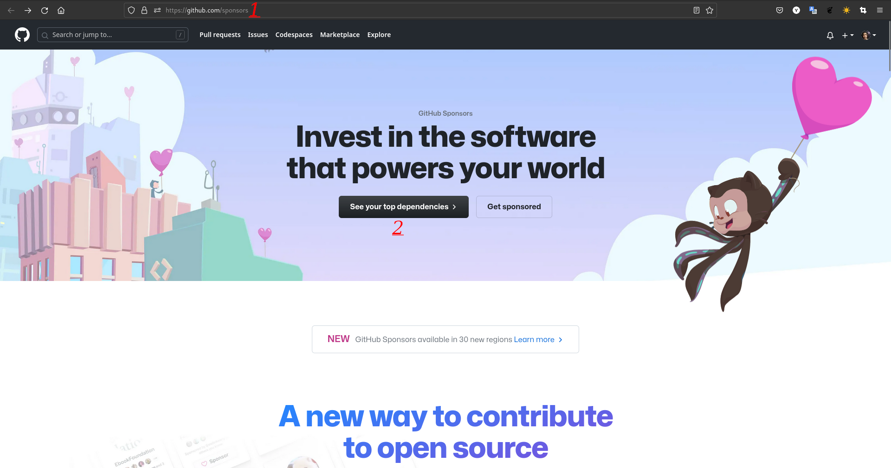

# الراعي العام (Public Sponsor)

## كيفية الحصول على إنجاز الراعي العام على GitHub خطوة بخطوة:
### 1. (أولاً، تحتاج إلى معرفة أنه من أجل الحصول على هذا الشارة، تحتاج إلى بطاقة ائتمان والتبرع ببعض الأموال). بعد ذلك، تحتاج إلى فتح صفحة GitHub Sponsors أولاً، ثم النقر على زر "رؤية أفضل تبعياتك".

### 2. يمكنك رؤية قائمة بالمطورين الذين يمكنك التبرع لهم هنا. (يمكنك أن تصبح راعيًا لأي مستخدمي GitHub الذين لديهم زر الرعاية على صفحاتهم).

### 3. بعد أن تجد شخصًا ترغب في دعمه، يمكنك رؤية صفحة لاختيار كمية التبرع الشهرية.

### 4. هناك نموذج للدفع هنا، بعد انتهاء الدفع الخاص بك، يمكنك رؤية شارتك في ملفك الشخصي (في الإصدار التجريبي 30 دولة تملك طرق دفع حتى الآن).

### 5. تمامًا، الآن يمكنك رؤية إنجاز الراعي العام في قائمة إنجازاتك.

