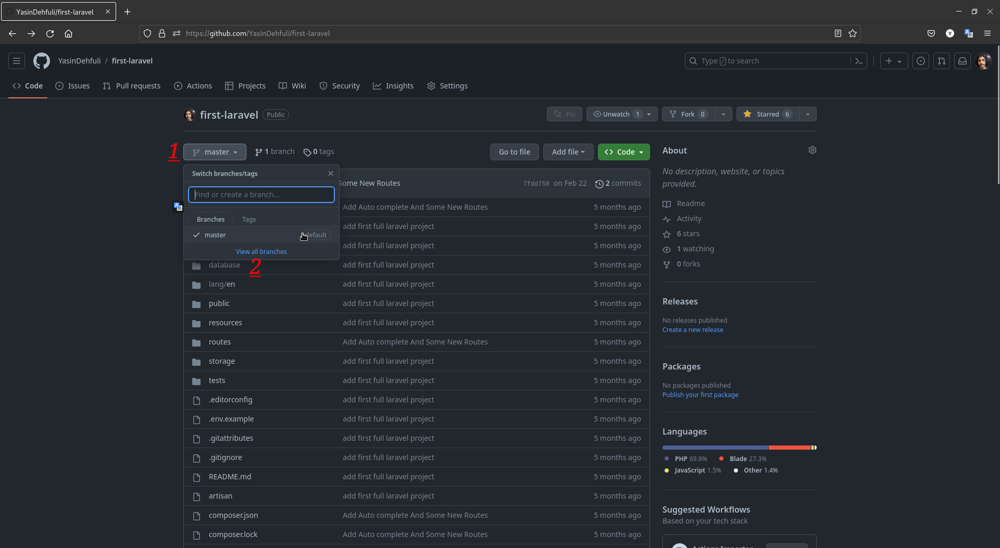
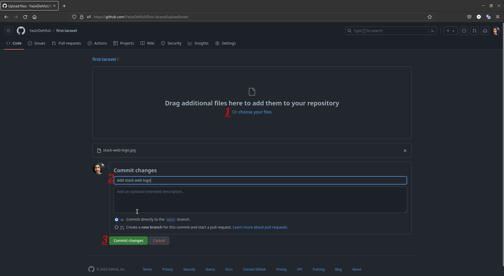

# يولو (Yolo)

## كيفية الحصول على إنجاز يولو على GitHub خطوة بخطوة:

### 1. أولًا، تحتاج إلى فتح المستودع والانتقال إلى الإعدادات.

### 2. ثانيًا، تحتاج إلى الانتقال إلى فئة المشاركين وفي هذا القسم، قم بدعوة حساب لديك وصول إلى المستودع.

### 3. ثالثًا، تحتاج إلى إضافة فرع جديد إلى مستودعك.

### 4. الآن، تحتاج إلى إضافة ملف إلى الفرع الجديد الذي أنشأته.

### 5. أضف الملف وأكمل الوصف له وأخيرًا قم بتأكيد التغييرات الخاصة بك.

### 6. انقر على الزر الأخضر، مقارنة وإرسال طلب السحب (pull request).

### 7. أضف الشخص الذي تمت دعوته في الخطوة 2 كمراجع، وأنشئ طلب السحب.

### 8. في النهاية، تحقق من مراجعك ثم انقر على دمج طلب السحب.

### 9. تمامًا، الآن يمكنك رؤية إنجاز يولو في قائمة إنجازاتك.

