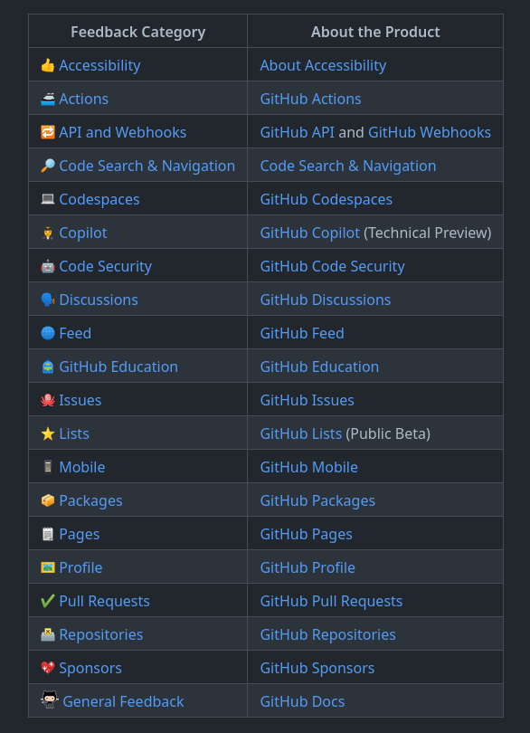

# Galaxy Brain

## গ্যালাক্সি ব্রেইন গিথুব অর্জনের জন্য ধাপে ধাপে নির্দেশিকা:

### 1. আপনাকে গিটহাব সম্প্রদায়ের ঠিকানায় যেতে হবে (https://github.com/community/community)। এবং একটি প্রতিক্রিয়া বিভাগ নির্বাচন করুন।

### 2. এখন আপনি আপনার পছন্দ অনুযায়ী অনুত্তরিত প্রশ্ন অনুসন্ধান করতে পারেন। এবং উত্তর দিতে প্রশ্ন.

### 3. প্রশ্নের সঠিক উত্তরটি লিখুন (প্রশ্ন ডিজাইনার দ্বারা উপস্থাপিত উত্তর হিসাবে বেছে নেওয়ার জন্য আপনার উত্তরটি অবশ্যই সেরা উত্তর হতে হবে)।

### 4. গ্যালাক্সি ব্রেইন অর্জনের জন্য আপনার দুটি উপস্থাপিত উত্তর প্রয়োজন।

### 5. সম্পন্ন, আপনি এখন আপনার কৃতিত্বের তালিকায় Galaxy Brain কৃতিত্ব দেখতে পাবেন।

