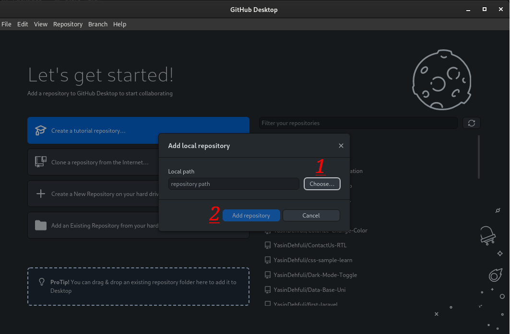

# Pair Extraordinaire

## কিভাবে পেয়ার এক্সট্রা-ডেনারেস গিটহাব কৃতিত্ব পেতে হয় সে সম্পর্কে ধাপে ধাপে নির্দেশিকা:

### 1. [GitHub Desktop](https://desktop.github.com/) আপনার অভ্যন্তরীণ সংগ্রহস্থল ফাইল থেকে আপনার সংগ্রহস্থল যোগ করার জন্য ইনস্টল করা হয়.

### 2. একটি স্থানীয় সংগ্রহস্থল যোগ করুন এবং প্রতিশ্রুতিবদ্ধ করুন এবং আপনার পরিবর্তিত ফাইলগুলি পুশ করুন।

### 3. ফিল্টার বক্স ব্যবহার করার দরকার নেই, শুধু "New Branch" ক্লিক করুন এবং আপনার সংগ্রহস্থলের জন্য একটি নতুন শাখা তৈরি করুন।

### 4. আপনার শিরোনাম বাক্সে একটি সারসংক্ষেপ যোগ করুন, তারপর একটি বিবরণ যোগ করুন, অবশেষে একটি GitHub ব্যবহারকারীর দ্বারা সহ-লেখকত্ব যোগ করুন (আপনাকে যা করতে হবে তা হল আপনার সংগ্রহস্থলে একটি ফাইল কমিট করা (ফাইলগুলিকে ধাক্কা দেবেন না))।

### 5. এখন GitHub-এ আপনার সংগ্রহস্থলটি পরীক্ষা করে দেখুন এবং "Assignees" যোগ করুন, এবং তারপর "মার্জ পুল রিকোয়েস্ট" বোতামে ক্লিক করুন (Pair Extraordinaire উভয় অ্যাকাউন্টই পাবেন (আপনি এবং সহ-লেখক))।

### 6. সম্পন্ন, আপনি এখন আপনার কৃতিত্বের তালিকায় পেয়ার এক্সট্রা-ডিনিয়র অর্জন দেখতে পাবেন।

