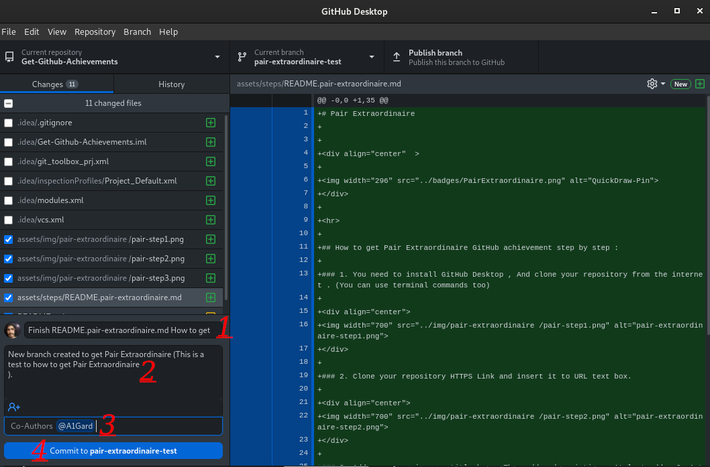

# Pair Extraordinaire

## 如何一步一步获得 Pair Extraordinaire GitHub 成就 :

### 1. 您需要安装 [GitHub Desktop](https://desktop.github.com/) , 并从网上上克隆您的仓库。（如果发现任何错误，则需要从内部仓库文件中添加仓库）

### 2. 克隆仓库HTTPS链接并将其粘贴URL文本框.

### 3. 不使用筛选框，只需单击“新建分支”并为仓库创建新分支

### 4. 在标题框中添加摘要，然后添加描述，最后按用户名 GitHub 添加共同作者（您只需在仓库中提交一个文件（不要推送文件））

### 5. 现在检查 GitHub 上的仓库并添加转让人，然后单击“合并拉取请求”按钮（Pair Extraordinaire 将同时提供给两个帐户（您和共同作者））。

### 6. 完成，现在你可以在你的成就列表中看到Pair Extraordinaire成就

