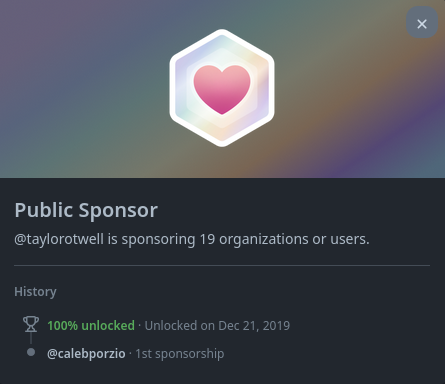

# Public Sponsor

## 如何一步一步获得 Public Sponsor GitHub 成就 :
### 1. （首先你需要知道，要想获得这个徽章，你需要信用卡和捐款）。然后你需要先打开GitHub赞助商页面，然后点击查看你的顶部附属按钮

### 2. 你可以在这里看到一个开发者列表，你可以捐赠他们。（您可以得到任何在其页面上有赞助按钮的GitHub用户的赞助。）

### 3. 当你找到一个人来得到赞助后。 您可以看到一个页面来选择您每月想要捐赠的金额

### 4. 付款完成后，这里有一个付款表格。 您可以在您的个人资料中看到您的徽章（在 Beta 版本中，目前有 30 个国家/地区有付款方式）

### 5. 完成，现在你可以在你的成就列表中看到Public Sponsor成就

