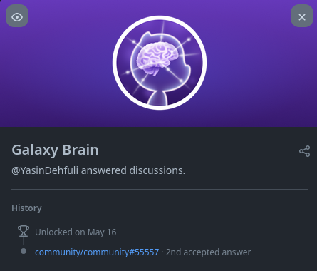

# Galaxy Brain

## How to get Galaxy Brain GitHub achievement step by step :

### 1. Sie müssen zur GitHub-Community-Adresse (https://github.com/community/community) gehen. Und wählen Sie eine der Feedback-Kategorien aus.

### 2. Jetzt müssen Sie unbeantwortete Fragen in den gewünschten Kategorien finden. und beantworte die Fragen.

### 3. Schreiben Sie die richtige Antwort auf die Frage (Ihre Antwort muss die bestmögliche sein, damit sie vom Fragendesigner als eingereichte Antwort ausgewählt werden kann).

### 4. Sie benötigen zwei eingereichte Antworten in allen Kategorien, in denen Sie den Galaxy Brain-Erfolg erhalten möchten

### 5. Fertig. Jetzt können Sie die Galaxy Brain-Errungenschaft in Ihrer Erfolgsliste sehen.

