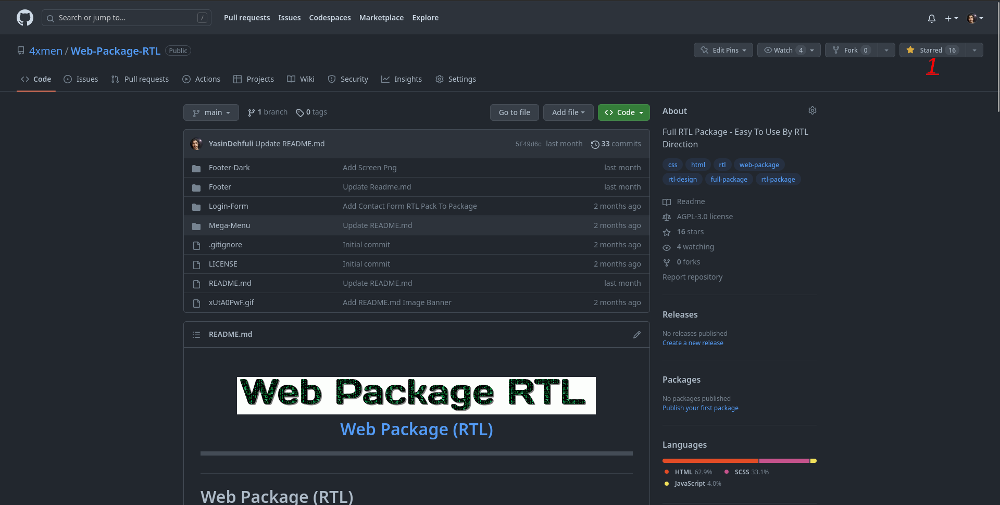
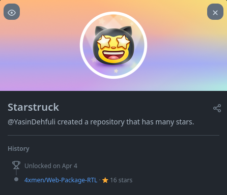

# Starstruck

## So erhalten Sie Schritt für Schritt den Starstruck GitHub-Erfolg:

### 1. Sie benötigen nur 16 Sterne für jedes unter Ihrem Benutzernamen registrierte Projekt. Erhalten Sie von anderen Benutzern Ihrer Organisation oder Ihres Repositorys.

### 2. Fertig. Jetzt können Sie den Starstruck-Erfolg in Ihrer Erfolgsliste sehen.

