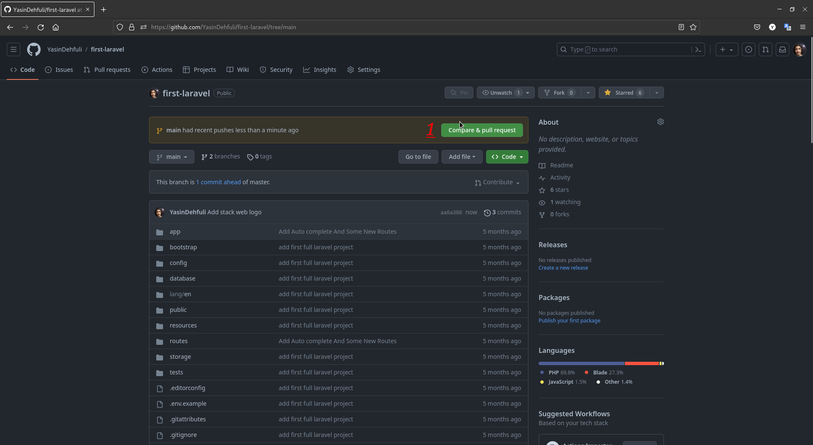

# Yolo

## So erhalten Sie Schritt für Schritt den Yolo GitHub-Erfolg:

### 1. First you need to fork from a repository , click fork then click on Create fork button get a fork of a repository

### 2. Fügen Sie eine Datei hinzu, bearbeiten Sie einige Texte oder nehmen Sie einige Änderungen am gespaltenen Repository vor

### 3. Übertragen Sie Ihre hinzugefügte Datei oder Ihren bearbeiteten Text in das gespaltene Repository.

### 4. Erstellen Sie einen neuen Zweig für diesen Commit und starten Sie eine Pull-Anfrage

### 5. Klicken Sie auf die Schaltfläche „Vergleichen und Anforderung abrufen“.

### 6. Fügen Sie einen Prüfer hinzu, der die Änderungen am geforkten Repository festschreibt

### 7. Fügen Sie einen beliebigen Kommentar in das Feld ein und klicken Sie dann auf „Pull-Anfrage erstellen“. Wenn Ihre Pull-Anfrage hinzugefügt wurde, führen Sie sie vor dem Prüfer zusammen und klicken Sie auf die Schaltfläche „Pull-Anfrage zusammenführen“.  

### 8. Fertig. Jetzt können Sie den Yolo-Erfolg in Ihrer Erfolgsliste sehen.

