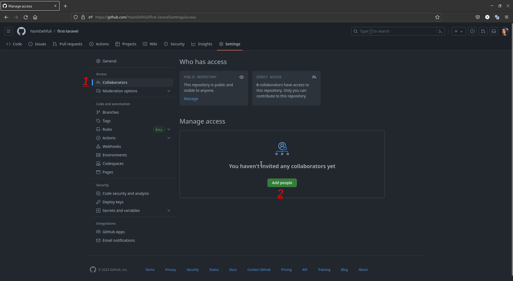

# Yolo

## So erhalten Sie Schritt für Schritt den Yolo GitHub-Erfolg:

### 1. Zuerst müssen Sie das Repository öffnen und zu den Einstellungen gehen.

### 2. Zweitens müssen Sie zur Kategorie „Mitarbeiter“ gehen und in diesem Abschnitt ein Konto einladen, mit dem Sie Zugriff auf das Repository haben.

### 3. Drittens müssen Sie Ihrem Repository einen neuen Zweig hinzufügen.

### 4. Jetzt müssen Sie dem neu erstellten Zweig eine Datei hinzufügen.

### 5. Fügen Sie die Datei hinzu, übernehmen Sie die Beschreibung dafür und übernehmen Sie schließlich Ihre Änderungen

### 6. Klicken Sie auf den grünen Button, vergleichen Sie und ziehen Sie die Anfrage.

### 7. Fügen Sie die eingeladene Person in Schritt 2 als Prüfer hinzu und erstellen Sie eine Pull-Anfrage.

### 8. Überprüfen Sie abschließend, ob Ihr Prüfer vorhanden ist, und klicken Sie dann auf Pull-Anfrage zusammenführen.

### 9. Fertig. Jetzt können Sie den Yolo-Erfolg in Ihrer Erfolgsliste sehen.

