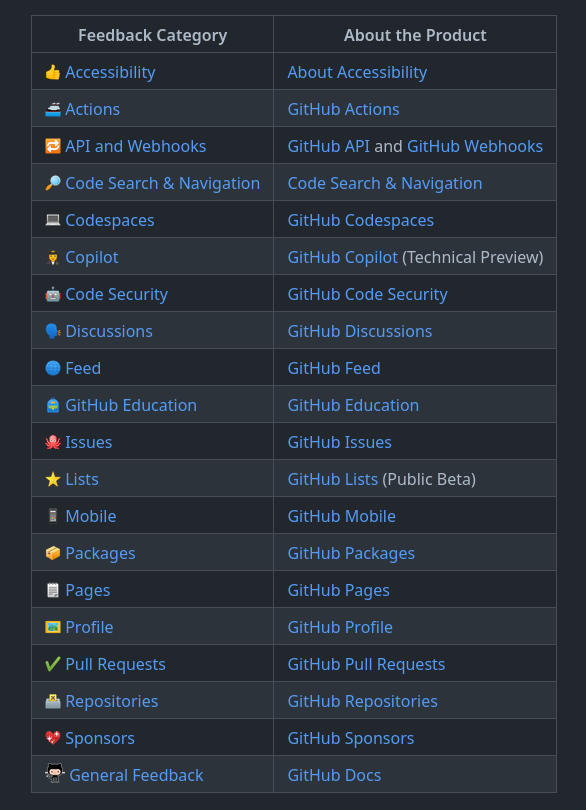
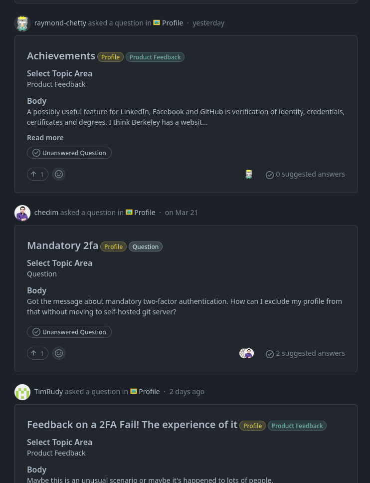
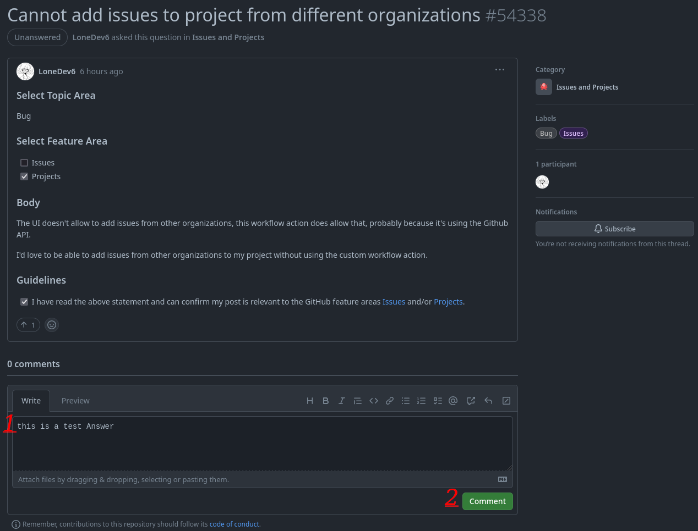
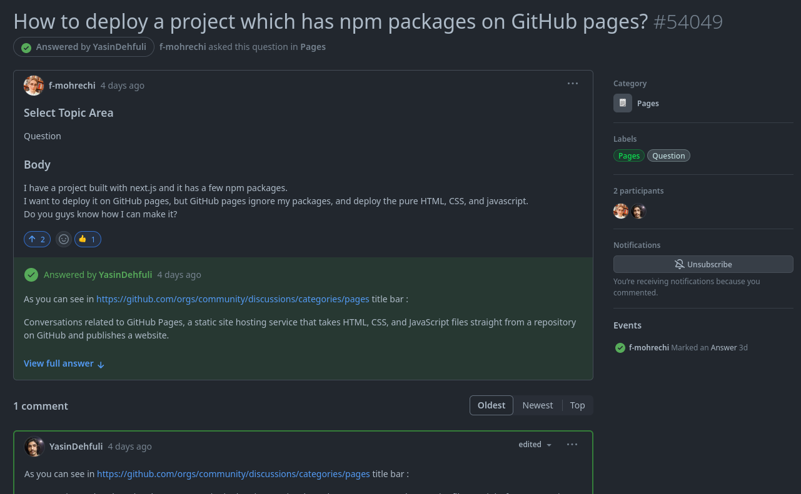
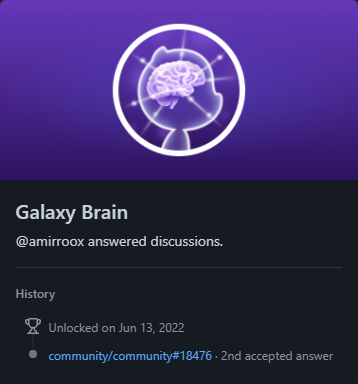

# Galaxy Brain

## Cómo obtener el logro Galaxy Brain en GitHub paso a paso:

### 1. Debes dirigirte a la comunidad de GitHub (https://github.com/community/community). Y seleccionar una de las categorías de comentarios.

### 2. Ahora debes encontrar preguntas sin respuesta en las categorías que desees y responder a las preguntas.

### 3. Escribe una respuesta correcta a la pregunta (Tu respuesta debe ser la mejor posible para ser seleccionada como la respuesta enviada por el diseñador de la pregunta).

### 4. Necesitas tener dos respuestas enviadas en las categorías que desees para obtener el logro de Galaxy Brain.

### 5. ¡Listo! Ahora puedes ver el logro de Galaxy Brain en tu lista de logros.

