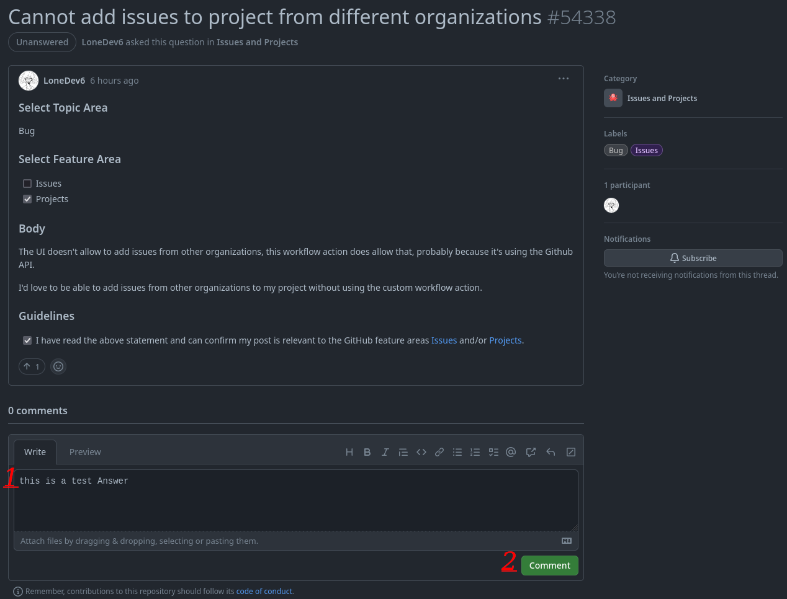

# پین Galaxy Brain

## نحوه دریافت پین Galaxy Brain , قدم به قدم  :

### 1. در مرحله اول نیاز است به آدرس  (https://github.com/community/community) , رفته سپس یکی از دسته های دسته بندی هارا انتخاب کنید که میتوانید به سوالات در کاربران در آن دسته پاسخ دهید  .

### 2. حال نیاز است از دسته بندی انتخاب شده . به سوالات کاربران پاسخ دهید.

### 3. به سوال پرسیده شده پاسخی درست کامل و صحیح بدهید. پاسخ خود را بنویسید و ثبت کنید. (پاسخ شما باید بهترین پاسخ ممکن باشد تا به عنوان پاسخ ارسالی توسط طراح سوال انتخاب شود).

### 4. برای دریافت پین Galaxy Brain به دو پاسخ ارسال شده در هر دسته بندی که می خواهید نیاز دارید

### 5. تبریک, حالا میتوانید پین Galaxy Brain را در پروفایل خود مشاهده کنید.  

