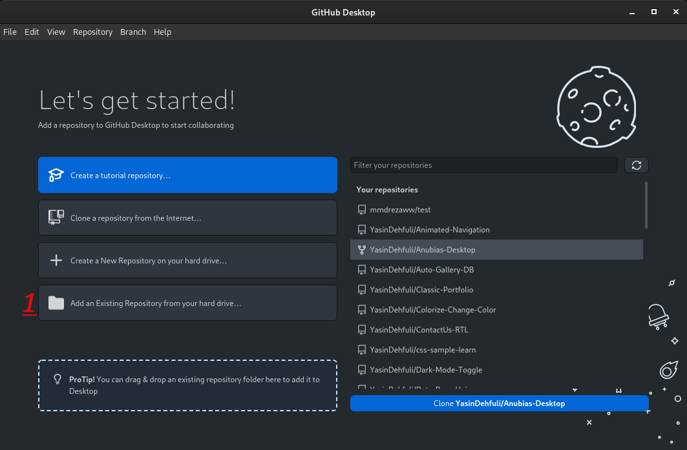

# پین Pair Extraordinaire

##  نحوه دریافت پین Pair Extraordinaire  , قدم به قدم :

### 1. باید GitHub Desktop را نصب کنید و مخزن خود را از اینترنت کلون کنید. (اگر Error پیدا کردید، باید مخزن خود را از فایل مخزن داخلی خود اضافه کنید)

### 2. پیوند HTTPS مخزن خود را کلون کنید و آن را در کادر متنی URL وارد کنید.

### 3. نیازی به استفاده از فیلتر باکس نیست فقط بر روی New Branch کلیک کنید و برای مخزن خود Branch جدید ایجاد کنید.

### 4. Add a summary in your title box , Then add a description , At last add a Co-Author By Username GitHub (You need to just commit a file in your repository (Don't Push the Files)).

### 5. Now check your repository on GitHub and add Assignees , And then click on Merge pull request button (the Pair Extraordinaire will give to both accounts (You and Co-Author)).

### 6. Done , Now you can see that Pair Extraordinaire Achievement in your achievements list.

