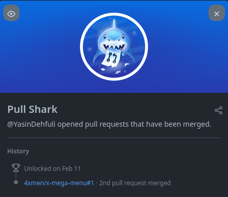

# Pull Shark

## How to get Pull Shark GitHub achievement step by step :

### 1. You need to get fork from a repository ( you can fork any repository you want ).  

### 2. When your forked repository create , you need to do some changes on forked repository ( any changes like add new file or do some changes on codes ! ), After that , you need to go to pull request tab;

### 3. Click on create pull request button ;

### 4. Now you can see able to merge green text that means you can merge your pulled request , So click on Create Pull request button to create your pull request successfully . Then you have to wait for your request to be Merged by the creator of repository.
#### - You need 2 merged pull request , to get the Pull Shark Achievement

### 5. Done , Now you can see that Pull Shark Achievement in your achievements list.

