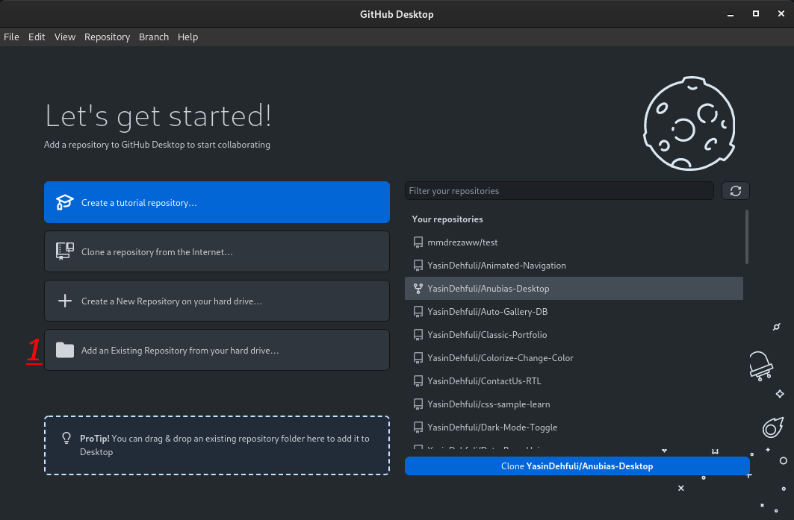
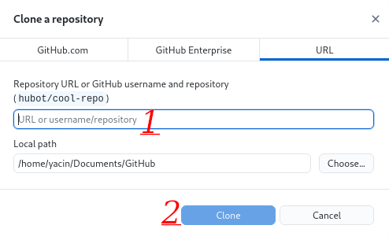
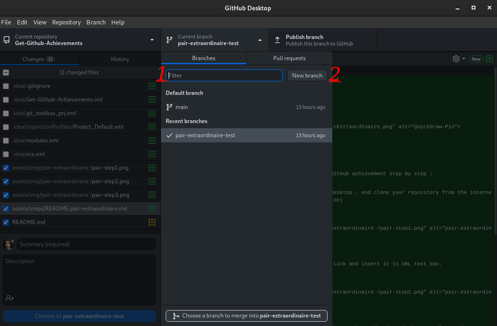
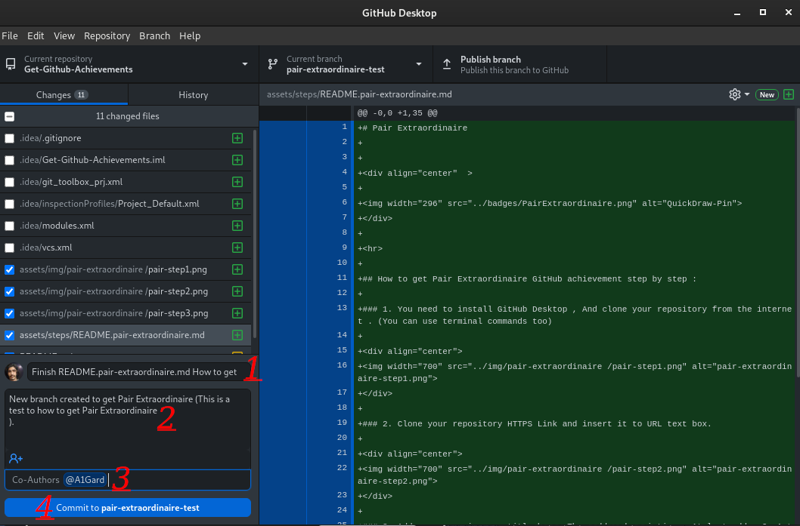
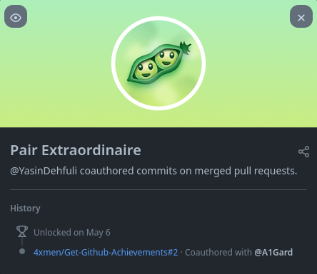

# Pair Extraordinaire

## Comment obtenir le succès Pair Extraordinaire GitHub étape par étape :

### 1. Vous devez installer GitHub Desktop et cloner votre référentiel à partir d'Internet. (si vous avez trouvé une erreur, vous devez ajouter votre référentiel à partir de votre fichier de référentiel interne)

### 2. Clonez votre lien HTTPS de référentiel et insérez-le dans la zone de texte URL.

### 3. Pas besoin d'utiliser la boîte de filtre, cliquez simplement sur Nouvelle branche et Créer une nouvelle branche pour votre référentiel

### 4. Ajoutez un résumé dans votre zone de titre, puis ajoutez une description, enfin ajoutez un co-auteur par nom d'utilisateur GitHub (vous devez simplement valider un fichier dans votre référentiel (ne poussez pas les fichiers)).

### 5. Vérifiez maintenant votre référentiel sur GitHub et ajoutez des cessionnaires, puis cliquez sur le bouton Fusionner la demande d'extraction (la paire extraordinaire donnera aux deux comptes (vous et co-auteur)).

### 6. Terminé, vous pouvez maintenant voir cette réalisation paire extraordinaire dans votre liste de réalisations.

