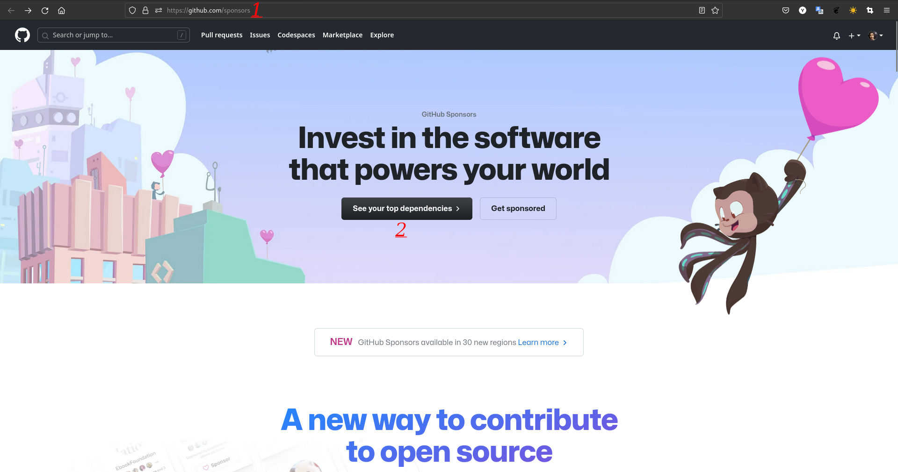
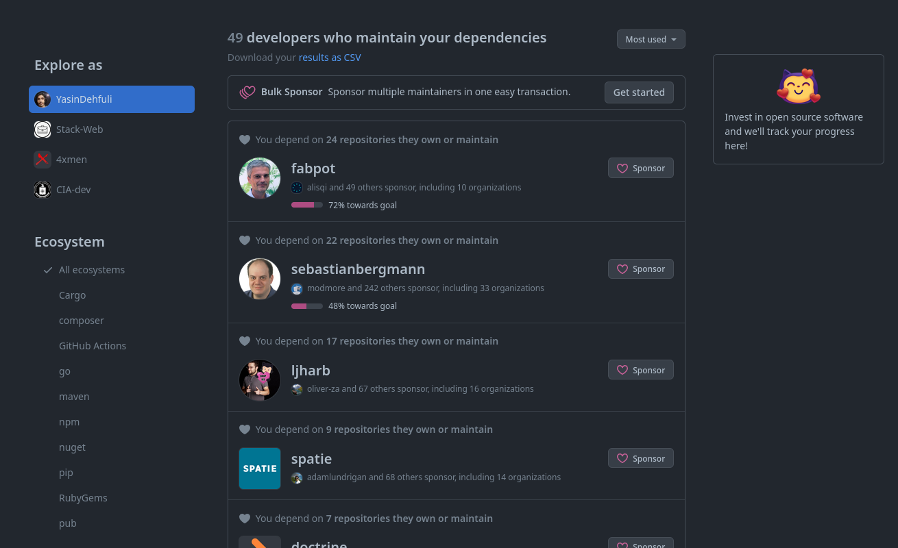
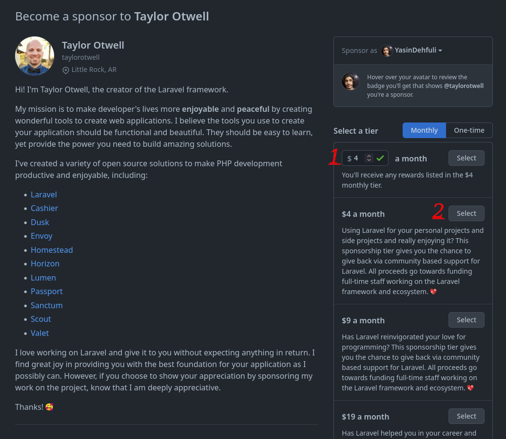
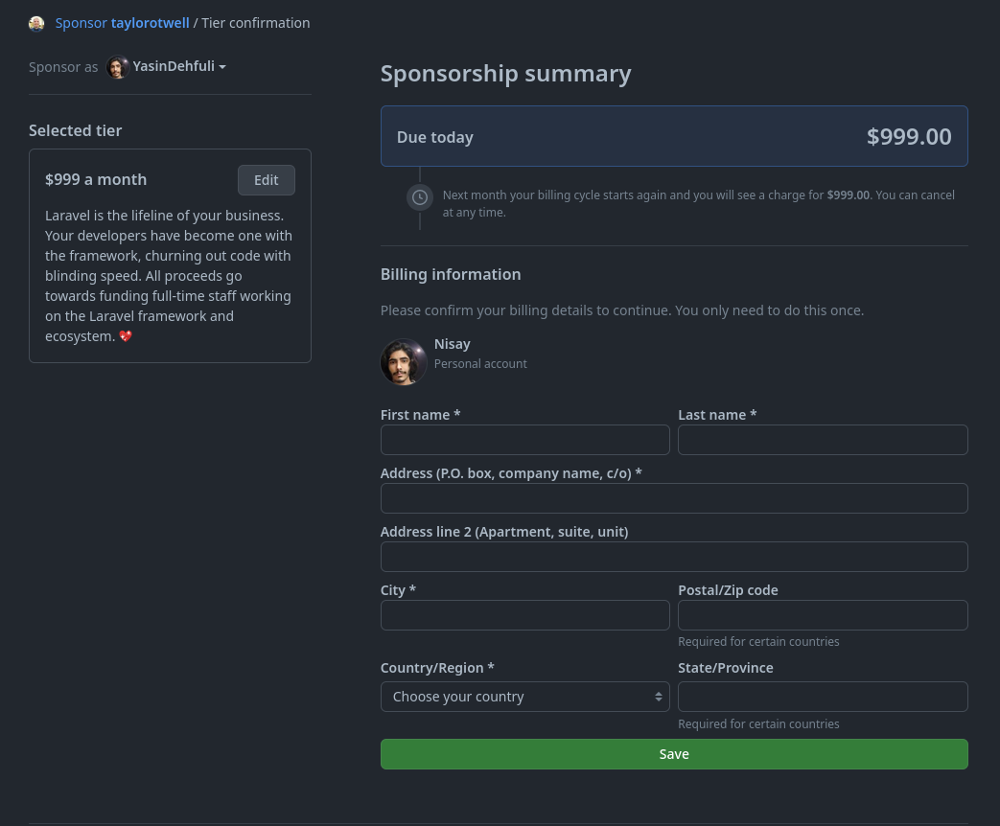
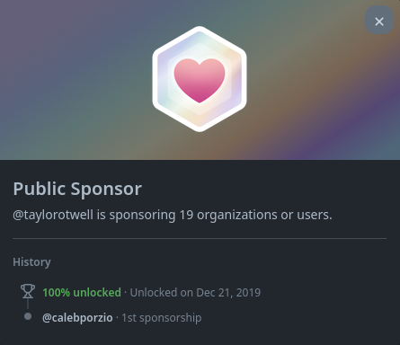

# Public Sponsor (Commanditaire du public)

## Comment obtenir la réussite du sponsor public GitHub étape par étape :
### 1. (Vous devez d'abord savoir, pour obtenir ce badge, vous avez besoin d'une carte de crédit et donner de l'argent). Ensuite, vous devez d'abord ouvrir la page des sponsors GitHub, puis cliquer sur le bouton Voir vos principales dépendances.

### 2. Vous pouvez voir une liste de développeurs que vous pouvez leur donner ici. (Vous pouvez être parrainé par tous les utilisateurs de GitHub qui ont un bouton sponsorisé sur leurs pages.)

### 3. Après avoir trouvé une personne à parrainer. vous pouvez voir une page pour sélectionner le montant que vous souhaitez donner par mois.

### 4. Il y a un formulaire de paiement ici, une fois votre paiement terminé. Vous pouvez voir votre badge dans votre profil (dans la version bêta, 30 pays ont des méthodes de paiement pour l'instant).

### 5. Terminé, vous pouvez maintenant voir cette réalisation de sponsor public dans votre liste de réalisations.

