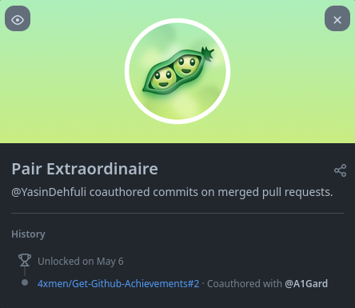

# Pair Extraordinaire

## कैसे पेयर एक्स्ट्रा-डिनेयर GitHub उपलब्धि प्राप्त करने का कदम-से-कदम तरीका:

### 1. [GitHub Desktop](https://desktop.github.com/) इंस्टॉल करें, अपने आंतरिक रिपॉजिटरी फ़ाइल से अपनी रिपॉजिटरी जोड़ना है।

### 2. एक स्थानीय रिपॉजिटरी जोड़ें और अपनी बदली गई फ़ाइलों को कमिट और पुश करें।

### 3. फ़िल्टर बॉक्स का उपयोग करने की आवश्यकता नहीं है, बस "New branch" पर क्लिक करें और अपनी रिपॉजिटरी के लिए एक नई शाखा बनाएं।

### 4. अपने शीर्षक बॉक्स में एक सारांश जोड़ें, फिर एक विवरण जोड़ें, अंत में GitHub उपयोगकर्ता के द्वारा सह-लेखक जोड़ें (आपको बस अपनी रिपॉजिटरी में एक फ़ाइल कमिट करनी है (फ़ाइलें पुश न करें))।

### 5. अब अपनी रिपॉजिटरी को GitHub पर चेक करें और Assignees जोड़ें, और फिर "Merge pull request" बटन पर क्लिक करें (Pair Extraordinaire दोनों खातों को मिलेगा (आप और सह-लेखक))।

### 6. हो गया, अब आप अपनी उपलब्धियों सूची में पेयर एक्स्ट्रा-डिनेयर उपलब्धि देख सकते हैं।

