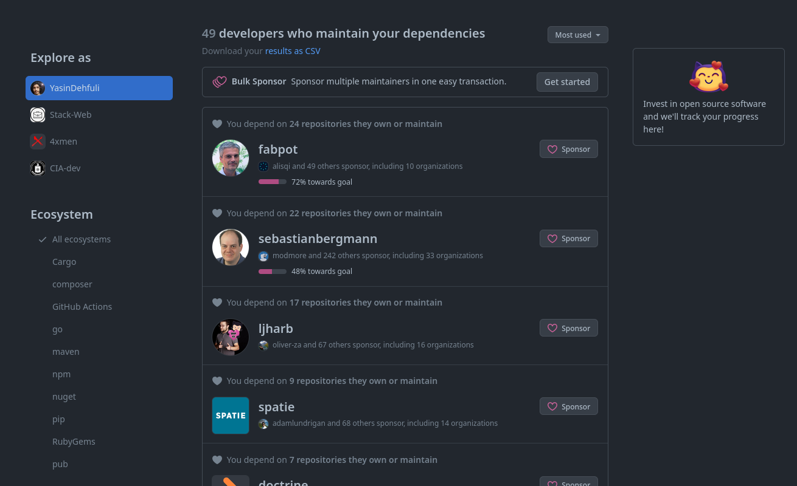

# Public Sponsor

## पब्लिक सपोंसर GitHub उपलब्धि प्राप्त करने का कदम-से-कदम तरीका:
### 1. (सबसे पहले आपको यह जानना होगा, इस बैज प्राप्त करने के लिए आपको क्रेडिट कार्ड और कुछ धन दान करना होगा)। तब आपको पहले GitHub सपोंसर्स पृष्ठ खोलना है, और फिर "See your top dependencies" बटन पर क्लिक करें।

### 2. यहां आप उन डेवेलपर्स की सूची देख सकते हैं जिन्हें आप यहां धन दान कर सकते हैं (आप उन GitHub उपयोगकर्ताओं के सपोंसर बटन के साथ जो धन दान कर सकते हैं)।

### 3. जब आपने सपोंसर करने वाले व्यक्ति को खोज लिया है, तो आपको महीने भर में कितना दान करना चाहते हैं, इसे चुनने के लिए एक पृष्ठ दिखाई देगा।

### 4. यहां एक भुगतान के लिए एक फॉर्म है, जब आपका भुगतान समाप्त हो जाएगा, तो आप अपने प्रोफ़ाइल में अपने बैज देख सकते हैं (बीटा संस्करण में 30 देशों के लिए अब भुगतान के तरीके हैं)।

### 5. हो गया, अब आप अपनी उपलब्धियों सूची में पब्लिक सपोंसर अचीवमेंट देख सकते हैं।

