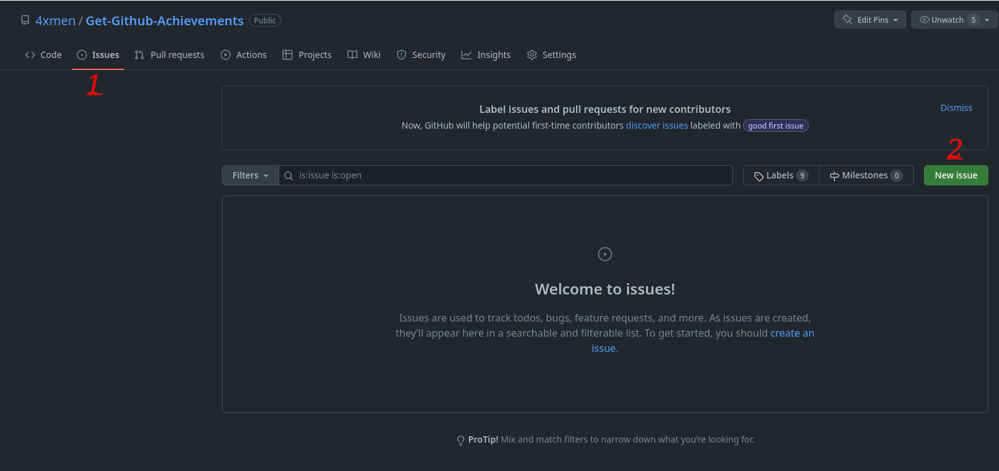

# Quickdraw

## कैसे Quickdraw GitHub उपलब्धि प्राप्त करने का कदम-से-कदम तरीका:

### 1. आपको किसी भी रिपॉजिटरी में नया मुद्दा (Issue) या पुल रिक्वेस्ट (Pull Request) बनाना होगा।

### 2. अब आपको एक शीर्षक लिखना होगा और एक टिप्पणी छोड़नी है (यदि आप चाहें)। और फिर, "Submit new issue" बटन पर क्लिक करें।

### 3. आप जो भी टिप्पणी छोड़ना चाहते हैं (आप बिना टिप्पणी के ही मुद्दा या पुल रिक्वेस्ट को बंद कर सकते हैं)। और फिर "Close issue / close pull request" पर क्लिक करें।

### 4. हो गया, अब आप अपनी उपलब्धियों सूची में Quickdraw अचीवमेंट देख सकते हैं।

