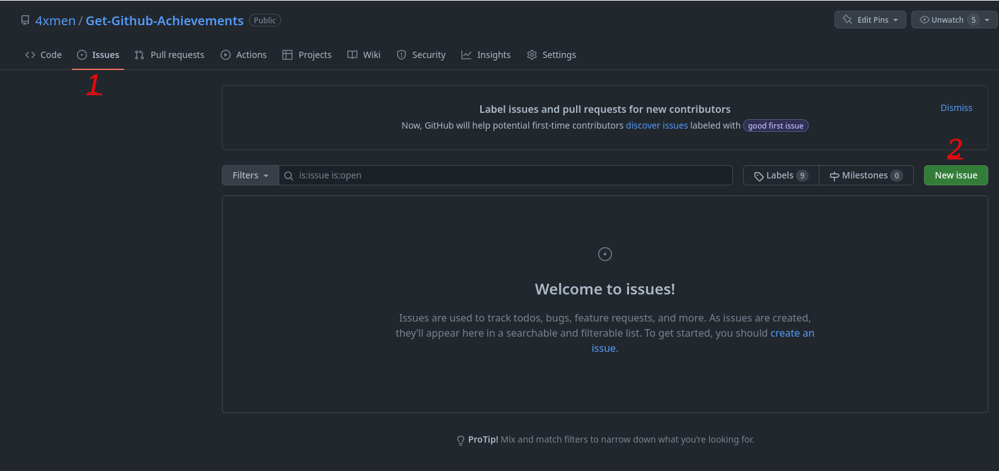
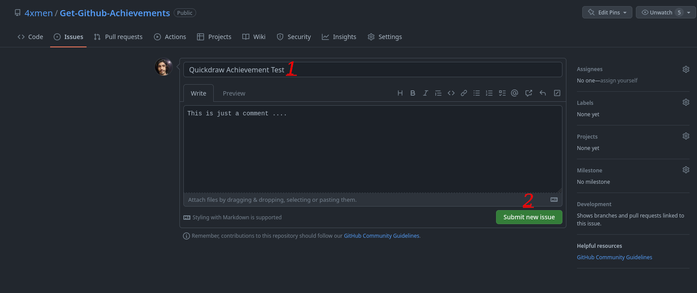
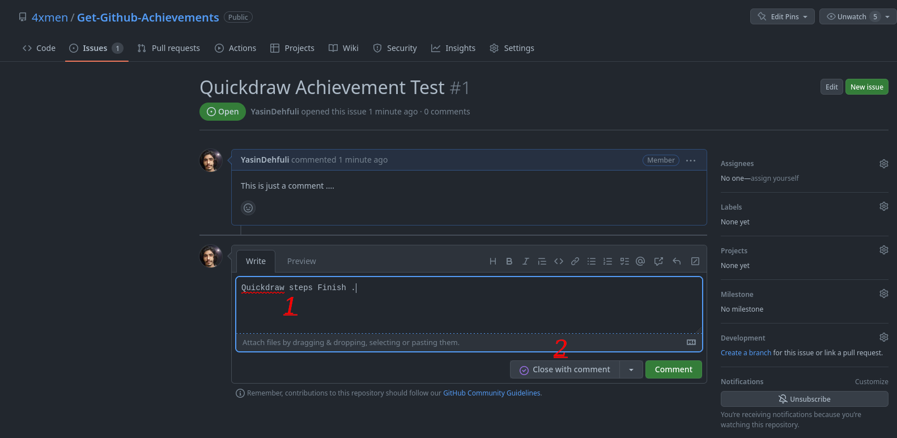
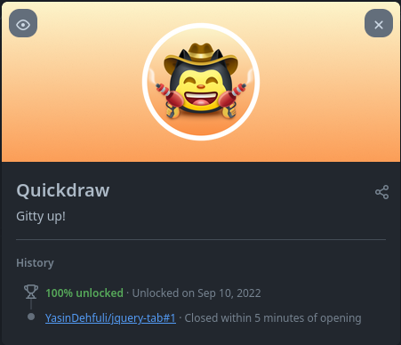

# Quickdraw

## Cara Mendapatkan Prestasi Quickdraw GitHub langkah demi langkah:

### 1. Anda perlu membuat Issue atau Pull Request Baru di repositori mana pun yang Anda inginkan.

### 2. Sekarang Anda harus menulis judul dan meninggalkan komentar (jika Anda mau). Kemudian klik tombol Submit new issue.

### 3. Tulis komentar apa pun yang Anda inginkan (Anda dapat menutup issue atau pull request tanpa memberi komentar juga). Kemudian klik Close issue / close pull request.

### 4. Selesai, sekarang Anda dapat melihat Prestasi Quickdraw di daftar prestasi Anda.

