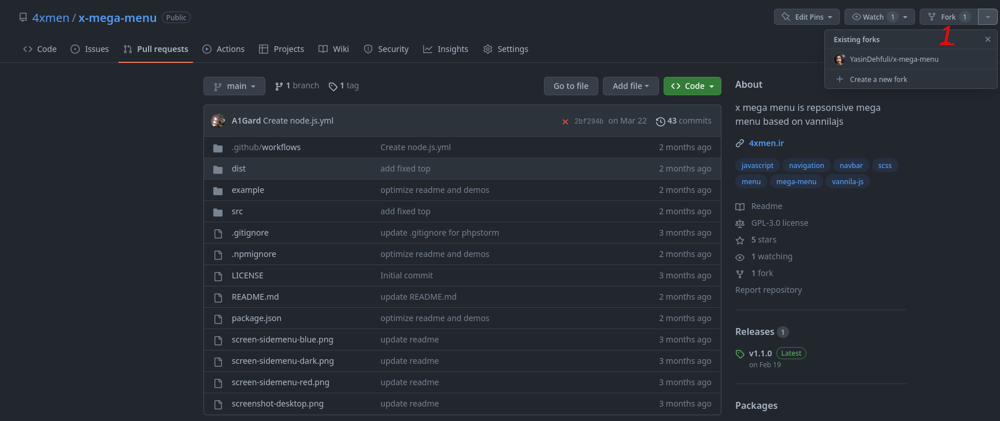
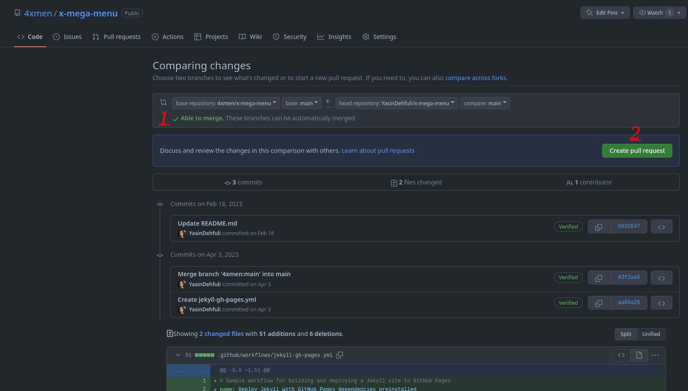

# Pull Shark

## GitHubアチーブメント「Pull Shark」を手に入れる方法：

### 1. リポジトリからフォークを作成する必要があります（好きなリポジトリをフォークできます）。  

### 2. フォークされたリポジトリが作成されたら、フォークされたリポジトリでいくつかの変更を行う必要があります（新しいファイルを追加したり、コードに変更を加えたりします）。その後、プルリクエストタブに移動します；

### 3. プルリクエストの作成ボタンをクリックします；

### 4. これでマージ可能な緑色のテキストが表示され、これはあなたのプルリクエストをマージできることを意味します。成功裏にプルリクエストを作成するには、「プルリクエストの作成」ボタンをクリックしてください。その後、リポジトリの作成者によってリクエストがマージされるのを待つ必要があります。
#### - Pull Shark Achievementを取得するには、2つのマージされたプルリクエストが必要です。

### 5. 完了しました。これで、アチーブメントリストに「Pull Shark」の達成が表示されます。

