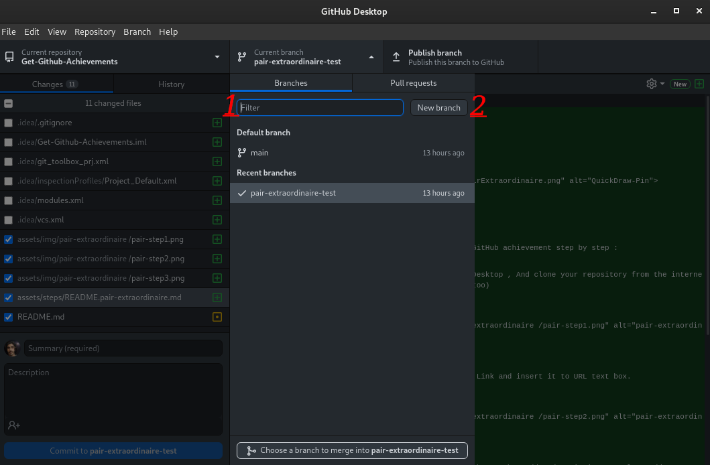

# Pair Extraordinaire

## Hoe krijg ik Pair Extraordinaire GitHub prestatie stap voor stap :

### 1. Je moet [GitHub Desktop](https://desktop.github.com/) installeren, en je repository van het internet klonen. (als je een foutmelding vindt, moet je je repository toevoegen vanuit je interne repository bestand)

### 2. Kloon de HTTPS-link van je archief en voeg deze in het tekstvak URL in.

### 3. Je hoeft het filtervak niet te gebruiken, klik gewoon op Nieuwe branch en maak een nieuwe branch voor je archief.

### 4. Voeg een samenvatting toe in je titelvak, voeg dan een beschrijving toe, voeg als laatste een Co-Author By Username GitHub (Je hoeft alleen maar een bestand vast te leggen in je repository (Don't Push the Files)).

### 5. Controleer nu je repository op GitHub en voeg Assignees toe, en klik dan op de samenvoeg pull request knop (de Pair Extraordinaire zal aan beide accounts geven (Jij en Co-Author)).

### 6. Klaar, nu kun je de prestatie Pair Extraordinaire zien in je lijst met prestaties.

