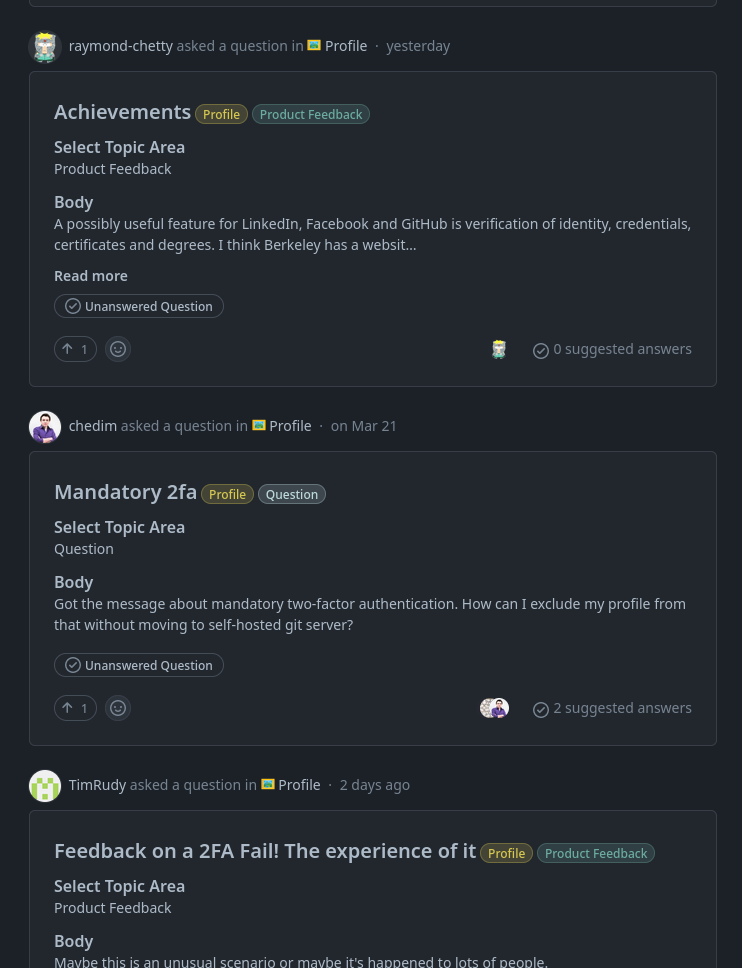
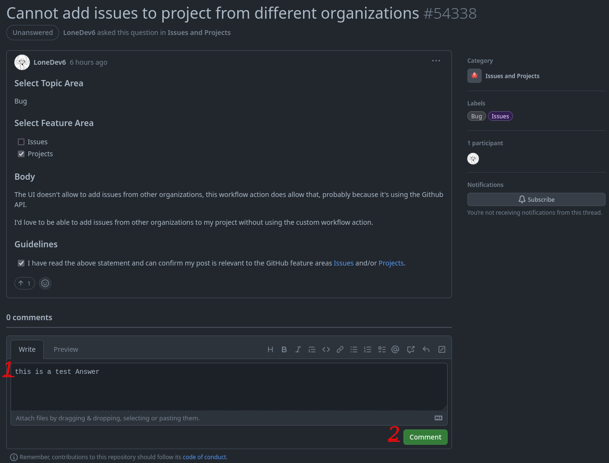
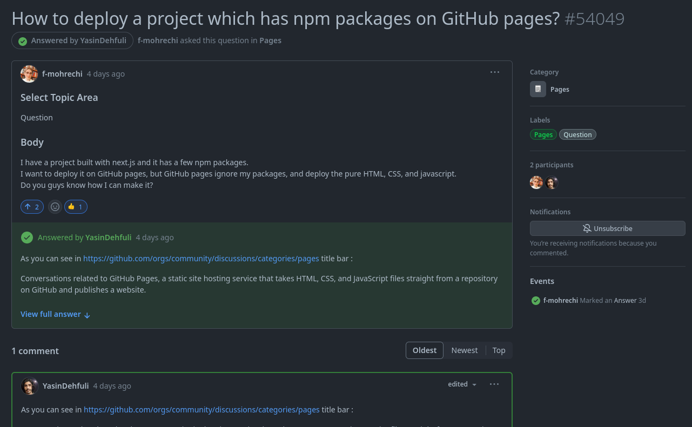
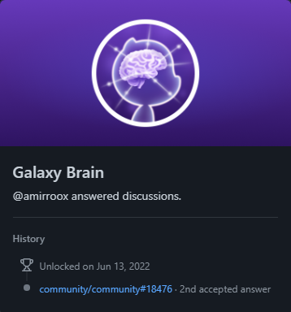

# Galaxy Brain

## Jak krok po kroku zdobyć osiągnięcie GitHub Galaxy Brain

### 2. Znajdź pytania bez odpowiedzi w wybranej kategorii i odpowiedz na nie.

### 3. Udziel poprawnej odpowiedzi. Powinna być możliwie najlepsza, aby autor pytania wybrał ją jako zaakceptowaną.

### 4. Aby zdobyć Galaxy Brain, potrzebujesz dwóch zaakceptowanych odpowiedzi w dowolnych kategoriach.

### 5. Gotowe. Osiągnięcie Galaxy Brain powinno pojawić się na liście Twoich osiągnięć.

