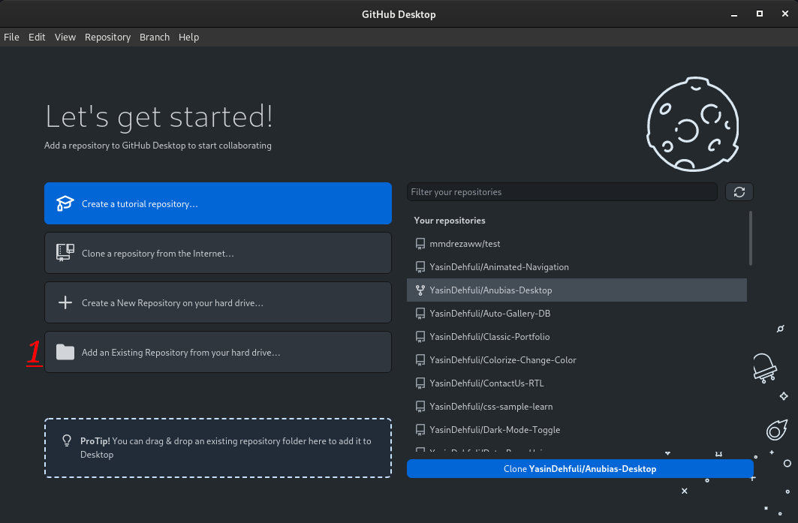
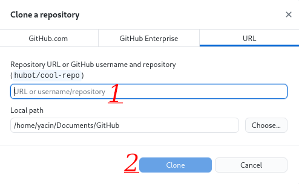
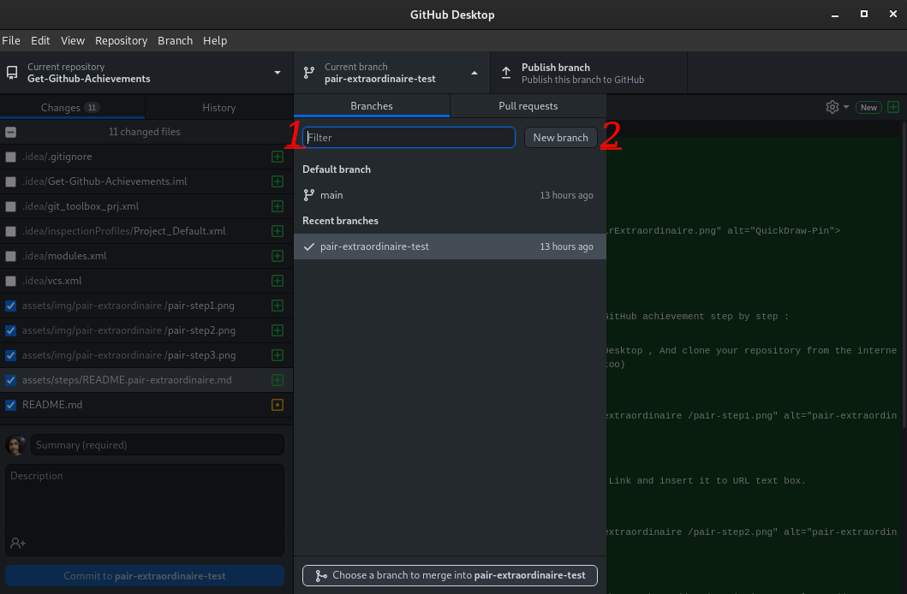
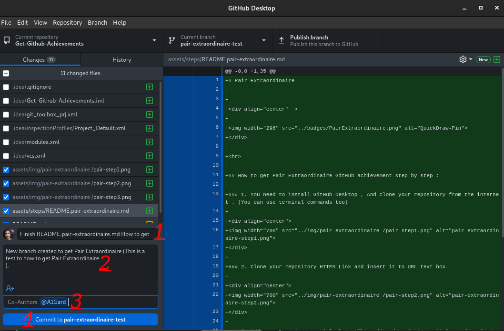
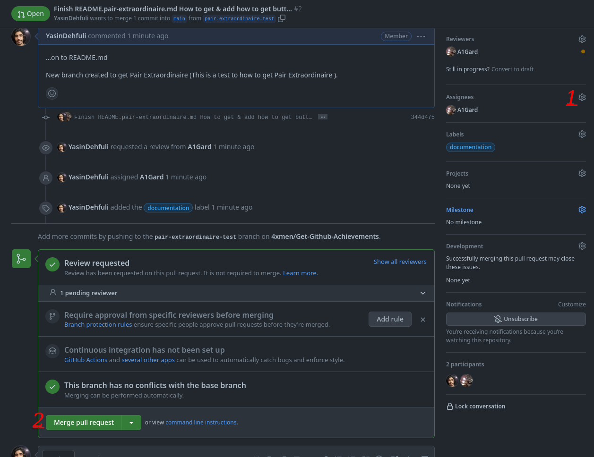
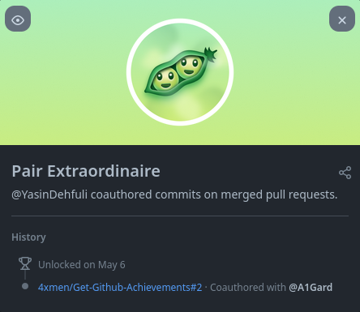

# Pair Extraordinaire

## Jak krok po kroku zdobyć osiągnięcie GitHub Pair Extraordinaire

### 1. Zainstaluj [GitHub Desktop](https://desktop.github.com/) i dodaj repozytorium ze swoich lokalnych plików.

### 2. Dodaj lokalne repozytorium, a następnie zatwierdź i wypchnij zmienione pliki.

### 3. Nie musisz używać pola filtrowania. Kliknij New branch i utwórz nową gałąź dla repozytorium.

### 4. Wpisz tytuł i opis, a na końcu dodaj współautora, podając jego nazwę użytkownika GitHub. Wystarczy zatwierdzić plik w repozytorium — nie wypychaj plików.

### 5. Otwórz repozytorium na GitHubie i dodaj osoby przypisane do zgłoszenia (assignees). Następnie kliknij Merge pull request. Odznakę Pair Extraordinaire otrzymają oba konta: Twoje i współautora.

### 6. Gotowe. Osiągnięcie Pair Extraordinaire powinno pojawić się na liście Twoich osiągnięć.

