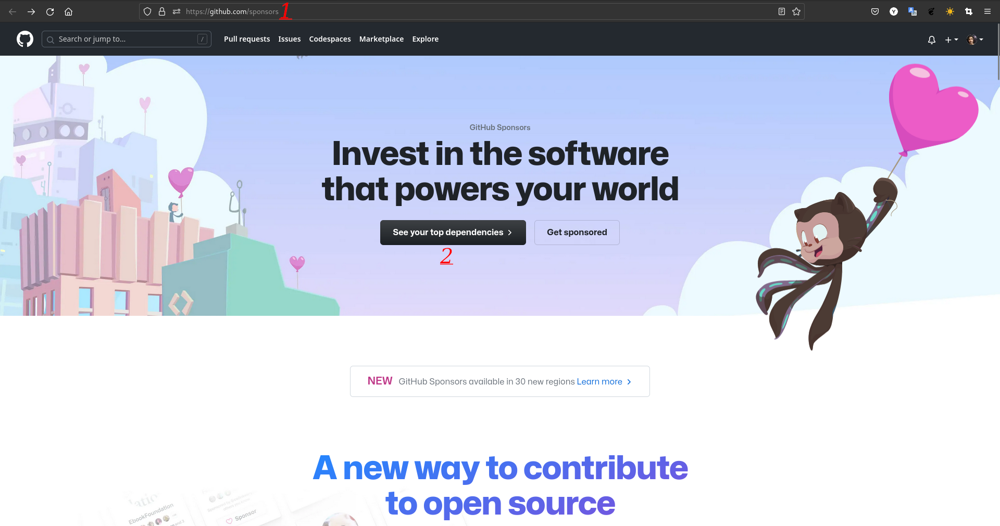
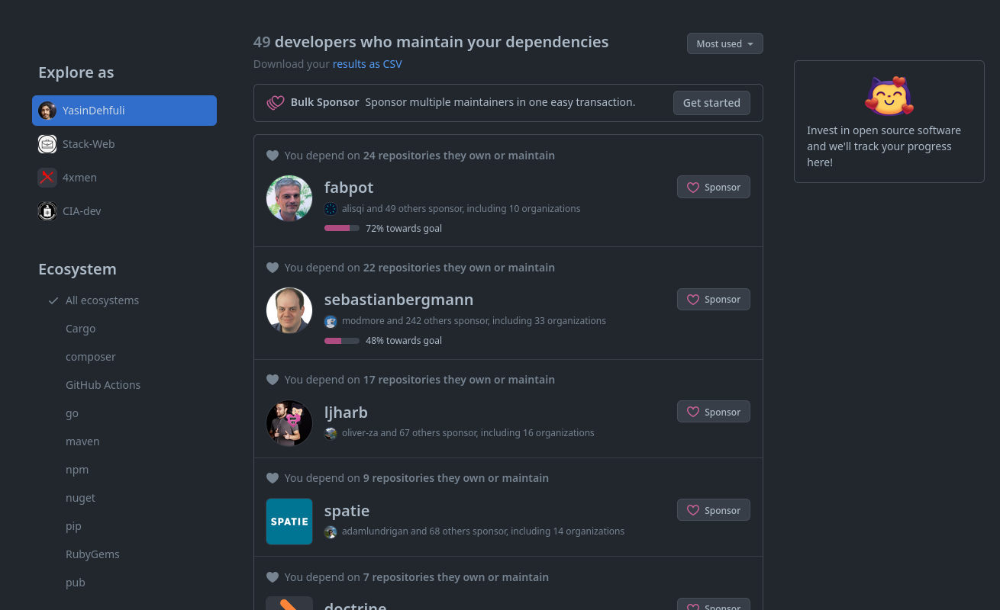
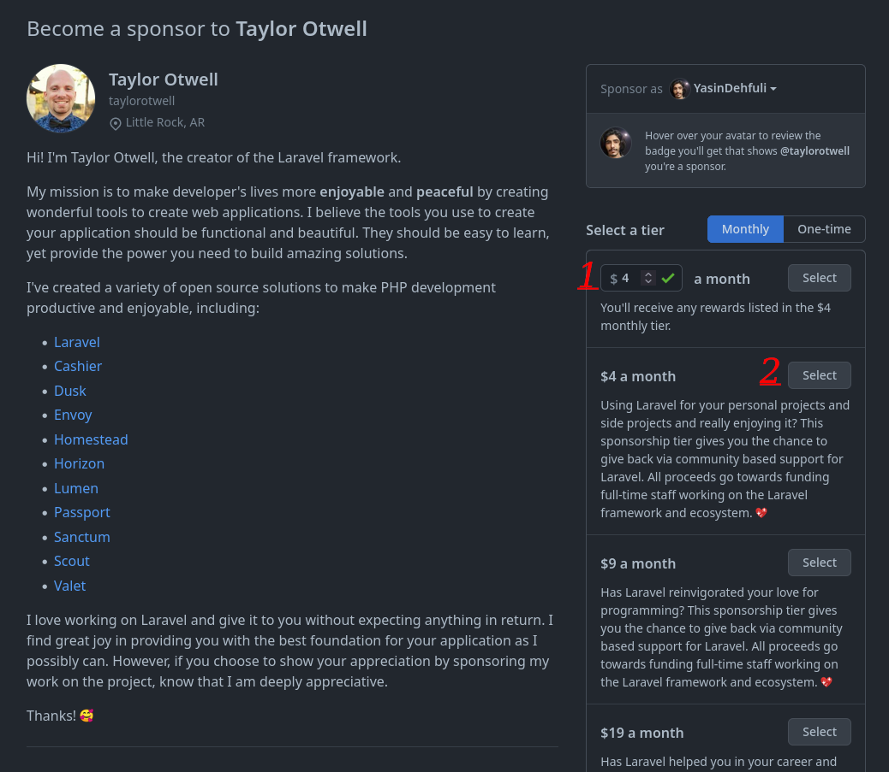
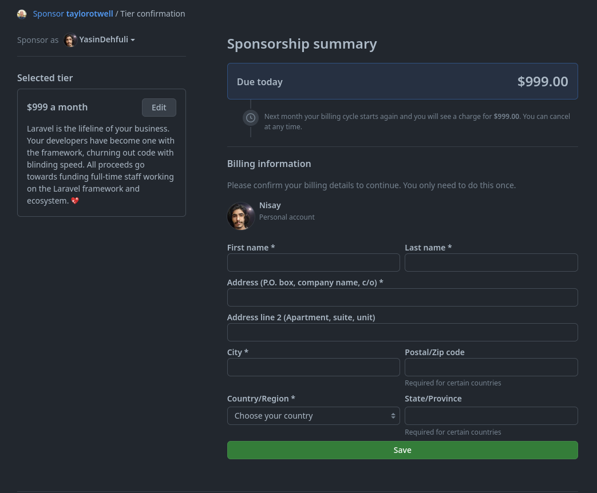
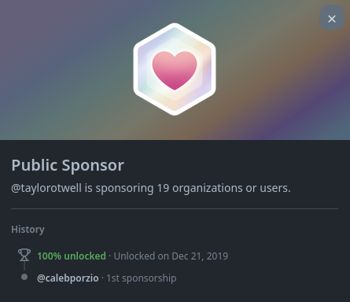

# Public Sponsor

## Jak krok po kroku zdobyć osiągnięcie GitHub Public Sponsor

### 1. Do zdobycia tej odznaki potrzebna jest karta płatnicza i wpłata. Otwórz stronę [GitHub Sponsors](https://github.com/sponsors), a następnie kliknij See your top dependencies.

### 2. Zobaczysz listę programistów, których możesz wesprzeć. Możesz sponsorować dowolnego użytkownika GitHub, który ma przycisk sponsorowania na swojej stronie.

### 3. Wybierz osobę, którą chcesz sponsorować, a następnie określ miesięczną kwotę wpłaty.

### 4. Wypełnij formularz płatności. Po jej zakończeniu odznaka powinna pojawić się na Twoim profilu. W wersji beta metody płatności były dostępne w 30 krajach.

### 5. Gotowe. Osiągnięcie Public Sponsor powinno pojawić się na liście Twoich osiągnięć.

