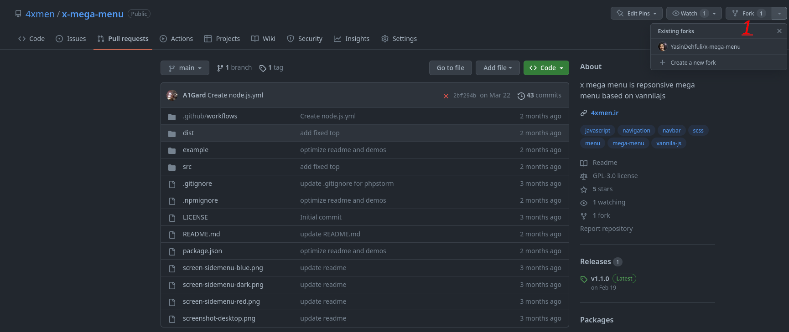
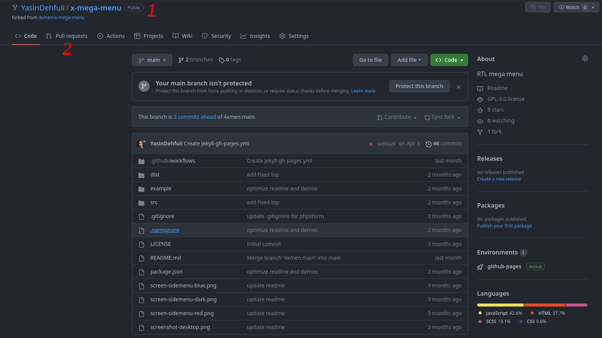
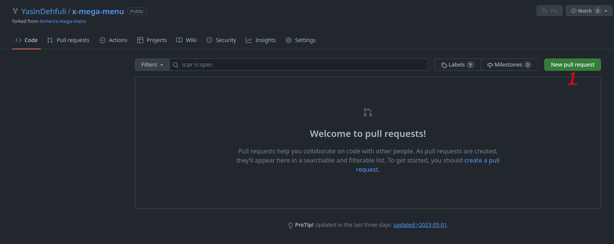
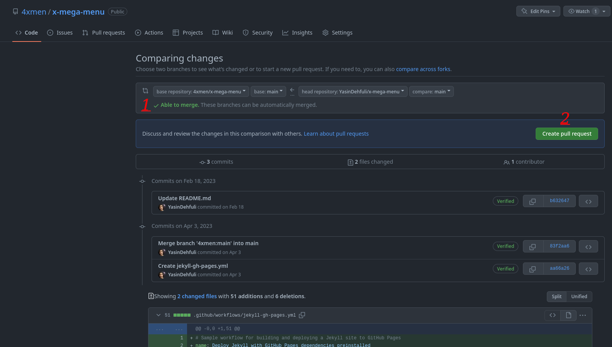
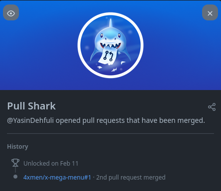

# Pull Shark

## Jak krok po kroku zdobyć osiągnięcie GitHub Pull Shark

### 1. Utwórz fork wybranego repozytorium.

### 2. Wprowadź zmiany w swoim forku, na przykład dodaj plik lub zmodyfikuj kod. Następnie przejdź do zakładki pull requestów.

### 3. Kliknij przycisk tworzenia pull requesta.

### 4. Jeśli widzisz zielony komunikat informujący, że zmiany można scalić, kliknij Create pull request. Poczekaj, aż właściciel repozytorium scali Twoje zgłoszenie.

#### - Do zdobycia osiągnięcia Pull Shark potrzebujesz dwóch scalonych pull requestów.

### 5. Gotowe. Osiągnięcie Pull Shark powinno pojawić się na liście Twoich osiągnięć.

