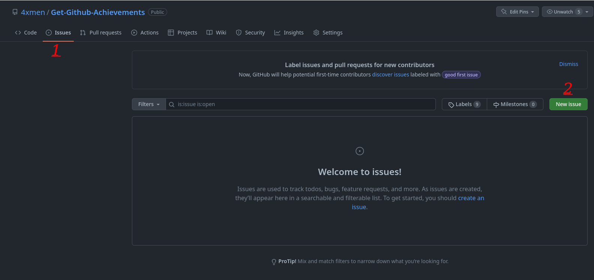
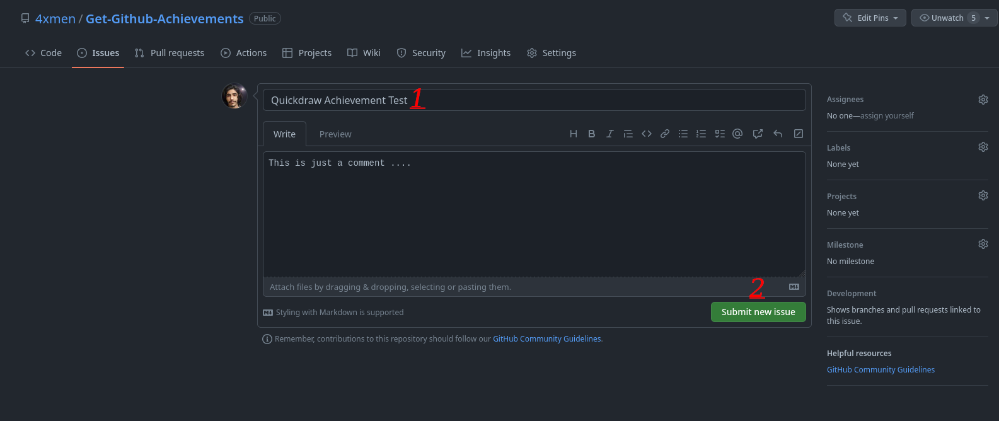
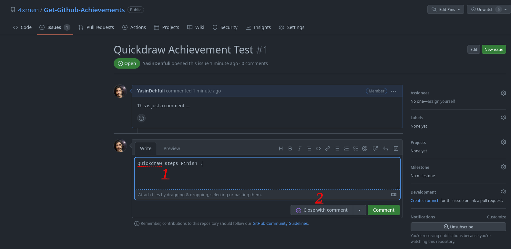
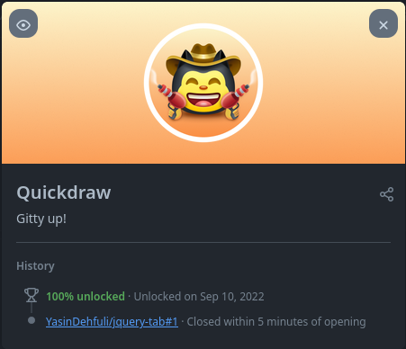

# Quickdraw

## Jak krok po kroku zdobyć osiągnięcie GitHub Quickdraw

### 1. Utwórz nowe zgłoszenie (issue) lub pull request w wybranym repozytorium.

### 2. Wpisz tytuł i, jeśli chcesz, dodaj komentarz. Następnie kliknij przycisk Submit new issue.

### 3. Dodaj dowolny komentarz, a następnie kliknij Close issue lub Close pull request. Możesz też zamknąć zgłoszenie albo pull request bez komentowania.

### 4. Gotowe. Osiągnięcie Quickdraw powinno pojawić się na liście Twoich osiągnięć.

