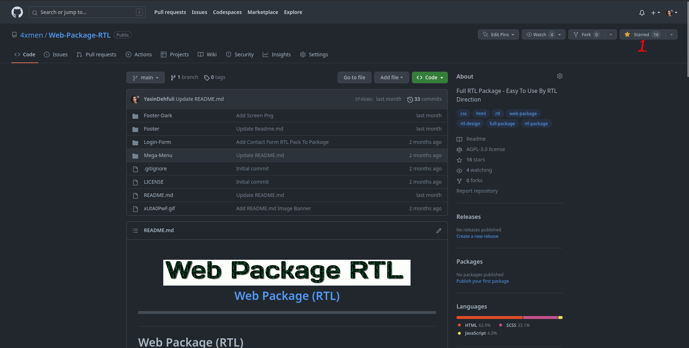
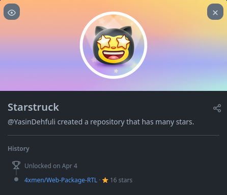

# Starstruck

## Jak krok po kroku zdobyć osiągnięcie GitHub Starstruck

### 1. Repozytorium przypisane do Twojego konta musi otrzymać 16 gwiazdek od innych użytkowników. Mogą to być użytkownicy Twojej organizacji lub repozytorium.

### 2. Gotowe. Osiągnięcie Starstruck powinno pojawić się na liście Twoich osiągnięć.

