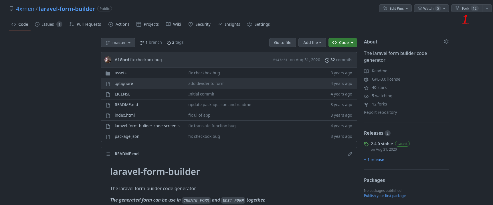
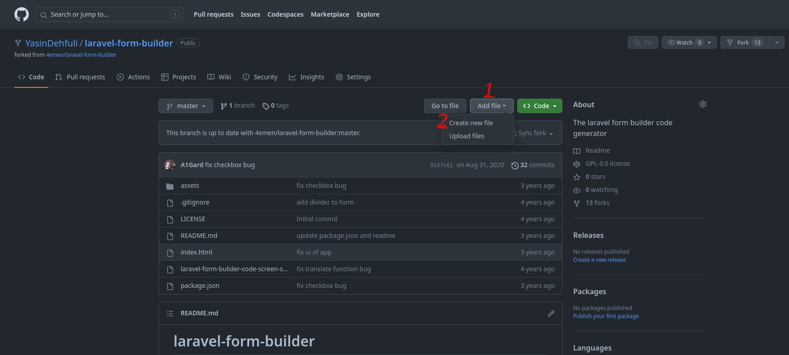
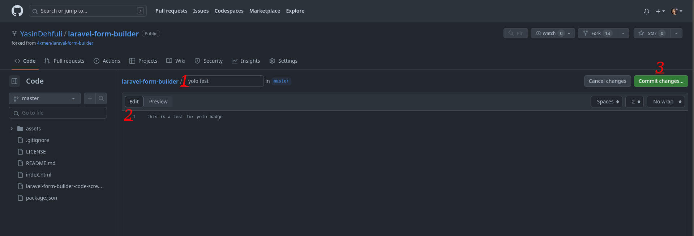
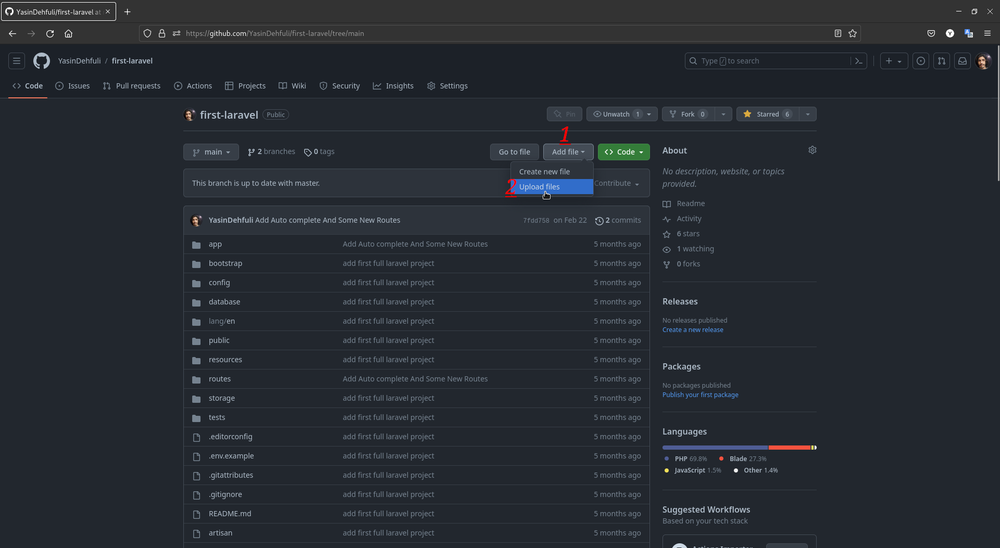
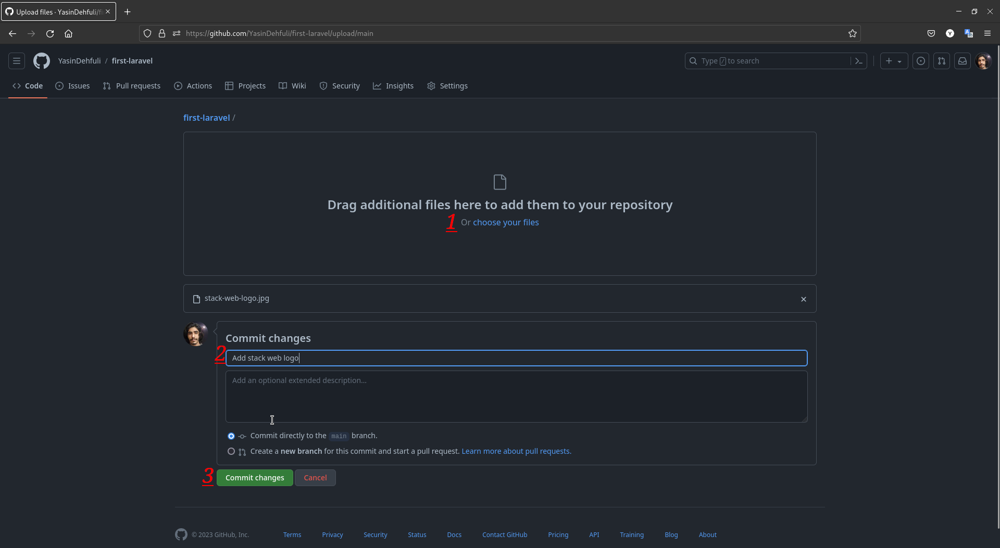
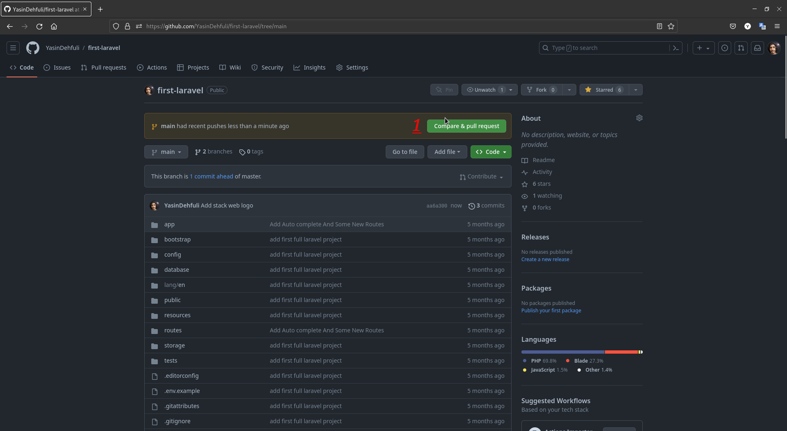
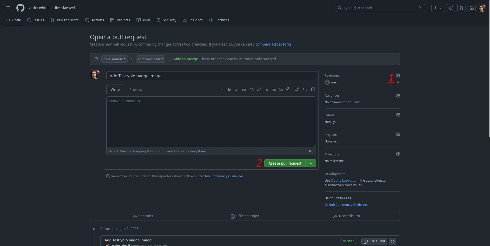
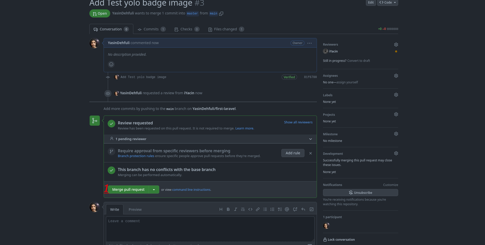

# YOLO

## Jak krok po kroku zdobyć osiągnięcie GitHub YOLO

### 1. Otwórz repozytorium i przejdź do ustawień.

### 2. Przejdź do sekcji Collaborators i zaproś konto, które ma dostęp do repozytorium.

### 3. Utwórz nową gałąź w repozytorium.

### 4. Dodaj plik do utworzonej gałęzi.

### 5. Dodaj plik, wpisz opis commita, a na koniec zatwierdź zmiany.

### 6. Kliknij zielony przycisk Compare and pull request.

### 7. Dodaj jako recenzenta osobę zaproszoną w kroku 2 i utwórz pull request.

### 8. Sprawdź, czy recenzent jest przypisany, a następnie kliknij Merge pull request.

### 9. Gotowe. Osiągnięcie YOLO powinno pojawić się na liście Twoich osiągnięć.

