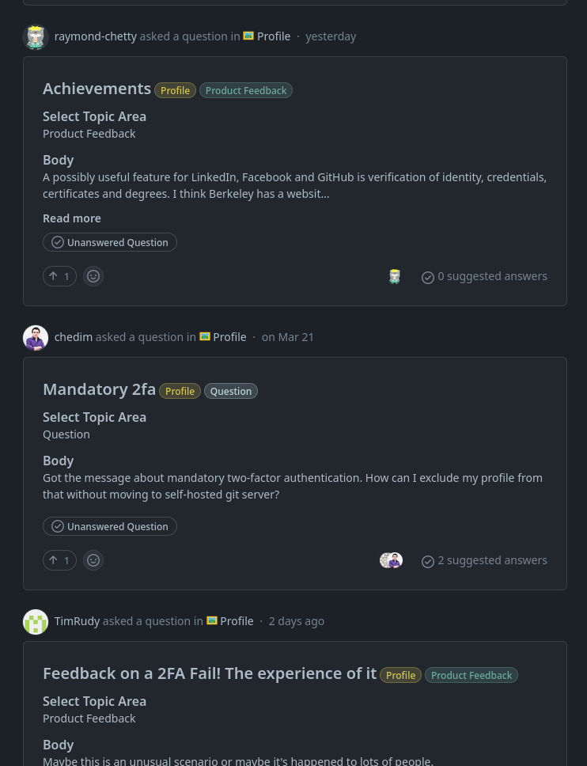

# Galaxy Brain

## Como obter a conquista Galaxy Brain no GitHub passo a passo:

### 1. Você deve acessar a comunidade GitHub (https://github.com/community/community). E selecione uma das categorias de comentários.

### 2. Agora você deve encontrar as perguntas não respondidas nas categorias desejadas e respondê-las.

### 3. Escreva uma resposta correta para a pergunta (sua resposta deve ser a melhor possível para ser selecionada como a resposta enviada pelo criador da pergunta).

### 4. Você precisa ter duas respostas enviadas nas categorias nas quais deseja obter a conquista Galaxy Brain.

### 5. Pronto! Agora você pode ver a conquista Galaxy Brain em sua lista de conquistas.

